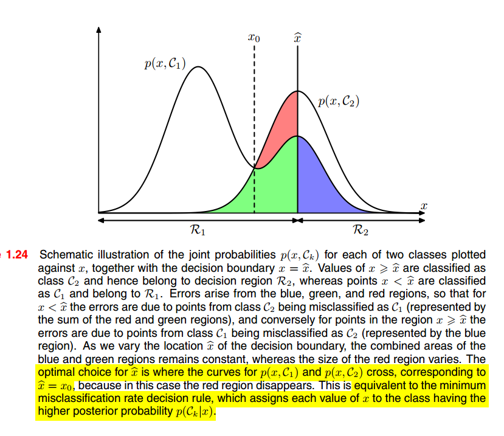

[toc]

# **<u>Chapter 1 - Introduction</u>**

- The book starts off by mentioning different terms related to pattern recognition and machine learning

- It also talks about the difference between **training** and **practical applications**

  - As training data will always comprise only a **tiny fraction** of **all possible input vectors**.
  - This means that we have to aim for **generalization** when using ML or Pattern Recognition.

- It also talks about **preprocessing** and how train and test data must have the same processing steps applied to both of them

  - It also talks about how preprocessing might be used to optimize time performance not only accuracy/prediction (e.g. viola jones face detection).

- Mentions the difference between **classification** and **regression**.

- Mentions **supervised**, **unsupervised** and **reinforcement learning**.

- Mentions how **unsupervised learning** can be used

  - Density estimation
  - Clustering
  - Visualization (think PCA allowing us to visualize word embeddings).

- Talk about **reinforcement learning** which I am not as experienced in.

  - Reinforcement learning is concerned with the problem of **finding suitable actions to take in a given situation to <u>maximize a reward</u>**.

  - So, the learning algorithm is not given **examples of optimal outputs** (like in supervised learning). Instead it must **discover them** through a process of **trial and error**.

  - Typically, there is a sequence of **states** and **actions** in which the learning algorithm is **interacting with its environment**.

  - In many cases, the **current action** not only affects immediate rewards but also has **an impact on the rewards of <u>all subsequent time steps</u>**

  - If we take for example, using RL to play backgammon the inputs for the model would be : the board position and the value of the dice throw and the output would be a move.

    A major challenge called the *credit assignment problem* is that backgammon has a lot of moves, and we can only give the reward at the end of the game (when victory is achieved). So the reward has to be **attributed appropriately to <u>all the moves that led to it</u>** even though not all moves played contributed equally to the victory.

  - Another problem is the *trade-off* between **exploration** and **exploitation**.

    **exploitation:** when the system makes use of actions that are **known to give a high reward**.

    **exploration:** when the system tries new kind of actions to check **how effective they are**.

  - If a model focuses too strongly on either exploration or exploitation, the model will yield poor results.

****

## **<u>Polynomial Curve Fitting</u>**

- Suppose we are given a set of inputs ${\bf{x}} = \{ x_1,x_2,....,x_N\}$ corresponding to the output values ${\bf{t}} = \{ t_1, t_2, ....,t_N\}$.
- We will assume that $t = sin(2 \pi x) + \mathcal{N}(0, 1)$ where this is a sine plus a Gaussian noise.
- This is similar to what machine learning tries to do in **supervised learning**, we have a function that we are trying to predict which is $sin(2\pi x)$ and some noise.
- We perform polynomial curve fitting using

$$
y(x,{\bf{w}}) = w_0 + w_1 x+ w_2 x^2 + .... + W_M x^M = \sum_{j=0}^Mw_jx^j
$$

and for the error we use the **RMSE**.

We can see that at $M=9$ and $N=10$, the training set error goes to zero but why at $M=9$ precisely ?

- At $M=9$, this polynomial contains **10 degrees of freedom** corresponding to the **10 coefficients**. $w_0,.....,w_9$ and so it can be tuned exactly to the **10 data points** in the training set.
  - This is why we can afford a more complex data model as $n$ (amount of data increases), because at a high $n$, we have a higher degree of freedom, so we can increase $k$ (# of features) without overfitting.

****

## **<u>Probability Theory <3</u>**

- Probability theory naturally arises in pattern recognition through **noise** and **finite size of datasets**.
- Probability theory combined with **decision theory** allow us to make **optimal predictions** based on the information available to us, even though that information may be **incomplete** or **ambiguous**.
- The book introduces some rules of probability

$$
\text{sum rule (marginal probability)} \ : \ P(X) = \sum_Yp(X,Y) \\ \text{product rule} \ : \ P(X,Y) = p(Y|X)p(X) = P(X|Y)p(Y) \\ \text{bayes rule : } P(Y|X) = \frac{P(X|Y) P(Y)}{P(X)} = \frac{P(X|Y) P(Y)}{\sum P(X|Y)P(Y)} \\
$$

****

## **<u>Probability densities</u>**

Check the notes from probability course

****

## **<u>Bayesian Probabilities</u>**

- The probability we reviewed so far was in terms of the **frequencies** of random and **repeatable** events. this is called the **classical** or **frequentist** interpretation of probability.

- What about events that can't be counted ?

  - e.g. the probability that the Arctic ice cap will have disappeared by the end of the century
    - This event can't be repeated for us to study and get the probability

- Nevertheless, we will generally have **some idea** (e.g. rate of melting of the ice) that can help us determine the probability

  - The **some idea** that we have is a reference to the **prior** information
    $$
    P(\theta|data) = \frac{P(data|\theta) P(\theta)}{P(data)}
    $$
    $P(\theta)$ is the prior, $P(data|\theta)$ is the likelihood and $P(\theta|data)$ is the posterior.

- Usually, $P(\theta)$ is not the same, through time its value might change and this will result in a change in our prediction too.

  - e.g. Satellites provide us with new data about the rate of melting of ice.

- **Bayesian probability** allows us to **quantify** our **expression of uncertainty** and change that expression based on **new data and observations**.

  - In turn this will lead us to making better decisions

****

### **<u>Example: Polynomial Curve Fitting</u>**

- If we want to fit a curve, it seems reasonable to apply the **frequentist** method. However, we would like to qunatify the **uncertainty** that surrounds the appropriate choice for the **parameters** $\bf w$ or the **choice of model** itself.
- Recall that, we have previously used **Bayes Theorem** to convert a **prior** probability to a **posterior** probability by **incorporating the evidence obtained by the data**.
  - We will see later that we can adopt a similar approach when making inferences about quantities such as **parameters** in the polynomial curve fitting.

****

- The effect of the observed data $\mathcal{D} = \{ t_1,....,t_N\}$ is expressed through the conditional probability $P(\mathcal{D}| \bf w)$, this can be represented using Bayes Theorem.
  $$
  P({\bf w}|\mathcal{D}) = \frac{P(\mathcal{D}|{\bf w})P({\bf w})}{P(\mathcal{D})}
  $$
  This allows us to evaluate the **uncertainty** in $\bf w$ after we have observed $\mathcal{D}$ in the form of the **posterior probability** $P(\bf w| \mathcal{D})$.

- $P(\mathcal{D}|\bf w)$ is called the **likelihood function**, it expresses how **probable the observed data** set is for different values of the parameter vector $\bf w$.

- Bayes theorem can be rephrased to words as
  $$
  \text{posterior} \propto \text{likelihood} \times \text{prior}
  $$
  where all the quantities are viewed as **functions of** $\bf w$. we ignore the denominator as it is just a normalizing factor.

- The denominator $P(\mathcal{D})$ can be expressed through the prior and the likelihood function
  $$
  P(\mathcal{D}) = \int P(\mathcal{D}|\bf w)p(\bf w) \dd\bf w
  $$

- In both the **Bayesian** & **frequentist** paradigms, the likelihood function $P(\mathcal{D}|\bf w)$ plays a **central role**

  - However, the **manner in which it is used** is fundamentally different in the two approaches.

****

### **<u>Likelihood</u>**

- In the frequentist setting, $\bf w$ is considered a **fixed parameter**, whose value is determined by some form of **estimator**.
  - Error bars on this estimate are obtained by considering the distribution of possible data sets $\mathcal{D}$
- By contrast, from the bayesian viewpoint there is only a **single dataset** $\mathcal{D}$ (the one being observed)
  - The uncertainty of the parameters is expressed through a distribution over $\bf w$.
- A widely used **frequentist estimator** is **maximum likelihood**, in which $\bf w$ is set to the value that maximizes the $P(\mathcal{D}|\bf w)$.
  - An approach to determining **frequentist error bars** is bootstrapping.
- One advantage of the **Bayesian viewpoint** is that the **prior information is naturally included**. e.g.
  - Suppose a coin is tossed 3 times and lands head each time.
    - A classical maximum likelihood estimate of probability of landing heads would give one (i.e. $P(Heads) = 1$), implying all future tosses will land heads.
    - However, The Bayesian approach would make use of **prior** and would yield a less extreme result.

****

## **<u>Curve fitting re-visited</u>**

- The goal of curve fitting is to be able to make **prediction** for a target variable $t$ given some input variable $x$ on the basis of a training set composing of $N$ samples $\bf x = \{x_1,..,x_N\}$ and their corresponding targets $\bf t =\{ t_1,....,t_N\}$.

- We can express our **uncertainty** over the **value of the target variable** using a **probability distribution**.

  - For this purpose, we are going to assume that $t$ has  a gaussian distribution of mean $y(x,\bf w) = \sum_{i=0}^M w_ix_i$ of the polynomial curve
    $$
    p(t|x,{\bf w},\beta) = \mathcal{N}(t|y(x, {\bf w}), \beta^{-1})
    $$

- We can now use the training data $\{\bf x, \bf t\}$ to determine the values of the unknown parameters $\bf w \ \& \ \beta$ using maximum likelihood.
  $$
  p({\bf t|\bf x,\bf w}, \beta) = \prod^N_{n=1} \mathcal{N}(t_n|y(x_n,\bf w), \beta^{-1})
  $$
  to make the problem easier we use the log likelihood
  $$
  ln( p({\bf t|\bf x,\bf w} \beta)) = -\frac{\beta}2 \sum^N_{n=1}(y(x_n,{bf w} - t_n)^2+
  \frac{N}2 ln(\beta)- \frac{N}2ln(2\pi)
  $$
  Now our objective is to
  $$
  max\ ln( p(\bf t|\bf x,\bf w, \beta)) \ 
  $$

- finding $\bf w_{ML}$

  - If we take the first derivative w.r.t to $\bf w$, the last two terms will disappear and we will be left with.
    $$
    \dv x \{-\frac{\beta}2 \sum^N_{n=1}(y(x_n,\bf w) - t_n)^2 \}= 0
    $$
    We can multiply by $-\frac{1}{\beta}$ and turn this into a **minimization** problem instead
    $$
    \dv x \{\frac{1}2 \sum^N_{n=1}(y(x_n,\bf w) - t_n)^2 \}= 0
    $$
    You can now see that using **maximum likelihood** is equivalent to **minimizing the sum of squares error function**.

- finding $\beta_{ML}$

  - If we take the derivate w.r.t $\beta$
    $$
    -\frac{1}2 \sum^N_{n=1}(y(x_n,\bf w_{ML}) - t_n)^2 + \frac{N}{2\beta_{ML}}= 0 \\
    \frac{1}{\beta_{ML}}= \frac{1}N \sum^N_{n=1}(y(x_n,\bf w_{ML}) - t_n)^2 
    $$
    **N.B.** we first had to get $\bf w_{ML}$ as it is used in the calculation of $\beta_{ML}$

- We now have $\bf w$ and $\beta$ and can make predictions by substituting the MLEs
  $$
  p(t|x, \bf w_{ML} , \beta_{ML} ) = \mathcal{N}(t|y(x, w_{ML} ), \beta_{ML}^{−1})
  $$

****

- If we take a step back towards a more Bayesian approach and introduce a **prior distribution**.

  - We'll assume it is a Gaussian with the form
    $$
    p(\bf w|\alpha) = \mathcal{N}(\bf w|0,\alpha^{-1}\bf I)\\
    =(\frac{\alpha}{2\pi})^{(M+1)/2} exp\{-\frac{\alpha}{2}\bf w^Tw\}
    $$
    where $\alpha$ is the precision of the distribution and $M+1$ is the total number of parameters in $\bf w$ which is an $M^{th}$ order polynomial.

  - Variables such as $\alpha$ which control the **distribution of the model parameters** are called **hyperparameters**.

- Using Bayes theorem, we can obtain
  $$
  p(\bf w|\bf x, \bf t,\alpha, \beta) \propto p(\bf t|\bf x,\bf w,\beta) p(\bf w|\alpha)
  $$
  We can now determine $\bf w$ by **maximizing the posterior distribution**. This technique is called **maximum posterior** (MAP).

  - If we perform the same steps as above, we will obtain
    $$
    \frac{\beta}2\sum^N_{n=1}\{y(x_n, \bf w)-t_n\}^2+\frac{\alpha}2\bf w^T\bf w
    $$
    We see that maximizing the posterior is equivalent to the **regularized sum of squares error function** with a regularization parametr $\lambda = \frac{\alpha}\beta$.

****

### **<u>Bayesian curve fitting</u>**

- Although we have included a prior distribution $p(\bf w|\alpha)$. we are still finding a **point estimate** of $\bf w$ which doesn't amount to the Bayesian treatment.
  
  - Our aim is to predict a distribution of each $t_n$.
  
- In a fully Bayesian approach, we should **consistently apply the <u>sum and product rules</u> of probability**. **<u>marginalization</u>** lie at the heart of Bayesian methods for pattern recognition.

- In curve fitting, we are given training data and target data along with a new test point $x$, our goal is to predict the value of $t$.

  - We therefore wish to evaluate the predictive distribution $p(t|x,{\bf x,t})$, assuming that the parameters $\alpha$ and $\beta$ are **known in advance**.

- A Bayesian treatment simply corresponds to a **consistent application of the <u>product and sum rules</u> of probability**
  $$
  p(t|x,{\bf x, t}) = \int p(t|x,{\bf w})p({\bf w |x, t})d\bf w
  $$

  - Here $p(t|x,\bf w)$ is given by $p({\bf t|\bf x,\bf w}, \beta) = \prod^N_{n=1} \mathcal{N}(t_n|y(x_n,\bf w), \beta^{-1})$ but with $\beta$ already known to simplify the notation.
  - $p({\bf w |x, t})$ is the posterior distribution over parameters.

- After evaluating $p(t|x,{\bf x, t})$ analytically, we find that
  $$
  p(t|x,{\bf x, t}) = \mathcal{N}(t|m(x),s^2(x))\\
  \text{such that}\\
  m(x)= \beta \phi(x)^T{\bf S}\sum^N_{n=1}\phi(x_n)t_n
  \\
  s^2(x) = \beta^{-1}+\phi(x)^T{\bf S}\phi(x).
  \\ \text{where S }=
  \alpha{\bf I} + \beta\sum_{n=1}^N \phi(x_n)\phi(x)^T
  $$
   $\bf I$ is the identity matrix and the vector$\phi(x)$ with elements $\phi_i(x) = x^i$ for $i = 0,...,M$.

- We can see that the mean as well as the variance are **dependent on** $x$.

- The first term in $s^2(x)$ represents the **uncertainty of the predicted value of** $t$ due to the **noise on the target variable** which was already addressed in the MLE by $\beta_{ML}$

  - The second term however arises from the **uncertainty in the <u>parameters</u>** $\bf w$ and is a **consequence of the Bayesian treatment**.

- The predictive distribution cab be shown in the figure below

  

****

## **<u>Model Selection</u>**

- This section introduces validation methods such as validation set, K-Fold cross validation, leave one out cross validation.

- Ideally, we want an approach that depends only on the training data and doesn't suffer from bias due to overfitting.

- Historically various **information criteria** have been proposed that attempt to correct the **bias of max likelihood**  by the **addition of a penalty term** to compensate for the overfitting of a complex models. e.g.

  - **Akai information criterion** (AIC)
    $$
    ln(p(\mathcal{D}|{\bf w_{ML}})) - M
    $$
    where $M$ is the number of adjustable parameters in the model and $p(\mathcal{D}|{\bf w_{ML}})$ is the best fit likelihood.

    We pick the model that **maximized** the AIC

  - **Bayesian information criterion** (BIC)

    This is a variant of AIC

  Such criteria tends to favor overly simple models.

****

## **<u>The Curse of Dimensionality</u>**

1. Real data will often be confined to a region of the space having a **lower effective dimensionality**.
   - In particular, the **direction over which important variations in the target variable** occur may be so confined
2. Real data typically exhibits some **smoothness property** (at least locally)
   - .i.e. **small changes ** in input will usually lead to **small changes in the target**
     - This allows us to exploit interpolation like techniques to allow us to make predictions of the target variables for new values of the input.

- Most successful pattern recognition approaches make use of 1 if not both of the properties above.

****

# **<u>Decision Theory</u>**

- Decision theory is concerned with **what actions should you take based on our understanding of the value of $t$** (the target variable).

- The **decision step** comes after **inference**, it tells us how to make **optimal decisions** given the **appropriate probabilities**

  - The decision stage is generally very simple, even trivial, once we have solved the inference problem.

- The example is this section is predicting the output variable $t$ which represents the **presence of cancer** from the input $x$ which is an image.

  - There are two classes: $\mathcal{C}_1$ at $t=0$ indicates no cancer & $\mathcal{C}_2$ at $t=1$ indicates cancer.

- In this problem, we are interested in getting the probability $P(\mathcal{C}_k|x)$ which can be expressed as
  $$
  P(\mathcal{C}_k|x) = \frac{P(x|\mathcal{C}_k)P(\mathcal{C}_k)}{P(x)}
  $$
  Note that any of theses quantities can be obtained from the joint distribution $P(\mathcal{C}_k,x)$ by using marginalization or conditioning w.r.t the appropriate variable.

  - $P(C_k)$ is the prior probability.
    - In this case $P(C_1)$ represents the probability that a person has cancer **before the X-ray measurement** (allows us to include other effects).
  - $P(\mathcal{C}_1|x)$ is the **revised probability**  using Bayes' theorem in light of the information contained in the X-ray.

- When classifying the intuitive thing to do would be this
  $$
  t = f(x) =  
  \mathcal{C_1} \ \ if \ \ P(\mathcal{C}_1|x) \geq P(\mathcal{C}_2|x) \\ 
  \mathcal{C_2} \ \ otherwise
   \\
  $$
  We will show why this intuition is **correct** and also discuss **general criteria for making decisions**

****

## **<u>Minimizing the misclassification rate</u>**

- Our goal is to make as few misclassifications as possible, misclassifications happen when an input $x$ that belongs to $\mathcal{C}_1$ is in region $\mathcal{R}_2$ or vice verse

  - We can then calculate the probability of a mistake by the equation
    $$
    P(mistake) = P(x \in \mathcal{R}_1, \mathcal{C}_2) + P(x \in \mathcal{R}_2, \mathcal{C}_1) \\
    =\int_{\mathcal{R}_1}P({\mathbf{x}}, \mathcal{C}_2) d\mathbf{x}+ \int_{\mathcal{R}_2} P(\mathbf{x},\mathcal{C}_1)  d\mathbf{x}
    $$
    We are trying to minimize the $P(mistake)$

    

****

## **<u>Minimizing the expected loss</u>**

- We can use the loss function to make the model penalize some decisions more than others. e.g.

  - In the cancer case, if a patient doesn't have cancer and the model predicted that he does, this will cause some patient distress and will lead to more testing.
    - However, if the patient actually has cancer and the model predicted that he doesn't, this will probably lead to death.
  - We can clearly see that one of these options is better than the other.

- This is formalized using the loss function, through the loss function we can tell the model what we just explained above. lets see how

  - The expected loss is stated as
    $$
    E[L] = \sum_k\sum_j \int_{\mathcal{R}_j} L_{kj} P(\mathbf{x}, \mathcal{C}_k)d\mathbf{x}
    $$
    where $L_{kj}$ is the loss if the element of class $C_k$ is in region $R_j$.

    

****

## **<u>The reject option</u>**

- As we noticed, our misclassifications arise from the areas where $P(\mathcal{C}_k|x) \ll 1$ or $P(\mathcal{C}_1|x )\approx P(\mathcal{C}_2|x)$.

- In some applications, it could be appropriate to **avoid making decisions** on the **difficult cases** to obtain a lower error rate on those examples where there is confusion.

  - This is known as the **reject option**.

- In the cancer problem, we could let the model automatically diagnose cases that it is fairly certain of and identify the doctors of only the uncertain ones, they can check those manually to reduce the error.

- We can achieve this by **introducing a threshold** $\theta$.

  - We can then reject all inputs where $P(C_{k_{max}}| x) \lt \theta$.

    

****

## **<u>Inference and decision</u>**

- We broke the classification problem into two separate problems.
  1. **<u>Inference</u>**
     - Use the training data to learn a model for $P(\mathcal{C}_k|x)$
  2. **<u>Decision</u>**
     - Use the posterior probabilities from stage 1 to make optimal class assignments
- Another approach would be to **solve both problems together**, simply learn a function that maps inputs $\bf x$ directly into **decisions**, such function is called a **discriminant function**.
- We have **3 approaches** to solving decision problems.

****

#### **<u>Generative Models</u>**

- First, we solve the **inference** problem of determining the **class conditional densities** $P(x|\mathcal{C}_k)$ for each $\mathcal{C}_k$ individually, also separately infer the prior class probabilities $P(\mathcal{C}_k)$ then use Bayes theorem to find the posterior probability $P(\mathcal{C}_k|x)$.

  - To find $P(\mathcal{C}_k|x)$, we can get the denominator $P(x)$ using
    $$
    P(x) = \sum_kP(x|\mathcal{C}_k)P(\mathcal{C}_k)
    $$
    which we already have.

- OR we can model the joint distribution $P(\mathcal{C}_k, x)$ directly and obtain the posterior probabilities from it.

- **After**  finding the **posterior probabilities**, we use **decision theory** to determine **class membership** for each input $x$

- Approaches that **model the input and output distributions** are known as **generative models**

  - As by sampling from them, it is possible to **generate** synthetic data points in the input space.

****

#### **<u>Discriminative models</u>**

- We first solve the inference problem of determining the **posterior class probabilities** and then use decision theory to take the decision
- The approaches that model **posterior probabilities** **<u>directly</u>** are called **discriminative models**

****

#### **<u>Discriminative vs Generative models</u>**

|        | Generative                                                   | Discriminative             |
| ------ | ------------------------------------------------------------ | -------------------------- |
| Models | $P(\mathcal{C}_k, x)$ OR $P(x|\mathcal{C}_k), P(\mathcal{C}_k)$ | $P(\mathcal{C}_k|x)$ Onlyy |

****

#### **<u>Discriminant Function</u>**

- We find a function $f(x)$ called a **discriminant function** which maps each **input** $x$ directly to a **class label**.
- In this case **probabilities play no role**.

****

### **<u>Comparison between approaches</u>**