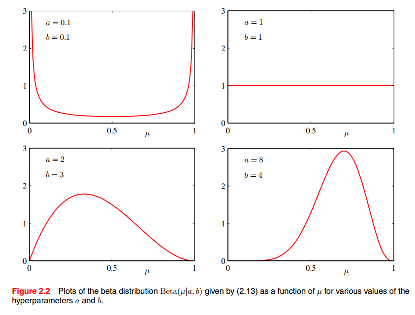

[toc]

# **<u>Chapter 2 - Probability Distributions</u>**

- Modeling the probability distribution $p(x)$ of a random variable $x$, given a finite set $x_1,....,x_N$ is known as **density estimation**

- The problem of **density estimation** is fundamentally **ill-posed** as there are **infinitely many distributions** that could've **resulted in the observed finite dataset**.

  - Any distribution that has a non zero value at $p(X=x_i)$ for all $x_i \in \{ x_1, ...,x_N\}$ is considered a **potential candidate**.

- Distributions like **Gaussian, Binomial and multinomial**  are called **parametric distributions** because they are **governed** by a small number of <u>**adaptive parameters**</u>.

- To apply such models to the density estimation, we need a **procedure** for **determining the values** for the **parameters** of the model.

  - <u>**Frequentist treatment**</u>

    We choose values for the parameters by **optimizing some criterion**. e.g. **likelihood function**.

  - **<u>Bayesian treatment</u>**

    We introduce a **prior distribution** over the **parameters** and then use **Bayes's theorem** to compute the **corresponding posterior distribution** given the observed data.

- **<u>Conjugate Priors</u>**

  Given 2 distributions, $d_1$ and $d_2$. the distribution $d_2$ is a **conjugate prior** to the distribution $d_1$ if we multiply $d_1$ by $d_2$ and the resulting distribution has the **same distribution type** as $d_2$ but with **different parameters**

- A different type is the **non parametric density estimation** methods in which the form of the distribution depends on the **size of the dataset**.

  - Such models **still contain <u>parameters</u>**, but these parameters control the **model complexity** rather than the **form of the distribution**.

****

# **<u>Binary Variables</u>**

## **<u>Bernoulli Distribution</u>**

- This is a single **binary random variable** $x \in \{ 0, 1\}$ where 1 is "success" and 0 is "failure".

- It is characterized by 1 parameter, lets call it $\mu$ which is the probability of success
  $$
  p(x=1|\mu) =  \mu
  $$

- The distribution can be expressed by
  $$
  \text{Bern}(x|\mu) = \mu^x(1-\mu)^{1-x}
  $$

  $$
  E[x] = \mu \\ \text{var}[x] = \mu(1-\mu)
  $$

- For a set of observations $\mathcal{D} = \{ x_1, ... ,x_N\}$, the **likelihood function** can be expressed as
  $$
  p(\mathcal{D}|\mu) = \prod_{n=1}^N \mu^{x_n}(1-\mu)^{1-x_n}
  $$
  and the **log likelihood** is
  $$
  \ln p(\mathcal{D}|\mu) = \sum^N_{n=1} \{ x_n \ln \mu + (1-x_n) \ln (1-\mu)\}
  $$

- **<u>Frequentist Setting</u>**

  In a frequentist setting, we can **estimate $\mu$ by maximizing the log likelihood**.

  Using calculus, we can determine that
  $$
  \mu_{ML} = \frac{\sum_{n=1}^Nx_n}{N}
  $$
  which is the sample mean, or number of successful attempts divided by $N$

- One of the problems with using **MLE** is **over-fitting**. i.e. If we flip a coin 3 times and the 3 are heads (success), then the sample mean is 1 and $\mu_{ML} = 1$ which predicts that all the following tosses will be heads.

  - This is quite unreasonable, we'll see later on with the introduction of a **prior distribution** for $\mu$ how we can prevent this from happening.

****

## **<u>Binomial Distribution</u>**

- Binomial distribution calculates the **probability of getting $m$** **success** if we repeat a **Bernoulli** experiment $N$ times

- It can be expressed as
  $$
  \text{Bin}(m|N,\mu) = {N\choose m} \mu^m(1-\mu)^{N-m}
  $$

  $$
  E[m] = N\mu
  \\
  var[m] = N\mu (1-\mu)
  $$

****

## **<u>The beta distribution</u>**

- It is a **family of distributions**, not only 1 shape.

- beta distribution represents a **probability distribution of probabilities**.

  - It is best used for when you **don't know the probability in advance** but we have some **reasonable guesses**.

- **Parameterized** by $a,b$ where $a,b \gt 0$

- PDF expressed by
  $$
  \text{Beta}(x|a,b) \propto x^{a-1}(1-x) ^{b-1} \\
  = k \ x^{a-1}(1-x) ^{b-1}
  $$
  where $k$ is a constant that makes the PDF integrate to 1.
  
- This constant is represented by a Gamma Function (factorial approximation)
  $$
  \text{Beta}(\mu|a,b) = \frac{\Gamma(a+b)}{\Gamma(a)\Gamma(b)} \mu^{a-1} (1-\mu)^{b-1}
  $$
  where the mean and variance are given by.
  $$
  E[\mu] = \frac{a}{a+b} \\
  \text{var}[\mu]= \frac{ab}{(a+b)^2 (a+b+1)}
  $$
  Here are various shapes for different values of $a,b$

  

- The **posterior distribution of** $\mu$ is now obtained by multiplying the **beta prior**  by the **binomial likelihood** as follows:
  $$
  p(\mu|m,l,a,b) \propto \mu^{m+a-1} (1-\mu)^{l+b-1}
  $$
  where $l = N - m$ (i.e. number of failure in binomial distribution).

  It can be seen that this is just another **beta distribution** with $a_{new} = m + a$ and $b_{new} = l + b$
  $$
  p(\mu|m,l,a,b) = \frac{\Gamma(m+a + l + b)}{\Gamma(m+a)\Gamma(l+b)} \mu^{m+a-1} (1-\mu)^{l+b-1}
  $$
  **<u>Example</u>**

  

- We can then use this **posterior distribution** as a prior in case new **observations are found**.

****

#### **<u>More Intuition</u>**

- Lets assume that we start with a prior of $\text{Beta}(\mu|a,b)$, we don't know $\mu$ but we have a rough estimate for it that we modeled through the beta distributions.
- After seeing what happens, we can update the distribution to be $\text{Beta}(\mu|a+\text{# success}, b +\text{# failure})$.
- If we imagine a coin, we assume (head = success). the prior distribution would be centered around 0.5 with small-ish variance.
  - If we flip the coin 6 times, and all 6 times are heads. it makes it more likely that $\mu > 0.5$
  - By making $a := a +6$, we shift the distribution to the right, just like the figure above.
    - This indicates that the probability of the probability of heads has increased.

****

- From what we saw before, we can see that a **sequential approach to learning** arises naturally when we adopt a **Bayesian viewpoint**.
  - It is independent of the choice of prior and likelihood function and only depends on the **assumptions of i.i.d data**.
  - Sequential methods make use of observations **in <u>small</u> batches** and then **discard them <u>before next observations are used</u>**.
  - They can be used for
    - real time learning as **predictions must be made before all of the data is seen**
    - can be used for **large datasets**.

****

#### **<u>Maximum Likelihood in a sequential framework</u>**

- To get the best prediction, we have to get $p(x=1|\mathcal{D})$
  $$
  p(x=1|\mathcal{D}) = \int_0^1 p(x = 1| \mu)p(\mu|\mathcal{D}) d\mu
  = \int_0^1 \mu p(\mu|\mathcal{D})d\mu = E[\mu|\mathcal{D}] \\
  E[\mu|\mathcal{D}] = \frac{m + a}{m+a+l+b} = \frac{\text{# success} + \text{initial estimate for successes}}{\text{total # of old tries + total # of new observations}}
  $$
  initial estimates are **fictitious prior observations**, these are the numbers from our estimate of the prior distribution.

- **N.B.** when $m,l \to \infin$, this reduces to $\mu_{ML} = \frac{m}N$.

  - It is a general property that **Bayesian** and **ML** results will agree in the case of an **infinitely large dataset**.
  - In **finitie datasets**, the **posterior mean** will **always** lie **between** the **prior** mean and the **MLE** for the mean.

- By playing with the values of $a,b$, we can see that as $a,b$(# of trials) increase, the **variance decreases**. and the distribution is more **sharply peaked**.

****

# **<u>Multinomial Variables</u>**

- Variable encountered are usually **multinomial**, i.e. can take **one of $K$** possible **mutually exclusive** states.

  - Assuming there are 3 states
    - The value of $\mathbf{x}$ is $\mathbf{x}= (0, 1, 0)^T$. since they're **mutually exclusive** only 1 of them can be 1 and the rest are zeros.
    - The probabilities $\mathbf{\mu} = (0.2,0.7,0.1)^T$
    
  - Notice that $\sum_k \mu_k = 1$.

  - The $p(\mathbf{x}|\mathbf{\mu}) = \prod_{k=1}^K \mu_{k}^{x_k}$.
    
    - $p(\mathbf{x}=(0,1,0)|\mathbf{\mu}=(0.2,0.7,0.1)) = 0.2^0 * 0.7^1 * 0.1^0 = 0.7$.
    
  - Since these are discrete variables
    $$
    E[\mathbf{x}|\mathbf{\mu}] = \sum_\mathbf{x}p(\mathbf{x}|\mathbf{\mu})\mathbf{x} = \mathbf{\mu}
    $$
    here we loop over all the values that $\mathbf{x}$ can take.

  - To find the **likelihood** of observations $\mathcal{D} = (\mathbf{x}_1, ....,\mathbf{x}_N)$ having a parameter $\mathbf{\mu}$
    $$
    p(\mathcal{D}|\mathbf{\mu}) = \prod^N_{n=1} \prod^K_{k=1} \mu_k^{x_{nk}} 
    = \prod^K_{k=1} \mu_k^{\sum_n x_{nk}} = \prod^K_{k=1} \mu_k^{m_k}
    $$
    where $m_k$ is the number of times $x_k = 1$ in the whole dataset (observations).

    You can see that $m_k$ acts as a **sufficient statistic** for the likelihood.

  - If we maximize the log-likelihood (and the Lagrange multiplier term)
    $$
    \sum^K_{k=1} m_k \ln\mu_k + \lambda(\sum^K_{k=1}- 1)
    $$
    After we solve the MLE problem, we get
    $$
    \mu_{k}^{ML}= \frac{m_k}N
    $$

****

### **<u>The multinomial distribution</u>**

- Expressed as
  $$
  \text{Mult}(m_1,.....,m_K|\mathbf{\mu},N) = { N \choose m_1m_2...m_K} \prod^K_{k=1} \mu_k^{m_k}
  $$
  where $\sum_k m_k = N$.

- Similar to the binomial, the multinomial is used to check if we run an experiment $N$ times, how likely is it that we get the first option $m_1$ times, the second $m_2$ times .... the $k$ th $m_K$ times.

****

### **<u>The Dirichlet distribution</u>**

- This is the **conjugate prior** for the **multinomial distribution**.

- It can be deduced from the formula that for the distribution to be a **conjugate prior**, it would have to take the form
  $$
  \text{Dir}(\mathbf{\mu}|\mathbf{\alpha}) \propto\prod^K_{k=1} \mu_k^{\alpha_k - 1}
  $$
  where $\sum_k \mu_K = 1$.

  The normalization constant is given by
  $$
  \text{Dir}(\mathbf{\mu}|\mathbf{\alpha}) = \frac{\Gamma(\prod_k\alpha_k)}{\prod_k \Gamma(\alpha_k)} \prod_k\mu_k^{\alpha_k-1}
  $$

- **N.B.** because of the summation $\sum_k \mu_k = 1$ the **distribution** over that space of $\{ \mu_k\}$ is confined to a **simplex** of dimensionality $K - 1$

  

  Here, even though there are 3 variable. the distribution is confined in a 2-D simplex (triangle).

  It is not a square because points like $\mu = (1, 0.5, 0.2)$ don't sum up to 1 therefore are invalid.

  - Here are more examples for them

    

****

- If we multiply a **Dirichlet prior** with a **multinomial likelihood**, we get the following
  $$
  p(\mathbf\mu |\mathcal{D}, \alpha) \propto p(\mathcal{D}|\mu)p(\mu|\alpha) \propto \prod^K_{k=1} \mu_k^{\alpha_k +m_k - 1}
  $$
  We see that the **posterior** takes the form of a **Dirichlet distribution** with the following parameters
  $$
  p(\mu|\mathcal{D},\alpha) = \text{Dir}(\mu| \alpha + \mathbf{m}) \\
  = \frac{\Gamma(\{\prod_k \alpha_k \}+ N)}{\prod_k \Gamma(\alpha_k + m_k)}
  \prod^K_{k=1} \mu_k^{\alpha_k +m_k - 1}
  $$

****

# **<u>The Gaussian Distribution</u>**

- In case of a single variable $x$, the Gaussian can be expressed as
  $$
  \mathcal{N}(x|\mu,\sigma^2) = \frac{1}{(2\pi\sigma^2)^\frac{1}2} \exp\{ -\frac{1}{2\sigma^2} (x - \mu)^2\}
  $$
  for a $D$-dimensional vector $\mathbf{x}$, the **multivariate** Gaussian is expressed by
  $$
  \mathcal{N}(\mathbf{x|\mu, \Sigma}) = \frac{1}{(2\pi)^\frac{D}2}\frac{1}{|\Sigma|^\frac{1}2} \exp(-\frac{1}2(x-\mu)^T\Sigma^{-1}(x-\mu))
  $$

- The variable that **maximizes** the **entropy** is a Gaussian (applies for both uni and multivariate)

- The Gaussian is also important due to the **central limit theorem**, it tells us that the **sample means of <u>nearly</u> all distributions is a Gaussian**.

  - If we take a binomial distribution, sample it and calculate the sample mean.

    That sample mean will be a random variable that is a **normal distribution**.

  - In practice, the **convergence to a Gaussian** as $N$ increases is **very rapid**.

****

Couldn't really understand the rest of this stuff, so I've moved on to later chapters and will return later if needed.

****