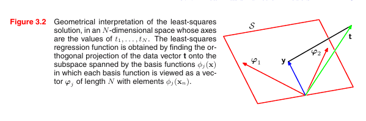

[toc]

# <u>**Chapter 3 - Linear Models (Regression)**</u>

- The goal of regression is to **predict 1 or more continuous *target* variables $t$ given the value of a $D$-dimensional vector $\mathbf{x}$  of *input* variables**.
- The polynomial curve fitting is a **specific example**  of a **broad class of function*s* called *linear regression models*** 
  - The models are called **linear** as they are linear functions **of the *adjustable parameters* **(can be **non-linear** functions of **inputs**)
- The simplest form of **linear regression models** are **linear functions of the input variables**.
  - However, we can obtain a **more useful** class of functions by taking **linear combinations of a fixed set of *non-linear functions of the input variables***, these functions are known as **basis functions**.
    - These models are **linear functions of the parameters**, which gives them **simple analytical properties**.
    - They can be **non-linear** w.r.t the **input variables**.
- Linear models have significant **limitations** as **practical techniques** in ML, particularly in problems involving **high dimensional input spaces**.
  - They do however have **nice analytical properties** and **form the foundation** for more sophisticated models

****

## **<u>Linear Basis Function Models</u>**

- The simplest linear model for regression is just a **linear combination** of the **input variables**
  $$
  y(\mathbf{x,w}) = w_0 + w_1x_1+....+w_Dx_D
  $$
  having the function be **linear** in the **input variables** imposes **significant limitations**.

  - So we extend the model by considering **non linear combinations** of **fixed <u>non-linear</u> functions of the <u>input variables</u>**
    $$
    y(\mathbf{x,w}) = w_0 + \sum^{M-1}_{j=1} w_j \phi_j(\mathbf{x})
    $$
    where $\phi(\mathbf{x})$ are known as **basis functions**.

  - The total number of parameters in this model is $M$.

- For convenience, we often add a new value $\phi_0(\mathbf{x}) = 1$, this allows us to express $y(\mathbf{x,w})$ as follows
  $$
  y(\mathbf{x,w}) = \sum^{M-1}_{j=0} w_j \phi_j(\mathbf{x}) = \mathbf{w}^T\phi(\mathbf{x})
  $$
  where $\mathbf{w} = (w_0, w_1,...,w_{M-1})^T$ and $\phi=(\phi_0,....,\phi_{M-1})^T$.

- In many applications of pattern recognition, we will apply some form of **fixed pre-processing** or **feature extraction** to the original data variables $\mathbf x$, we can represent these operations in terms of the **basis functions** $\{ \phi_j(\mathbf x )\}$

****

#### **<u>Examples of Basis Functions</u>**

- In the polynomial curve fitting example, we used the basis function $\phi_j(x) = x^j$.

  - A limitation for these functions is that they are **global functions**, so changes in one region of the input space affects all other regions.
    - This can be fixed by dividing the input space into regions and fitting a **different polynomial** for each region. functions that do this are called **spline functions**

- **<u>Gaussian Basis functions</u>**
  $$
  \phi_j(\mathbf x) = \exp\{ -\frac{||\mathbf x-\mu_j||^2}{2s^2}\}
  $$

  - where $\mu_j$ can be obtained through some sort of reductions. (using k-means to find the centers that represent the data, and in that case $\phi$ would be $k$-dimensional)
  - The parameter $s$ governs the **spatial scale**.
  - Notice that $2s^2$ is just a scaling factor which is not that important, as the $\mathbf w$ are adaptive and will decrease/increase to match the target.

- **<u>Sigmoidal basis function</u>**
  $$
  \phi_j(\mathbf x) = \sigma(\frac{\mathbf x - \mu_j}{s})
  $$
  where $\sigma$ is the sigmoid function

  - we can replace the sigmoid with $\tanh$ as they are closely related $\tanh(a) = 2\sigma(a) - 1$.

- **<u>Fourier basis function</u>**

  - Each basis function represents a **specific frequency** and has **infinite spatial extent**.
  - In many signal processing applications, it it of interest to consider functions that are **localized in both space and frequency**, leading to a class of functions called **wavelets**. 
  - **wavelets** are designed to be **mutually orthogonal** to simplify their application.
  - Wavelets are **most applicable** when the input values live on a **regular lattice**, such as **successive time points in a temporal sequence**, or **pixels in an image**.

****

The analysis applied in this chapter is usually **independent** of the **choice of basis functions**.

****

### <u>**ML and Least Squares**</u>

- Previously, we fitted polynomial functions to datasets by **minimizing a sum-of-squares** error function.

  - We showed that the error function could be motivated as the ML solution under a **Gaussian noise model**.

- We assume $t$ is given by
  $$
  t = y(\mathbf{x,w}) + \epsilon
  $$
  where $\epsilon$ is a $\mathcal{N}(0,\beta^{-1})$, which allows us to say
  $$
  p(t|\mathbf{x,w},\beta) = \mathcal{N}(t|y(\mathbf{x,w}), \beta^{-1})
  $$
   if we assume a **squared loss function**, the **optimal prediction** for a new value of $\mathbf x$ will be given by **the conditional mean of the target variable**, in case of a Gaussian distribution, the conditional mean will be
  $$
  E[t|\mathbf x] = \int t * p(t|x) dt = y(\mathbf{x, w})
  $$

- Note that **Gaussian noise assumption** implies that the $p(t|\mathbf{x})$ is **unimodal**, which may be **inappropriate for some applications**.

- If we consider the likelihood function
  $$
  p(\mathbf{t|X,w}\beta) = \prod^N_{n=1} \mathcal{N}(t_n|\mathbf w^T\phi(\mathbf x_n), \beta^{-1})
  $$
  Since in regression problem, we don't seek to model $\mathbf X$, we will drop the $\mathbf x$ from expressions like $p(\mathbf{ t| x, w}, \beta)$ to keep the notation **uncluttered**

  - We will take the log likelihood which is
    $$
    \ln p(\mathbf t|\mathbf w, \beta) = \sum^N_{n=1} \ln \mathcal{N}(t_n|\mathbf w^T \phi(\mathbf x_n), \beta^{-1})
    \\ = \frac{N}2 \ln \beta - \frac{N}2 \ln2\pi - \beta E_D(\mathbf w)
    $$
    where $E_D(\mathbf w) = \frac{1}2 \sum^N_{n = 1} \{ t_n - \mathbf w^T \phi(\mathbf x_n)\}^2$.

  - We can now compute the maximum likelihood for $\mathbf w$ and $\beta$
    $$
    \nabla \ln p(\mathbf{ t|w},\beta) = \sum^N_{n=1} \{t_n - \mathbf w^T \phi(\mathbf x_n) \} \phi(\mathbf x_n)^T
    $$
    if we set the gradient to zero and solve, we obtain
    $$
    \mathbf w_{ML} = (\phi^T\phi)^{-1} \phi^T \mathbf t
    $$
    which is know as the **normal equation** for the **least squares problem**.

    $\phi$ is an $N \times M$ matrix called the **design matrix** whose elements are given by $\phi_{nj} =\phi_j(\mathbf x_n)$

  - The quantity $\phi^\dagger = (\phi^T \phi)^{-1} \phi^T$ which is known as **Moore-Penrose pseudo-inverse**

    It can be regarded as a **generalization** of the **inverse** to **non square matrices**.

    - If the matrix is square and invertible $A^\dagger = A^{-1}$.

- We can gain some insight into the **role of the bias parameter** $w_0$.
  $$
  E_D(\mathbf w) = \frac{1}2 \sum^N_{n=1} \{ t_n - w_0 - \sum^{M-1}_{j=1} w_j \phi_j(\mathbf x_n)\}^2
  $$
  setting the derivative w.r.t $w_0$ to zero, and solving for $w_0$, we get
  $$
  w_0 = \bar t- \sum^{M-1}_{j=1} w_j \bar \phi_j
  $$
  where 
  $$
  \bar t = \frac{1}N \sum^N_{n=1}t_n \ \& \ \bar \phi_j = \frac{1}N \sum^N_{n=1} \phi_j(\mathbf x_n)
  $$
  thus the bias $w_0$ **compensates** for the **difference** between **averages of the target variable** and the **weighted sum of the average of the basis function values**. (on the training set)

- We can also maximize the log likelihood w.r.t $\beta$ to get
  $$
  \frac{1}{\beta_{ML}} = \frac{1}N \sum^N_{n=1} \{ t_n - \mathbf w^T_{ML} \phi(\mathbf x_n) \}^2
  $$
  so it is given by the **residual variance** of the **target values** around the **regression function**.

****

### **<u>Geometry of least squares</u>**

- We consider an $N$-dimensional space.
- $\mathbf t$ & $\phi_j(\mathbf x_n)$ are vectors in the space.
  - Note that $\phi_j(\mathbf x_n)$ is an $N$-dimensional vector (column in the input matrix)
- If the # of basis functions $M$ is **smaller** than the # of data points.
  - The $M$ vectors $\phi_j(\mathbf x_n)$ will span a **linear subspace $\mathcal{S}$** of dimensionality $M$.
- We define $\mathbf y = [y(\mathbf{x_0,w}),..,y(\mathbf{x_n,w})] $ to be an $N$-dimensional vector.
- Since $\mathbf y$ is a **linear combination** of $\phi_j(\mathbf x_n)$, it can exist anywhere on the $M-$dimensional subspace $\mathcal{S}$.
- Thus, the least squares error can be described as the **squared Euclidean distance** between $\mathbf y$ and $\mathbf t$.
- The **least-square solution for $\mathbf w$** corresponds to the choice of $\mathbf y$ that lies in the subspace $\mathcal{S}$ and that is closest to $\mathbf t$.
  - The solution also corresponds to the **projection** of $\mathbf t$ onto the **subspace** $\mathcal{S}$.

****

### **<u>Sequential Learning</u>**

- Sequential learning is applying techniques like **stochastic gradient descent** aka **sequential gradient descent**.

****

### **<u>Regularized least squares</u>**

- We had previously introduced the **regularization term** that controls the **relative importance** of the **data-dependent error** $E_D(\mathbf w)$ and the **regularization term** $E_W(\mathbf w)$.
  - $$
    E_D(\mathbf w) + \lambda E_W(\mathbf w)
    $$
- One of the simplest form of regularizers is given by the **sum of squares of the weights**
  $$E_W(\mathbf w) = \frac{1}{2} \mathbf w^T\mathbf w$$
- The total error function then becomes
  $$\frac{1}{2}\sum_{n=1}^N \{t_n - \mathbf{w^T}\phi(\mathbf x_n)\}^2 + \frac{\lambda}2 \mathbf w^T \mathbf w$$

- This **particular choice of regularizer** - sum of the squares of the weights - is known in the ML literature as **weight decay**, because in sequential learning algorithms, it **encourages weight values to decay towards zero, <u>unless supported by the data</u>**.
  - In statistics, it provides an example of **parameter shrinkage** method as it shrinks the **parameter values towards zero**.
  - It also has the advantage that the error function remains quadratic, so it can be solved in closed form as before.
    $$\mathbf w = (\lambda I + \Phi^T\Phi)^{-1} \Phi^T \mathbf t$$
- A more general regularizer is sometimes used
  $$\frac{1}{2}\sum_{n=1}^N \{t_n - \mathbf{w^T}\phi(\mathbf x_n)\}^2 + \frac{\lambda}2  \sum^M_{j=1}|w_j|^q$$
  - In the case of $q=2$, this is the **quadratic regularizer** which was discussed above
  - In the case of $q=1$, the regularizer is known as the **lasso**, it has the property that if $\lambda$ is sufficiently large, some of the cofficients $w_j$ will be zero, leading to a **sparse model**.

****
### Multiple Outputs

- A basic thing to do is to just create a **different set of basis functions** for each component of $mathbf{t}$.
  - This leads to **multiple independent regression** problems.

- A more interesting and **more common** approach is to use the **same set** of basis on all of the components of the target vector.

$$y(\mathbf{x,w}) = \mathbf{W}^T \phi (\mathbf{x})$$

- where $\mathbf{y}$ is a $K$-dimensional column vector, $\mathbf{W}$ is a $M \times K$ matrix of parameters and $\phi(x)$ is an $M$-dimensional vector.
  - This is done so $\mathbf{W}^T \phi(\mathbf(x))$ outputs a $K$-dimensional vector straight away.

****

- if we have a set of observations $t_0,...,t_N$, we can combine them into a matrix $\mathbf{T}$ of size $N \times K$.
- we can then express the conditional distribution of the target vector in the guassian form.

$$
  p(\mathbf{t}|\mathbf{x}, \mathbf{W}, \beta ) = \mathcal{N}(\mathbf{t|W^T \phi(x)}, \beta^{-1} \mathbf{I}
$$

- If we take the log of the likelihood

$$
  \ln p(\mathbf{T|X,W}, \beta) = \frac{NK}{2} \ln (\frac{\beta}{2 \pi}) - \frac{\beta}{2} \sum^N_{n=1} ||t_n - \mathbf{W^T}\phi(x_n)||^2
$$

- The closed form solution is the pseudo-inverse just like the previous case
  $W_{ML} = (\Phi^T \Phi)^{-1} \Phi^T T$

- If we examine this for each $t_k$ separately, we get
$w_k = (\Phi^T \Phi)^{-1} \Phi^T \mathbf{t}_k$

****

## Bias variance decomposition

- We've seen that using **maximum likelihood (least squares)** can lead to **severe over-fitting** if complex models are trained on datasets of limited size
- On the other hand, If you **limit** the **number of basis functions** $M$, this will limit the **flexibility of the model** to capture **interesting and important trends in data**.
- To "solve" this, we introduced **regularization**, but how do we choose the correct value for $\lambda$ ?

----------

- Overfitting is a **property of maximum likelihood** and **doesn't arise when we marginalize over parameters in a Bayesian setting**.
- It is helpful to consider a **frequentist** point of view of the **model complexity issue** known as the **bias-variance tradeoff**.
  - It is introduced in the linear basis function models, but the concept is applied to other functions as well.

- The expectation of the loss can be written as
  $$
    \mathbf{E}[L] = \int \{y(\mathbf{x}) - h(\mathbf{x})\}^2 p(\mathbf{x}) d\mathbf{x}  + \int \{t - h(\mathbf{x})\}^2 p(\mathbf{x}) d\mathbf{x} dt 
  $$

  - Where $y$ is our prediction, $h$ is the actual pattern (without the noise) and $t$ is the target.
- We can see that the second term is independent of $y$, it arises from the **intrinsic noise in the data** .
  - This represents the **minimal achievable value of expected loss**.
- The first term is the one we seek to minimize as it depends on the choice of $y$ which is what we can control.
- If we had unlimited data and computation, we could model $h$ exactly and then the error would only be the second term.
  - But in practice, we only have a limited supply of data $\mathcal{D}$ where $N$ is finite

----------

- If we model $h(\mathbf{x}) using a **parametric function** $y(\mathbf{x,w})$ governed by a parameter vector $\mathbf{w}$. From a
  - **Bayesian Perspective** 
    - The uncertainty in our model is expressed through a **posterior distribution over** $\mathbf{w}$
  - **Frequentist Perspective** 
    - Involves making a point estimate of $\mathbf{w}$ based on the dataset $\mathcal{D}$.
    - Then tries to interpret uncertainty of this estimate through the following experiment

### Frequentist uncertainty estimate

- Assume we have a large number of **datasets** each of size $N$ and each drawn independently from the distribution $p(t, \mathbf{x})$
- For any given dataset $\mathcal{D}$, we run our learning algorithm and get a function $y(\mathbf{x}; \mathcal{D})$.
- Different datasets will lead to different parameters and different values of the loss.
- We assess the **performance** of a **learning algorithm** through taking the **average over this ensemble of datasets**.

- We only have control over the first term of the loss which was $\{y(\mathbf{x}) - h(\mathbf{x})\}^2$.
  - If we add and subtract $E_\mathcal{D}[y(\mathbf{x}; \mathcal{D})]$ inside the curly brackets, we get the following

    $$
    \{y(\mathbf{x}) - E_\mathcal{D}[y(\mathbf{x}; \mathcal{D})]+ E_\mathcal{D}[y(\mathbf{x}; \mathcal{D})] - h(\mathbf{x})\}^2 \\
    = \{ y(\mathbf{x}) - E_\mathcal{D}[y(\mathbf{x}; \mathcal{D})]\}^2  
    + \{ E_\mathcal{D}[y(\mathbf{x}; \mathcal{D})] - h(\mathbf{x})\}^2 \\
    + 2 \ \{ y(\mathbf{x}) - E_\mathcal{D}[y(\mathbf{x}; \mathcal{D})]\} \ \{E_\mathcal{D}[y(\mathbf{x}; \mathcal{D})] - h(\mathbf{x})\}  
    $$

- If we take the expectation of that term, the final term will vanish and two terms will remain.

$$
 \mathbf{E}_\mathcal{D} [\{y(\mathbf{x}) - h(\mathbf{x})\}^2 ] \\
  = \{ E_\mathcal{D}[y(\mathbf{x}; \mathcal{D})] - h(\mathbf{x}) \}^2  + E_\mathcal{D}[\{y(\mathbf{x}; \mathcal{D}) - E_\mathcal{D}[y(\mathbf{x}; \mathcal{D})]\}^2]
$$
- The first term is the $(\text{bias})^2$
  - It represents how the **average prediction over all datasets** differs from the **desired regression function** $h$
- The second term is the **variance** 
  - measures the extent to whcih the **solutions for *individual datasets* vary around their average** 
  - i.e. measures the extent to which the function $y(\mathbf{x}; \mathcal{D})$ is sensitive to the **particular choice of dataset** (All sampled independently from $p(\mathbf{x}, t)$

So we can rewrite the loss as

$$
  \text{expected loss} = (\text{bias})^2 + \text{variance} + \text{noise}
$$

- Our goal is to pick a model that leads to the **best balance between bias and variance**.
  - More complex models reduce bias but increase variance.
  - Less complex models increase bias but reduce variance

----------

- Although the bias-variance decomposition is a good theoretical way to understand model complexity in a frequentist setting.
  - It is not very practical as we don't have multiple datasets, we only have 1 and separating it into multiple smaller ones would increase the level of overfitting.

- Given these limitations, we turn to the Bayesian treatment of linear basis function models.
  - This not only provides powerful insights into the issues of over-fitting but also leads to practical techniques for addressing the question of model complexity.

----------

## Bayesian Linear Regression

- We've seen that the effective model complexity is governed by the # of basis functions and needs to be controlled by the size of the dataset
- A **regularization** term can control the complexity to some extent but the choice of the number and form of the basis functions remains important.
- Depending on maximum likelihood will always lead to excessive model complexity and over-fitting.
  - We could use a holdout dataset to determine model complexity, but we would waste computation and data we could've learned from.

- We therefore turn to a **Bayesian treatment of linear regression** which **avoids** the overfitting problem of max likelihood.
  - This also leads to automatic methods of determining **model complexity** using **the training data alone**.

----------

### Parameter Distribution

- We start by defining a **prior** distribution over the model parameters $\mathbf{w}$.
  - We will treat the noise parameter $\beta$ as a known constant.

- The **likelihood** function $p(\mathbf{t|w}) = \prod_{n=1}^N \mathcal{N}(t_n|\mathbf{w}^T \phi(\mathbf{x}_n, \beta^{-1})$
- The conjugate **prior** is expressed as $p(\mathbf{w}) = \mathcal{N}(\mathbf{w}|m_0, S_0)$
  - Where the mean is $m_0$ and covariance is $S_0$

- Next we compute the **posterior** distribution which is proportional to the product of the prior and the likelihood.
  - Due to the choice of distribution (conjugate prior), we know that it'll be a **Gaussian**.

- The **posterior** distribution will have the form of (derived previously)
  $$
    p(\mathbf{w|t}) = \mathcal{N}(\mathbf{w}|m_N, S_N) \\
    m_N = S_n(S_0^{-1}m_0 + \beta \Phi^T \mathbf{t}) \\
    S_N^{-1} = S_0^{-1} + \beta \Phi^T\Phi
  $$

- **N.B.** Since the posterior is a Guassian, the mean and the mode are the same, so the maximum posterior weight vector $\mathbf{w}_{MAP} = m_N$
- If we consider an infinitely broad prior $S_0 = \alpha^{-1} \mathbf{I}$ where $\alpha \rightarrow 0$ (this means that the prior doesn't  have any useful information)
  - The mean $m_N$ of the posterior distribution reduces to the maximum likelihood value $\mathbf{w}_{ML}$
- Similarly, if $N=0$, then the posterior distribution is the same as the prior
- If data points arrive **sequentially**, then the posterior distribution at any stage acts as the prior distribution for the subsequent data point.

----------

- There will be an example, and for simplification, we will consider the prior to be an isotropic Gaussian with zero mean.
  $p(\mathbf{w}|\alpha) = \mathcal{N}(\mathbf{w}|0, \alpha^{-1} I)$
  - Due to the simplification, the posterior will be given by
    $$
      m_N = \beta S_N \Phi^T \mathbf{t} \\
      S_n^{-1} = \alpha I + \beta \Phi^T \Phi
    $$
- The log of the **posterior** distribution is given by the sum of the log **likelihood** and the log of the **prior** as a function of $\mathbf{w}$.

$$
  \ln p(\mathbf{w|t}) = - \frac{\beta}{2} \sum_{n=1}^N \{ t_n - \mathbf{w}^T \phi(\mathbf{x}_n)\}^2 - \frac{\alpha}{2} \mathbf{w}^T \mathbf{w} + \text{const}
$$

- Maximization of this posterior distribution w.r.t $\mathbf{w}$ is equivalent to the minimization of the sum-of-squares error function with a quadratic regularization term where $\lambda = \frac{\alpha}{\beta}$.

----------

- We will show an example of learning using Bayesian learning in a linear basis function model as well as the **sequential update** of a posterior distribution using straight line fitting
  - In our example, we'll consider a single input variable $x$ and a single target $t$ in order to plot the results.
  - Our model will be $y(x, \mathbf{w}) = w_0 + w_1 x$.

- We will generate target data from the function $f(x, \mathbf{a}) = a_0 + a_1 x$ where $a_0 = -0.3$ and $a_1 = 0.5$.
  - We also add noise with $\sigma = 0.2$
  
- The goal is to recover the values of $a_0$ and $a_1$ from the data.

- We will explore the dependence on the size of the dataset.

- We will asume that noise variance is known and hence we set its value $\beta = (\frac{1}{0.2})^2 = 25$ and similarly we set the parameter $\alpha = 2$
  - We will also discuss how to set the parameters $\alpha $ and $ \beta$ from the training data.

- The first example is one where we only have the prior and no data points.

  

- The image in the middle is a distribution for the **prior** distribution.
- The image on the right show 6 samples from the posterior distribution (in case of no data, posterior = prior)
  - Each sample from the posterior $p(\mathbf{w| X})$ represents a line (as we only have 2 parameters).

- In the second image, we add 1 data point with likelihood $p(\mathbf{X|w})$
  

- To get the posterior in the second image, we multiply the likelihood (2nd image) with the posterior (1st image)
  - This shows the sequential nature of Bayesian learning

- You'll find a white cross on the curve, which represents the original function $f(\mathbf{a}, x)$ from which the data was sampled.

- We see the third image, which represents us adding more data points to the algorithm and watching how it learns.
  

- You'll see that the more points added, the closer the distribution gets (lower variance and mean gets closer to real values of $a_0$ and $a_1$).

- If we had infinite points, we would have the posterior be a delta function at the true values of $a_0$ and $a_1$.

----------

- Other forms of the **prior** can be considered, for example we can generalize the Gaussian prior to give
  $$
    p(\mathbf{w}|\alpha) = [ \frac{q}2 (\frac{\alpha}{2})^\frac{1}q \frac{1}{\Gamma(\frac{1}q ]}^M \exp(- \frac{\alpha}{2} \sum_{j=1}^M |w_j|^q )
  $$

- In the case of $q = 2$, this corresponds to the Gaussian distribution and only in this case the prior distribution.
  - Finding the max of the posterior distribution over $\mathbf{w}$ corresponds to the minimization of the regularized error function.
  - In the case of the Guassian prior, the mode = mean in the posterior. 
  - This will not hold if $q \neq 2$

----------

### Predictive distribution

- In practice, we are not interested in the value of $\mathbf{w}$ itself but rather in making predictions of $t$ for new values of $\mathbf{x}$.
  - This requires we evaluate the **predictive distribution** defined by
    $$
      p(t| \mathbf{t}, \alpha, \beta) = \int p(t|\mathbf{w}, \beta) p(\mathbf{w|t}, \alpha, \beta) d\mathbf{w}
    $$
    where $\mathbf{t}$ is the vector of target values from the training set.
  - We've omitted the input vectors from the right hand side of the conditionals to simplify notation.
  - The result of the integration above will be:
    $$
      p(t|\mathbf{x,t}, \alpha, \beta) = \mathcal{N}(t|m_N^T \phi(\mathbf{x}), \sigma^2_N(\mathbf{x})) \\
      \sigma_N^2(\mathbf{x}) = \frac{1}\beta + \phi(\mathbf{x})^T S_N \phi(\mathbf{x})
    $$
    - The first term in $\sigma_N^2(\mathbf{x})$ represents the **noise in the data**
    - The second term reflects the **uncertainty** associated with the parameters $\mathbf{w}$.
    - **N.B.** As noise and the parameters $\mathbf{w}$ are independent Gaussians, their variance is additive.
    - **N.B.** Note that as $N$ increases, the posterior distribution becomes narrower (second term of variance decreases until it goes to zero)
      - At that point, we will be certain of the values of $\mathbf{w}$ and only variance due to noise in data remains. 

### Equivalent kernel

- The **posterior mean solution** for the linear basis function model has a different interpretation.
- Since the posterior and prior are both Gaussian, then the weights of the model is the same as the mean.
  - This allows us to do the following
    $$
      y(\mathbf{x,m}_n) = \mathbf{m}_N^T \phi(\mathbf{x}) = \beta \phi(\mathbf{x})^T \mathbf{S}_N \Phi^T \mathbf{t} = \sum^N_{n=1} \beta \phi(\mathbf{x})^T \mathbf{S}_N \phi(\mathbf{x}_n) t_n
    $$

  - The result of this substitution is that, the mean of the predictive distribution at a point $\mathbf{x}$ is given by a **linear combination of the training set target variables** $t_n$
  We can also rewrite it as
    $$
      y(\mathbf{x,m}_N) = \sum_{n=1}^N k(\mathbf{x,x}_n) t_n \\
      k(\mathbf{x, x}') = \beta \phi(\mathbf{x})^T \mathbf{S}_N \phi(\mathbf{x}')
    $$
    - This is known as the **smoother matrix** or the **equivalent kernel**.
    - They make their predictions by taking a **linear combination** of the training set target values known as **linear smoothers**
      - The equivalent kernel depends on the input values $\mathbf{x}_n$ from the dataset as these appear in the definition of $\mathbf{S}_N$.
    - Data points closer to $x$ are given higher weight than points that are far away from it.

----------

- This formulation suggests an alternative approach to regression.
- Instead of introducing a set of basis functions, which **implicitly** determines an **equivalent kernel**
- We can instead define a **localized kernel directly** and use it to make prediction for new input vectors $\mathbf{x}$ given the observed training set.
- This leads to a practical framework for regression and classification called **Gaussian processes**  which will be discussed in chapter 6.

----------

- The weights of the training have to sum up to 1.
  $$
    \sum_{n=1}^N k(\mathbf{x,x}_n) = 1
  $$

- Note that the weigth **can be negative**

- An **important** property of all kernels is that they can be **expressed as an inner product**
  $$
    k(\mathbf{x,z}) = \psi(\mathbf{x})^T \psi(\mathbf{z}) \\

    \psi(\mathbf{x}) = \beta^{\frac{1}2)} \mathbf{S}{\frac{1}2)} \phi(\mathbf{x})
  $$

----------

## Bayesian Model Comparison

- We will talk about the **model selection** from a **Bayesian perspective**, the discussion will be general, then we'll see how they are applied to the determination of regularization parameters in linear regression.
- Overfitting associated with maximum likelihood **can be avoided** by **marginalizing** over model parameters instead of making point estimates of their values.
- Models can then be trained directly on the training set, without a need for a validation set and all the computation that comes with it.
  - this allows multiple **complexity parameters** to be determined simultaneously as **part of the training process.**

- The **Bayesian view of model comparison** simply involves the **use** of probabilities to **represent uncertainty** in the choice of model.

----------

- Assume we're comparing $L$ models $\{ \mathcal{{M}_i } \}   \ \, \ i = 1,...,L$ 
  - where each model represents a **probability distribution over the observed data** $\mathcal{D}$
  - We assume that the data is generated from one of these models, but we don't know which one.

- Our uncertainty is expressed through a **prior distribution** $p(\mathcal{{M}_i })$
- Given a training set $\mathcal{D}$, we wish to evaluate the **posterior distribution**.

  $$
      p(\mathcal{{M}_i }|\mathcal{D}) \propto p(\mathcal{{M}_i }) p(\mathcal{D}|\mathcal{{M}_i })
  $$

- The prior allows us to **express a preference** for different models.
- If we simplify and give all models an equal prior distribution, we'll only care about $p(\mathcal{D}|\mathcal{{M}_i })$
  - This term expresses the **preference shown by the data for different models**
    - It is also sometimes called **marginal likelihood** as it can be viewed as a likelihood function over the space of models.

- The ratio between two model evidences $\frac{p(\mathcal{D}|\mathcal{{M}_i })}{p(\mathcal{D}|\mathcal{{M}_j })}$ is known as **Bayes factor**
  
- Once we know the posterior distribution over models, the **predictive distribution** is given by
  $$
    p(t| \mathbf{x}, \mathcal{D}) = \sum^L_{i=1}  p(t| \mathbf{x}, \mathcal{M}_i, \mathcal{D}) p(\mathcal{\mathcal{M}_i}|\mathcal{D})
  $$

- This is an example of a **mixture distribution** in which the overall predictive distribution is obtained by **average the predictive distribution** $p(t| \mathbf{x}, \mathcal{M}_i, \mathcal{D})$ of **multiple** individual models **weighted by the posterior probabilities** $p(\mathcal{\mathcal{M}_i}|\mathcal{D})$ of those models.
- So, if two models that are **a-posteruiru equally likely** and one predicts a narrow distribution around $t = a$ and the other a narrow distribution around $t=b$
  - The overall predictive distribution will be a **bimodal distribution** at $t=a$ and $t=b$, not a single model at $t = \frac{a + b}2$.
- **Model selection** can happen by **selecting the most probable model** alone to make predictions.

----------

- For a model with a set of parameters $\mathbf{w}$, the **model evidence** is given by
  $$
    p(\mathcal{D}|\mathcal{M}_i) = \int p(\mathcal{D}| \mathbf{w}, \mathcal{\mathcal{M}_i}) p(\mathbf{w}|\mathcal{\mathcal{M}_i}) d\mathbf{w}
  $$

- From a sampling perspective, the **marginal likelihood** can be viewed as the probability of generating a dataset $\mathcal{D}$ from a model whose parameters are **sampled at random from the prior**.

- It's also intereseting to note that the evidence is the **normalizing term** in Bayes' theorem when evaluating the **posterior distribution over parameters**
  $$
    p(\mathbf{w}|\mathcal{D, M}_i) = \frac{p(\mathcal{D}| \mathbf{w}, \mathcal{\mathcal{M}_i}) p(\mathbf{w}|\mathcal{\mathcal{M}_i})}{p(\mathcal{D|M}_i)}
  $$

----------

- If we make some simple approximations over the integral parameters, we can obtain some insight into **model evidence** 
  1. consider that the model has a single parameter $w$, where $p(w) \propto p(\mathcal{D}|w) p (w), we omit the dependence on $\mathcal{M}_i$ for simplicity.
  2. if we assume that the posterior distribution is sharply peaked around the most probable value $w_{MAP}$ with width $\Delta w_{\text{posterior}}$, we can approximate the integration into length times width.
  3. If we also assume that the prior is flat with width $\Delta w_{\text{prior}}$, $p(w) = \frac{1}{\Delta w_{\text{prior}}}$

   

- This results in the following
  $$

  p(\mathcal{D}) = \int p(\mathcal{D}|w)p(w)dw \approx p(\mathcal{D}|w_{\text{MAP}}) \frac{\Delta w_\text{posterior}}{\Delta w_\text{prior}}  
  $$
- If we take the log, we get

  $$

  \ln p(\mathcal{D}) \approx  \ln p(\mathcal{D}|w_{\text{MAP}}) + \ln (\frac{\Delta w_\text{posterior}}{\Delta w_\text{prior}} )
  $$

- The first term represents the **fit to the data** given by the **most probable parameter values** (for a flat prior, this corresponds to the log likelihood)
- The second term **penalizes the mode for its complexity**
  - since $\Delta w_\text{posterior} < \Delta w_\text{prior}$, the term is negative.
  - $\frac{\Delta w_\text{posterior}}{\Delta w_\text{prior}}$ gets smaller, if parameters are finely tuned to the data in the posterior distribution. (resulting in worse penalty)

- If a model has $M$ parameters, all with the same ratio of $\frac{\Delta w_\text{posterior}}{\Delta w_\text{prior}}$
  $$
  \ln p(\mathcal{D}) \approx  \ln p(\mathcal{D}|w_{\text{MAP}}) + M \ln (\frac{\Delta w_\text{posterior}}{\Delta w_\text{prior}} )
  $$

- Thus, the size of complexity penalty increases linearly with the **number of parameters** $M$.
- The optimal model complexity will be given in a tradeoff between the **first and second terms**.

----------

 

- The image above can help us understand how marginal likelihood can favor models of **intermediate complexity**.
- The horizontal axis represents the **space of possible datasets**, so each point on the axis corresponds to a **specific dataset**.
- If we now consider 3 models $\mathcal{M}_1$ ,  $\mathcal{M}_2$ and  $\mathcal{M}_3$ of successively increasing complexity.
- Imagine if we run these models **generatively** to produce example datasets, and then look at the distribution of datasets that result.
- Any given model can generate a **variety of datasets** since the parameters are governed by a **prior probability distribution** and for any choice of parameters there may be **random noise on the target variables**.

----------

(this is the same image as above)
 

- To generate a particular dataset from a specific model, we first choose the values of the parameters from their prior distribution $p(\mathbf{w})$, and then from these parameters, we sample the data from $p(\mathcal{D}|\mathbf{w})$
- A simple model like $\mathcal{M}_1$ has **little variability**, so the datasets it generates will be **fairly similar** (smaller range of datasets).
- By contrast, a complex model can generate a **great variety** if datasets, so its distribution $p(\mathcal{D})$ is spread over a **large region** of the space of datasets.
- If we look at the point $\mathcal{D}_0$, we can see that the **highest value of the evidence** $p(\mathcal{D,M}_i)$ belongs to the model of **intermediate complexity**.
  - This happens due to the follwoing reasons
    1. The simpler model cannot fit the data well.
    2. The more complex model soreads its predictive probability over too broad a range of datasets, and so assigns a **relatively small probability to any of them**.

----------

- In the Bayesian model comparison framework, it's assumed that the **true distribution** from which the data is generated is **contained withing the set of models under cosideration**.

- Based on this assumption, we can show that Bayesian model comparison will on average **favour the correct model**.
  - To see this, we consider two models $\mathcal{M}_1$ and $\mathcal{M}_2$ in which the truth corresponds to $\mathcal{M}_1$.

- For a given finite dataset, it's possible for the Bayes factor to be **larger for the incorrect model**.
  - However, if we average the **Bayes factor** over the **distribution of datasets**, we obtain the expected Bayes factor in the form
    $$
      \int p(\mathcal{D|M}_1) \ln \frac{p(\mathcal{D|M}_1)}{p(\mathcal{D|M}_2)} d\mathcal{D}
    $$

- This average has been taken w.r.t to the true distribution of the data.
- The quantity is an example of the **Kullback-Liebler** divergence (measures dissimilarity between two distributions).
  - Thus on average, the Bayes factor will always favour the correct model.

----------

- We've seen that the Bayesian framework **avoids** the problem of **overfitting** and allows models to be **compared on the basis of the training data alone**.
- However a **Bayesian approach** like any approach to pattern recognition, needs to make **assumptions** about the **form of the model**.
  - If these are **invalid**, then the results can be **misleading**.

- The model evidence can be sensitive to **many aspects of the prior**, such as the **behavior of the tails**.
- **N.B.** An improper prior is a prior that doesn't have to be a proper distribution.
- The evidence is not defined if the prior is improper, as can be seen by noting that an improper prior has an arbitrary scaling factor.
- If we consider a proper prior then take a suitable limit in order to obtain an improper prior, the eveidence will **go to zero**.
  - It may then be possible to consider the **evidence ratio** between **two models first** then take a limit to obtain a meaningful answer.

- In a practical application, it will be wise to keep aside an **independent test set** of data on which to evaluate the overall performance of the final system.

