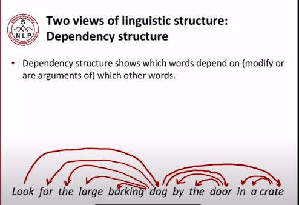
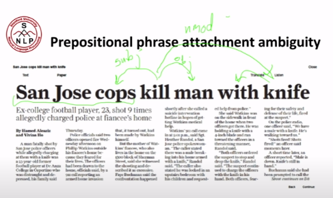
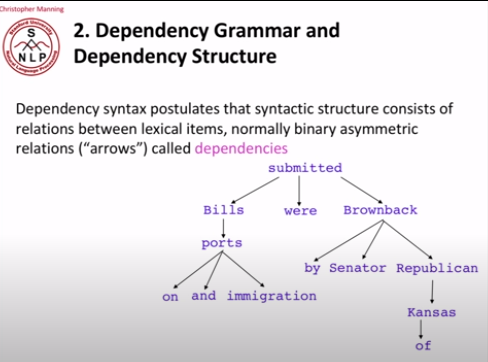
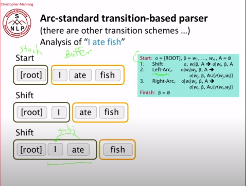
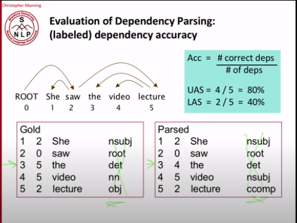
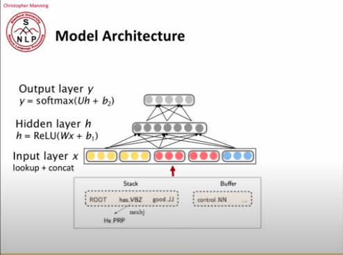

# L5_CS224N

## **<u>Sentence Structure</u>**

**Why do we need sentence structure?**

​	We need to understand structure to interpret language correctly, the more information we need to convey, the more words are needed. Without structure, these words will become confusing (especially to computers).

****

There are two main ways to view words in a language (not only in English )

1. ### <u>Context-free grammars (Phrase structure grammar)</u>

   Phrase structure organizes words into **<u>nested constituents</u>**.

   i.e. building nested blocks that we can use to describe a sentence

   ****

   

   | Word          | Called     | Referred to as |
   | ------------- | ---------- | -------------- |
   | the / a       | Determiner | Det            |
   | cat / dog     | Noun       | N              |
   | large / small | adjectives | Adj            |

   All of these combined form a new thing called **Noun Phrase**

   | Sentence        | Blocks      | Called               |
   | --------------- | ----------- | -------------------- |
   | The (large) dog | Det (Adj) N | Noun Phrase (**NP**) |

   Notice that the adjective may or may not be there.

   ****

   We can then introduce <u>**prepositions**</u>

   | Word         | Called      | Referred to as |
   | ------------ | ----------- | -------------- |
   | by / in / at | Preposition | Prep           |

   When we introduce prepositions, we see that there are new sentences that can be formed.

   | Sentence   | Blocks  | Called                        |
   | ---------- | ------- | ----------------------------- |
   | in a crate | Prep NP | Prepositional Phrase (**PP**) |

   **N.B.** Notice that we used a compound structure (NP) to form another compound structure (PP). This shows that these are nested components.

   ****

   With these few structures, we can make an infinite number of sentences.

   i.e. The dog in a crate on the table  by the kitchen in the house .... etc

   NP PP where each PP contains a new NP which makes it an infinine series of sentences.

   ****

   We can then introduce new components to make even bigger sentences

   | Word        | Called | Referred to as |
   | ----------- | ------ | -------------- |
   | talk / walk | Verb   | V              |

   We can use verbs to make **Verb Phrases**

   | Sentence        | Blocks | Called                |
   | --------------- | ------ | --------------------- |
   | talk to the cat | V PP   | Verb Phrases (**VP**) |

   ****

   **N.B.** Different languages will have different components, like may in another language, the **VP** will consist of PP V instead of V PP.

   ****

2. ### <u>Dependency Structure</u>

   Dependency structure shows which words **depend on** (modify or are arguments of) which other words.

   

   **root**: is where the sentence starts, in this case the verb Look

   ****

   

   Here the word **kill** has an **nmod** which is called an **instructional modifier** to indicate that the knife was the tool that was used to do the killing

   ****

   #### **<u>Ambiguities in English parsing</u>**

   <u>**Prepositional phrase attachment ambiguity**</u>

   This is one of the most common ambiguity in the parsing of English.

   When you have a NP or a VP followed by multiple PPs, Those PPs can modify either the Verb or the Noun which leads to the ambiguity

   The number of possibilities of the modification is represented by whats called *Catalan numbers* : $C_n \ =\ \frac{2n!}{(n+1)!(n)!}$ which have exponential complexity. 

   These numbers get very high which is the reason for the ambiguity.

   ****

   There are also many other types of Ambiguities.

   ****

   

   These are the types of dependency structure that we will try to generate using NNs, so we don't say the type of relationships between each word.

   Usually, dependencies form a tree (**connected**, **acyclic**, **single-head**).

   ****

****

## **<u>Building dependency parsers</u>**

**What do we (humans) look for when doing dependency parsing?**

1. **Bilexical affinities** : [discussion --:arrow_forward: issues] 

   This means that certain words are more likely to modify each other

2. **Dependency distance**:

   Dependency happens **mostly** with nearby words

3. **Intervening material**:

   Dependencies rarely span intervening verbs or punctuation

   i.e. you will rarely find a dependency from something the is mentioned before and something after a semi-colon or the word so.

4. **Valency of heads**:

   How many dependents are on which side of a word.

   i.e. **was completed** there will be a dependency before this (item being completed) but there won't be any nouns after it.

****

### **<u>Dependency Parsing</u>**

When doing dependency parsing, we have some **constraint**:

- Only one word is a dependent of **ROOT**
- Don't want cycles

This results in the dependency being a tree.

We also want to determine whether or not arrows can cross each other. If they can cross, they are called **<u>*non projective*</u>**.

****

### **<u>Methods of Dependency Parsing</u>**

1. Dynamic programming
2. Graph algorithms
3. Constraint Satisfaction
4. **"Transition-based parsing" or "deterministic dependency parsing"**

We will discuss only the 4th one in the course.

#### <u>**"Transition-based parsing" or "deterministic dependency parsing"**</u>

Greedy choice of attachments guided by good machine learning classifiers has proven highly effective.

It is inspired by a *shift reduce parser*

Look at the (has time stamp as query parameter) [video](https://www.youtube.com/watch?v=nC9_RfjYwqA&t=3300)

To summarize, we have two items

-  a **stack**
- a **buffer** 

three operations

- **Shift**: move item from the leftmost position in the buffer into the stack
- **Left-Arc reduction**: take the second from top thing on the stack as a dependent of the thing on top of the stack and the head is left on the stack
- **Right-Arc reduction**: take the top thing on the stack as a right dependent to the thing that is second on top of the stack

We use machine learning to train a model that takes decisions in order to decide whether we should do **shift**, **right-arc** or **left-arc**.

#### **<u>Shift reduce parser example</u>**

****

### **<u>MaltParser</u>**

- This was a high accuracy classifier.
- It provides very **fast linear time parsing**.
- Each action is predicted by a discriminative classifier(e.g. softmax classifier) for each move.
- This has no search, However adding **beam search** can bump up the performance of the model

The problem was that the **feature representation** was hard to do in the parsers. You would end up with a binary and sparse $10^6 \text{~} 10^7$ dimensional matrix which took a lot of time to compute

****

#### <u>**Problems with Feature Representation**</u>

1. **Sparse**
2. **Incomplete**
3. **Expensive** computation: More than 95% of parsing time is consumed by feature computation.

This motivated **neural dependency parsers** where the feature representation is replaced by a neural network to learn these features on its own.

****

### **<u>Evaluation of dependency parsers</u>**

There are two metrics:

- **Unlabeled Attachment Score (UAS):** This checks the arrows only ignoring the labels 
- **Labeled Attachment Score (LAS):** This checks the labels and the arrows

****

### **<u>Neural dependency parser</u>**

The thing that makes them succeed is that the time taken to compute the matrices is way less than the time taken to compute features in the non neural parsers.

#### **<u>Distributed Representations</u>**

- **Words**

  Words were represented as *d*-dimensional vectors (word embeddings)

- **POS and dependency labels**

  They were also represented as *d*-dimensional vectors. 

  <u>**Part of speech** (**POS**)</u> 

  ​	**NNS**(Plural Noun) should be close to **NN**(singular noun)

  <u>**Dependency Labels**</u>

  ​	 **num** (numerical modifier) hould be close to **amod** (adjective modifier).

We convert the words and their pos and dependency labels into a the feature as follows.

****

### **<u>Improvements made to dependency parsers</u>**

- Bigger, deeper networks with better tuned hyperparameters
- Beam search
- Global, conditional random field (CRF)-style inference over the decision sequence.

****

