# <u>L7_CS224n</u>

## **<u>Vanishing & Exploding Gradient</u>**

Since the gradient backpropagates through time. From the chain rule, it is multiplied by other gradients. If these gradients are $ < 1$, It'll be a product of multiple values that are smaller than one. Which means that the gradient gets smaller and smaller (vanishes) as you travel farther back in time.

This means that there will be low gradient for words that are far away resulting in that the model doesn't learn anything from far away words.

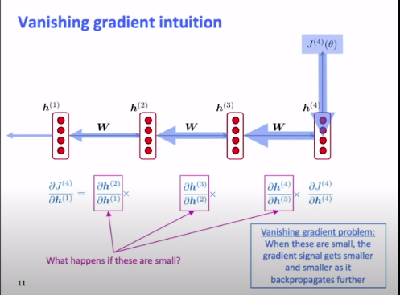

****

### <u>Proof for Vanishing problem</u>

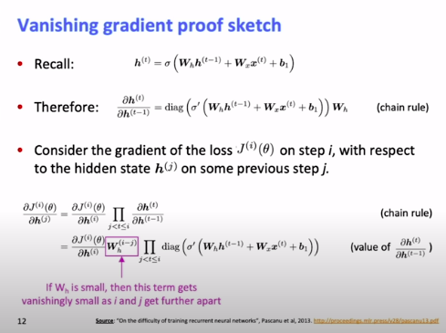

You can also see that this causes **exploding gradient problem** too

- If $||W_h|| > 1$, $||W_h||^{(i-j)}$ will be a large value when $ i >> j$ 
- If $||W_h|| < 1$, $||W_h||^{(i-j)}$ will be a small value when $ i >> j$ 

We get $\frac {\partial J^{(i)}(\theta)}{\partial h^{(j)}}$ when we are learning about word $j$ standing at word $i$ , so if $i$ is far away from $j$,  $i-j$ will be a large number

However, here the gradient will be less than 1 due to the **sigmoid function**

****

### **<u>Why is vanishing gradient a problem</u>**

- **Gradient** can be viewed as a measure of the **effect of the past on the future**

- If the gradient becomes small over long distance, One of two cases happened

  1. There's **no dependency** between step $t$ and step $t+n$ in the data
  2. We have **wrong parameters** to capture the true dependency

  And we can't know which case is true as we will always have small gradients due to the **model structure** that we are using.

****

### **<u>Effect of vanishing gradient on RNN-LM</u>**

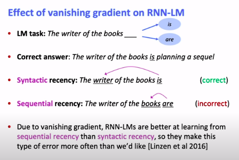

**Syntactic** recency is harder to capture as it is farther away so weak signal in **vanilla RNN-LM**, so it ends up caturing the **Sequential** recency which is incorrect.

****

### **Why is <u>exploding</u> gradient a problem**

If the gradient is large, according to gradient descent
$$
\theta^{\text{new}} = \theta^{\text{old}} - \alpha \nabla_\theta J(\theta) 
$$
Having a large $\nabla_\theta J(\theta)$ will result in a very large step and will probably result to a bad configuration.

In the worst case, It'll result in **Inf or Nan** in the network, The only solution to this is to **restart training from an earlier checkpoint**.

****

### <u>**Solution to gradient clipping**</u>

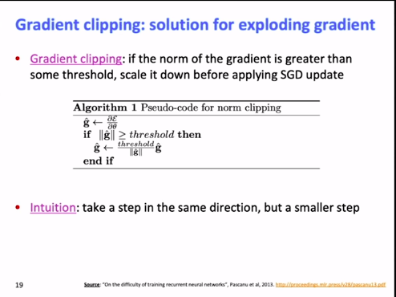

****

## <u>Long-Short Term Memory (LSTM)</u>

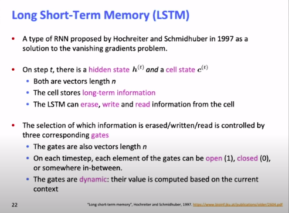

For each step t, there is a

- **hidden state** $h^{(t)}$ 
- **cell state** $c^{(t)}$ 
- Both **vectors** of length $n$

The LSTM can **erase**, **write** and **read** information from the cell

Each of the erase, write and read operation is controlled by a unique **gate**

- The gates are **vectors** of length $n$
- On each time step, each **element** of the gates has a range of $[0, 1]$ where 1 indicates **open** and 0 indicates **closed**
- The gates are **dynamic** (i.e. have different values based on the context)

****

### **<u>LSTM Equations</u>**

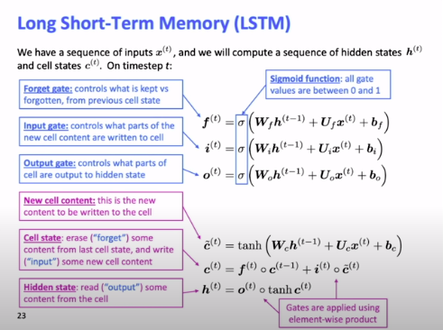

**Forget gate** is responsible for **erasing** as it tells which part of the previous **cell state** to forget and which to be taken into account in **current cell state**.

**Input gate** is responsible for **writing** as it tell which part of the **new cell content** to pass into the **current cell state**

- $c^{(t)} = f^{(t)} \cdot c^{(t-1)} + i^{(t)} \cdot \tilde c^{(t)}$ --- **Forget & Input** gates

**Output gate** is responsible for **reading**  as it determines which elements from the **current cell state** passes over to the current **hidden state**.

- $h^{(t)} = o^{(t)} \cdot tanh(c^{(t)})$  --- **Output** gate

****

### <u>LSTM and  Vanishing gradient</u>

The LSTM architecture makes it **easier** for the RNN to **preserve info over many timesteps**

- e.g. if the forget gate is set to remember everything on every time step, then info is preserved **indefinitely**
- By contrast it's harder for vanilla RNN to learn recurrent weight matrix $W_h$ that preserves info in hidden state.

LSTM doesn't guarantee that there is no **vanishing/exploding** gradient, but it provides an easier way for the model to **learn long-distance dependencies**

****

## <u>GRU RNN</u>

GRUs try to do the same thing as LSTMs but with less complexity

- Like the LSTM, GRU uses **gates** to control the flow of information.

- However, for each time $t$, The GRU has only an **input $x^{(t)}$** 

  and a **hidden state** $h^{(t)}$

- GRUs **don't** have a **cell state** $c^{(t)}$

****

### **<u>GRU Equations</u>**

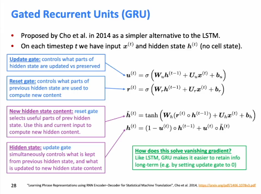

**Update gate** controls what parts of hidden state are update vs preserved (i.e plays the role of both the **forget** and **input** gate in the LSTM)

$h^{(t)} = (1 - u^{(t)}) \cdot h^{(t-1)} + u^{(t)} \cdot \tilde h^{(t)}$ ---- In GRU, there's a trade off between how much you remember from last hidden state and how much you take from this one as they are both a function of $u^{(t)}$. Unlike LSTM where each one of these are independent.

**Reset gate** determines which part of the previous gate is useful or not

 $\tilde h = tanh(W_h (r^{(t)}\cdot h^{(t-1)})\ +\ U_hx^{(t)} + b_h)$

****

## <u>LSTM vs GRU</u>

- There are many other proposed **gated RNN** variants, but **LSTM** and **GRU** are the most widely-used
- The biggest difference is the  **GRU** is **quicker to compute** and has **fewer** **parameters**.
- There is **no conclusive evidence** that one consistently performs better than the other
- **LSTM** is a **good default choice** (especially if your data has particularly **long dependencies**, or you have **lots of training data**)
- **Rule of thumb**: start with LSTM, but switch to GRU if you want **more efficiency**

****

## <u>Vanishing/exploding gradient in DL</u>

This problem occurs not only in RNNs, but all **neural architectures** like **CNNs** and **feed-forward NN** (especially **deep** ones).

- Due to the **chain rule** / choice of **nonlinearity function**, gradient can become very small as it **backpropagates**
- Thus **lower layers** are learnt very slowly (hard to train)
- **Solution**: lots of new deep feed-forward/convolutional architectures **add more direct connections** (thus allowing the gradients to flow)

Vanishing/exploding gradients are a general problem in DL, However **RNNs are particularly unstable** due to the repeated multiplication by the **same weight matrix**

### <u>Examples for direct connections</u>

#### <u>**ResNet**</u>

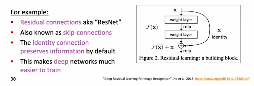

The people who wrote the **ResNet** paper found that sometimes **shallow NNs** perform better than **deep NNs** due to how hard deep NNs are to train which was solved by **Residual connections**

****

#### **<u>DesnseNet</u>**

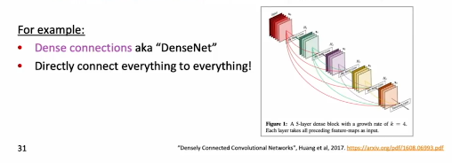

**Empirically**, these have proved to work better than **ResNets**

****

#### **<u>HighwayNet</u>**

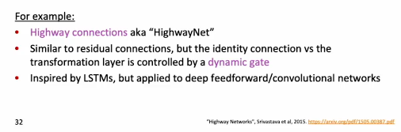

****

## <u>Bidirectional RNN</u>

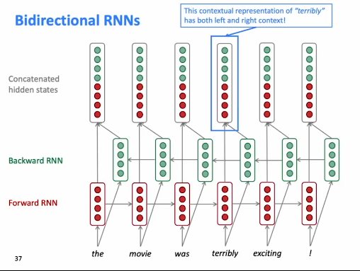

This is an inflated diagram of how Bidirectional RNNs work and this isn't used a lot in explanations due to it's large size

****

### <u>**Bidirectional RNN Equations**</u>

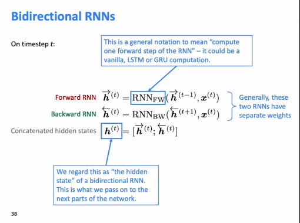

Sometimes, FWD and BKWD RNN share the same weights but this is very rare.

****

### <u>Bidirectional RNNs: simplified diagram</u>

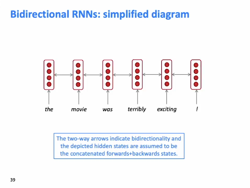

This is the common diagram that is used when referring to a bidirectional RNN. 

****

**Question**: Are the fwd and backward trained separately or at the same time ?

**Answer**: They are trained at the same time

****

### <u>Using Bidirectionality in RNNs</u>

- Bidirectional RNNs are only applicable if you have access to the **entire input sequence**
  - e.g. Not applicable to language modeling as you only have the left context in that case
- If possible, the **default** should be that you use **bidirectional RNNs** as it is **powerful**
- For example, *BERT* (**Bidirectional** Encoder Representation from Transformers) is a powerful pretrained contextual representation system **built on bidirectionality**

****

## <u>Multi-layer RNNs</u>

Applying multiple RNNs after each other.

- This allows the network to compute more **complex representations**.
  - The **lower RNNs** should compute **lower-level features**(like keeping track of syntax) and the **higher RNNs** should compute **higher-level features** (semantics)
- Multi-later RNNs are also called **stacked RNNs**

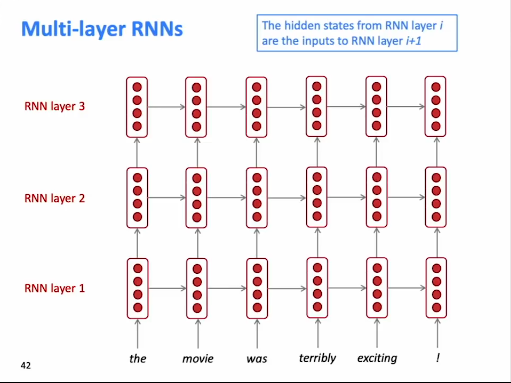

#### <u>**Order of computation**</u>

It can go multiple ways, pyTorch does computation for **RNN layer 1** then 2 then 3 but you could go vertically as well. (unidirectional RNN)

For Bidiretional RNNs, you can only go horizontally.

****

### <u>Multilayer RNNs in practice</u>

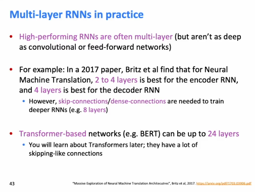

RNNs can't be deep as they have to be computed sequentially not in parallel so having a lot of layers adds up and slows computation.

****

## **<u>Practical takeaways</u>**

1. **LSTMs** are more **powerful** but **GRUs** are **faster**
2. **Clip** your gradients
3. **Use bidirectinality** when possible
4. Multilayer RNNs are powerful, but you might need **skip/dense** connections if it's deep

****

