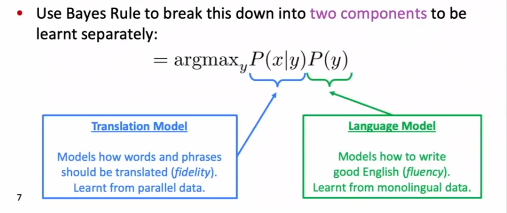
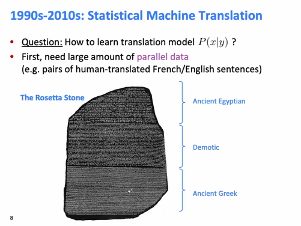
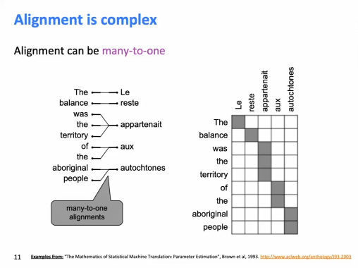
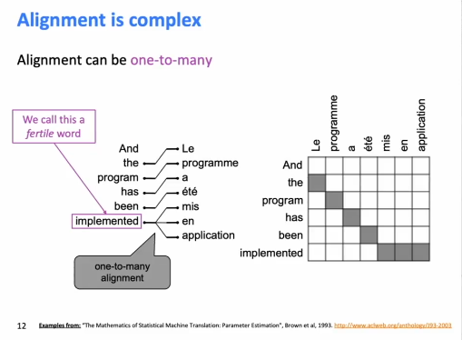
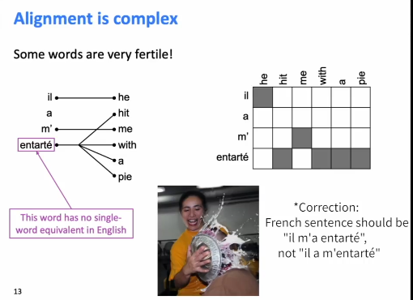
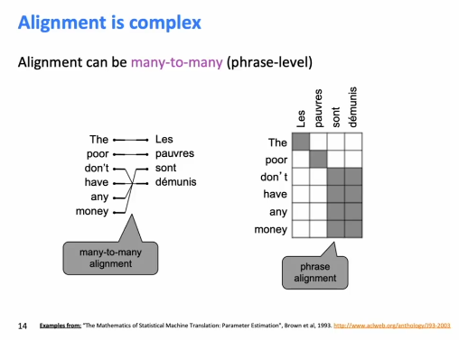
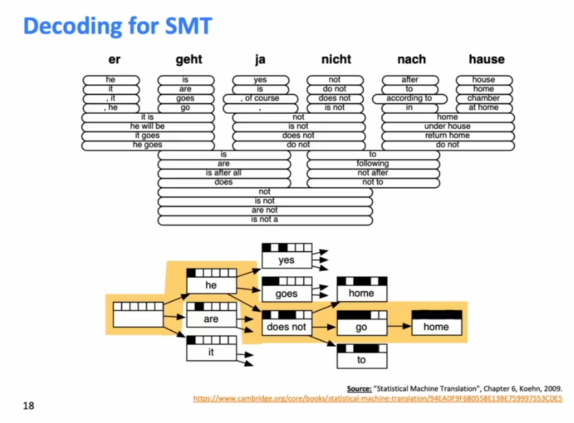
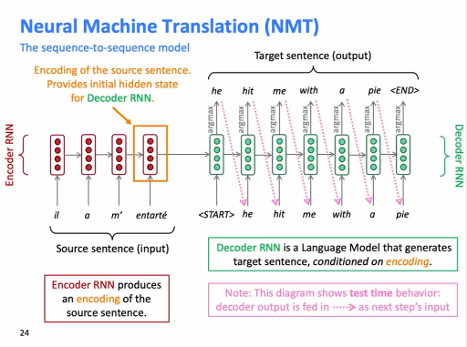
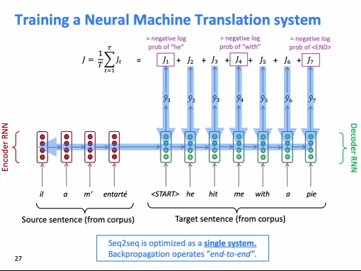

# <u>**L8_CS224n**</u>

## **<u>Machine Translation (MT)</u>**

It is the process of changing a sentence from the **source** language into the **target** language

****

### <u>**History of MT**</u>

#### <u>**Lookup Tables**</u>

In older days, MT was all about rule based systems which was basically a lookup table where source language and target language dictionaries were stored.

****

#### **<u>Statistical Machine Translation</u>**

- **Idea**: Learn a **probabilistic model** from **data**
- Assume translation is **French -> English**
- **Goal**: find the **best english sentence** $y$, given **french sentence** $x$ $argmax_yP(y|x)$

The task is divided into two models, so that each model can focus more on a specific task

****

#### **<u>How to learn translation model $P(x|y)$ ?</u>**

##### <u>Learning translation model $P(x|y)$ from the parallel corpus.</u>

We break it down further into $P(x,a|y)$ where $a$ is the **alignment**

**Alignment**: word-level correspondence between French sentence $x$ and English sentence $y$

****

##### <u>What is alignment ?</u>

Alignment is the **correspondence between particular words** in the translated sentence pair.

Notice that the word **Le** in French has no counterpart in English.

The word **Le** is called a **spurious word** because it has no counterpart in English.

****

###### <u>**Many-to-One Alignment**</u>

###### **<u>One-to-Many Alignment</u>**

The word **implemented** is called a **fertile word** because it maps to more than one word.

###### <u>**Many-to-Many Alignment**</u>

This is called **Phrase-level translation**.

****

##### **<u>Learning alignment for SMT</u>**

We learn $P(x,a|y)$ as a combination of many factors, including:

- Probability of particular words aligning (also depends on position in sentence)
- Probability of particular words having particular **fertility** (# of corresponding words)
- etc..

****

##### **<u>Decoding for SMT</u>**

###### **<u>How to compute $argmax_y P(x|y)P(y)$ ?</u>**

- Computing the probability of every possible $y$ and getting the max (**Too Expensive**)
- **Answer**: use a **heuristic search algorithm** to **search for the best translation**, discarding hypotheses that are too low-probability
- This process is called **decoding**

****

##### **<u>Statistical Machine Translation</u>**

SMT was a **huge research field**

The best systems were **extremely complex**

- Systems had many **separately-designed subcomponents** (we only discussed two)
- Lots of **feature engineering**
  - Need to design features to capture particular language phenomena
- Require compiling and maintaining **extra resources**
  - Like **tables of equivalent phrases**
- Lots of **human effort** to maintain
  - Repeated effort for each language **pair**

****

## <u>**Neural Machine Translation**</u>

**Neural Machine Translation (NMT)** is a way to do MT with a single neural network. The architecture used for this is called **sequence-to-sequence**(aka **seq2seq**) and it involves **two RNNs**.

The two RNNs are called **encoder** and **decoder RNNs**.

The decoder RNN is a **conditional RNN**. It is conditioned based on the last hidden state $h^{(T)}$ of the **encoder RNN** which is fed to the **decoder RNN** as the **hidden state** $h^{(0)}$.

Each language requires a separate **word embedding**.

Keep in mind that this is the test time behaviour.

- At test time, the output of the decoder RNN at time $t ,\ y^{(t)}$  is fed as an input for the next timestep (i.e. $x^{(t+1)} = y^{(t)}$)

****

## <u>Sequence-to-sequence is versatile !</u>

Seq2seq is useful for **more than just MT**.

Many NLP tasks can be phrased as seq2seq

- **Summarization** (long text -> short text)
- **Dialogue** (previous utterances -> next utterance)
- **Parsing** (input text -> output parse as sequence). This might not be the best option but an option nonetheless.
- **Code generation** (natural language -> Python code)

****

## <u>NMT Recap</u>

The **sequence-to-sequence** model is an example of a **Conditional Language Model**

- **Language Model** because the decoder is predicting the next word of the target sentence $y$

- **Conditional** because its predictions are condition on the source sentence $x$

- NMT directly calculates $P(y|x)$

  $P(y|x) = P(y_1|x)P(y_2|y_1,x)P(y_3|y_1,y_2,x)......P(y_T|y_1,y_2....,y_{T-1},x)$

****

## <u>Training a Neural Machine Translation system</u>

**N.B.** unlike the test time, where the output in timestep $t$ is fed to the input in step $t+1$When training, the input to the **decoder RNN** is the correct sentence in the target language.

Sometimes, if the sentences don't have the same length. We pad the sentences with zeros to match the largest sentence in the corpus. But make sure not to use any hidden state that came from paddings.

We train the model end-to-end to make sure that the two RNNs work well together. as by doing that you are more sure that the two models work well together which results in **optimizing the model as a whole**.

There is research being done in training a general encoder for each language. (i.e. having a general English encoder and 2 general French and Arabic decoders. If that is achieved, this would allow us to mix and match. English Encoder -> Arabic decoder or Same English encoder -> French decoder and both would work)

****

## <u>Greedy decoding</u>

Since the decoder outputs a PMF of all the vocabulary indicating which word is more likely. Greedy decoding takes only the most likely path.

The problem is that there's no way to know which path is most likely unless you take all of them (which is not feasible $O(|V|^T)$)

****

## <u>Beam search decoding</u>

****

## <u>Advantages of NMT</u>

compared to SMT, NMT has many **advantages**

- Better **performance**
  - More **fluent**
  - Better use of **context**
  - Better use of **phrase similarities**
- A **single** neural network to be optimized **end-to-end**
  - No subcomponents to be **individually optimized**
- Requires much **less human engineering effort**
  - No feature engineering
  - Same method for all **language pairs** (same architecture but different data)

****

<u>**Disadvantages** compared to SMT</u>

- NMT is **less interpretable**
  - **Hard to debug** (while SMT is also not very interpretable, it is atleast kind of interpretable (more than NMT))
- NMT is **difficult to control**
  - You can't easily **specify rules or guidelines** for translation
  - Safety concerns (can't expect what the model will say)

****

 