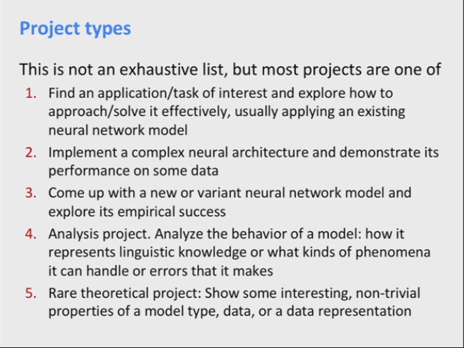

# <u>**PracticalTips**</u>

## <u>**Finding Research Topics**</u>

There are **two basic starting points**, for all of science

-  **Nails**

  Start with a **(domain)** problem of interest and try to find good/better ways to address it than are currently known/used.

  **i.e**. Try to improve **machine translation**

- **Hammers**

  Start with a **technical approach** of interest, and work out good ways to **extend** or **improve** it or **new ways to apply it**.

  **i.e**. Trying to use different activation function for LSTM or Applying LSTM in a new domain

****

## **<u>Research Project Types</u>**

****

## <u>Interesting places to start</u>

- ACL anthology for NLP papers

  https://aclanthology.info

- Major ML conferences

  NeurIPS, ICML, ICLR

- Past cs224n projects

- Paperswithcode and arxiv and arxiv-sanity

- Real world problems

****

## <u>Must-haves</u>

- Suitable data
- Feasible task (can be done by humans)
- Automatic evaluation metric

****

## <u>Doing your research: example</u>

1. **Define Task**

   Example: **Summarization**

2. **Define Dataset**

   1. Academic datasets (already has baseline)
   2. Define your own data (need to create a baseline)

3. **Dataset hygiene**

   Split data to test, dev, train

4. **Define your metric(s)**

   Check if there is already a metric for this

5. **Establish a baseline**

   1. Implement the simplest model first
   2. test the model
   3. try a more complex and improve

6. **Implement existing neural net model**

7. **Always be close to the data**(Except the final test set)

   - Visualize dataset
   - Collect summary statistics
   - Look at errors
   - Analyze how different hyperparams affect performance

8. **Try different models and model variants**

   Make sure to have a setup where it is easy to change models.

****

## **<u>work incrementally</u>**

Run first on a small amount of data to be able to iterate quickly

****

Models should be able to get close to 100% and it is normal to overfit the data and get nearly 100% acc and then regularize.

****