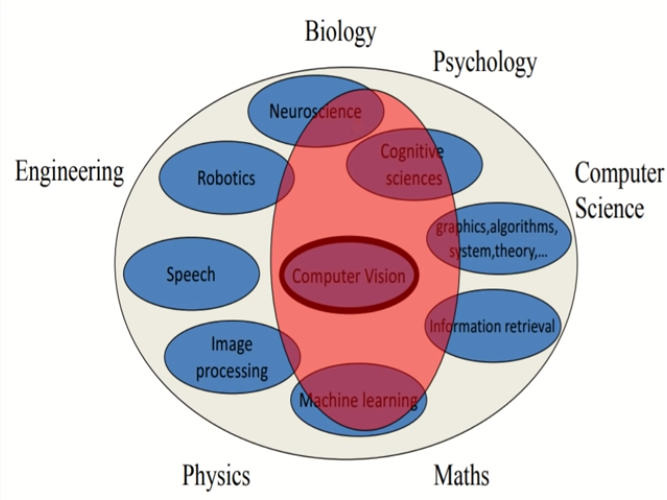
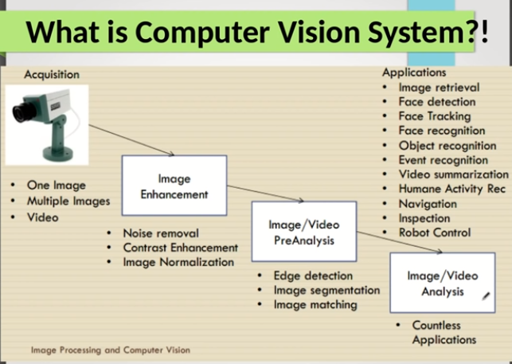

# **<u>L1_Image Processing</u>**

| P.O.C          | Image Processing | Computer Vision              |
| -------------- | ---------------- | ---------------------------- |
| **Definition** | Process an image | Try to emulate human vision  |
| **Input**      | Image            | Image, Image Sequence, Video |
| **Output**     | Image            | Decision, Classification     |

**Image Processing** is a **part** of the **CV Pipeline**.

****

## **<u>Computer Vision Pipeline</u>**

There are common stages of a CV Project 

1. Acquisition
2. Image Enhancement (Noise removal, Contrast Enhancement, Image Normalization)
3. Image Pre-Analysis (Edge detection, Image segmentation, Image matching)
4. Applications

****

## **<u>Color Models in Images</u>**

### **<u>RGB</u>**

While this is the one traditionally used. Some applications are easier to work with if you have a different color model.

To get the other **color models**, there is a **conversion equation** from RGB to each model

****

### <u>HSV</u>

[HSV](http://en.wikipedia.org/wiki/HSL_and_HSV) **separates** *luma*, or the image intensity, from *chroma* or the color information.

Stands for **H**ue, **S**aturation, **V**alue. Sometimes **HIS** for **H**ue,**I**ntensity, **V**alue.

**Hue**: An angle from $0^\circ \ \text{to} \ 360^\circ$  that tells you which color are you on

**Saturation**: The amount of color

**Value**: The brightness of the color

****

## **<u>Traditional Data Structures for Images</u>**

### **<u>Matrices</u>**

Type of images represented by matrices

1. **Binary Images**: each pixel is **1-bit** and has two colors (white and black)
2. **Gray scale Images**: Typically **8-bits** that has values from 0-255
3. **Multi-spectral(Color) Images**: Similar to RGB Images

#### **<u>Global Information derived from images in matrices</u>**

##### **<u>Histogram</u>**

****

