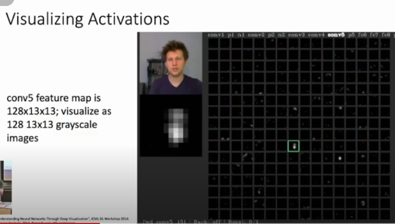
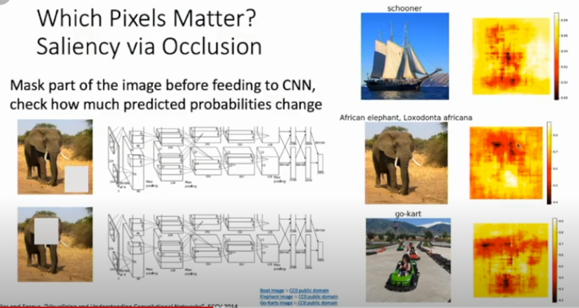
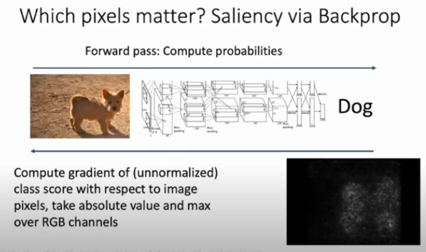
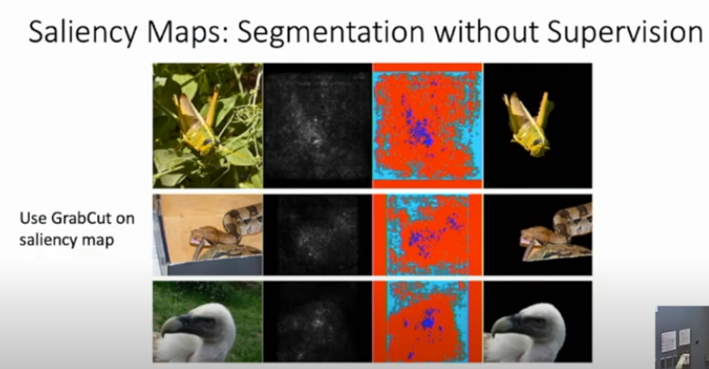

[toc]

# L14-Visualizing-and-Understanding

# Michigan DL for CV

# Visualizing CNN Layer

The first layers in CNN can be easily visualized as images.

## First Layer

**AlexNet**: $64 \ \times \ 3 \ \times \ 11 \ \times \ 11 $ 

**ResNet & DenseNet**: $64 \ \times \ 3 \ \times \ 7 \ \times \ 7 $ 

So there are $64$ filters that have 3 color channels, of size $7 \ \times \ 7$ 

- Can be visualized as **RGB** Images

****

## Second Layer

Has size of $20 \ \times \ 16 \ \times \ 7 \ \times \ 7 $

so we have 20 filters with 16 channels each of size $ 7\ \times \ 7$.

- Can visualize each channel in each filter as an independent  $ 7\ \times \ 7$ gray scale image
- This means we have $ 20 \ \times \ 16$ gray scale images to see.

As we go to higher layers the channel begin to have less meaning to humans.

****

## Last Layer

- Most if not all CNN Architectures consist of Convolutional layers then a FC layer.

- If we take the output of the conv layers which in **AlexNet** is a 4096-dimensional vector. We can play around with it.

- The 4096-dim vector is how the encoding of the image by the CNN.

- Thus, for cat images, the CNN will produce encodings similar to each other. These encoding represents  the "cattiness" of the photo.

When mapped to a 4096 dimensional space, Images of similar things are closer to each other, regardless of the color and other image features.

### Dimensionality Reduction

- After mapping Images to 4096-dims, you can apply **t-SNE or PCA** to lower the dimension to two
- Two dim are easily visualized and understood by us.

****

# Visualizing Activations

- You could visualize the activation functions after the cnn to see which values are non zeros.
- The non zero values indicate which part of the image does the cnn detect/focus on.
- You can see in the image above, The pixels where the face exists are the ones that light up.

****

- You can also pass all train images and pick a certain activation, and see for that activation which images make it have the maximum value.

****

# Which pixels matter in an image ?

## Saliency via forward prop

- You basically "whiten" parts of the image and see how the probabilities change
- If you whiten the face of the elephant, probability is expected to decrease.
- If you whiten the ground nothing is expected to change.

****

## Saliency via Backprop

- This indicates that if the pixels of the dog change, it will affect the prediction (non zero grad).
- While the non dog pixels have zero grad (i.e. doesn't affect the final prediction)
- Doesn't always work as nice as this.

****

# Saliency Maps: Segmentation w/o supervision

****