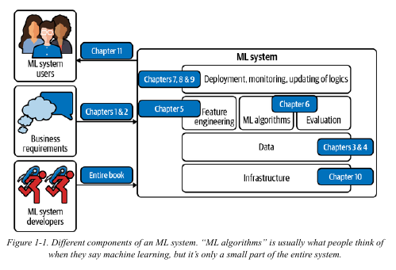

[toc]

# Machine Learning Systems in Production.

## ML System
 

- A ML System involves all these parts.
- Most books focus only on the Algorithms part of the system and leave the rest.
  - This book won't focus that much on algorithms but will help to understand the system as a whole.
- Due to the speed at which models are deployed, the challenges are sometimes not always understood, let alone addressed.
  - The failure to address these problems can lead to huge problems.

## When and when not to use ML ?

### When to use ML ?

- ML is an approach used to  (1) learn (2) complex (3) patterns from (4) existing data and use these patterns to make (5) predictions on (6) unseen data

#### Complex

- Always make sure that the pattern you're trying to learn is complex enough to need an ML algorithm.
  - If there is a non ML solution it might even be better for the problem.

#### Patterns

- Make sure that there is a pattern to learn.
  - Some outputs are random and no matter how much data or computational power you have they can't be learned
  - e.g. a company that spends money to predict the output of a fair die.

- There might be a pattern in the data even if your model can't capture it.

#### Existing Data

- We have to make sure there is enough data, or atleast **a way to collect data**.
### Good characteristics for ML Projects

- Due to the way most ML algorithms learn, ML will shine if you have the following characteristics.

#### Repetitive

- Repetitive tasks are easier for machines to learn.

#### It's at scale

- Since ML is expensive (team and computation wise), it's better if the model will make a lot of predictions.

#### Changing Patterns

- If the patterns don't change (vary) a hardcoded solution would be sufficient, without the need for ML.

----------

### When not to use ML

- Don't use ML if 
  1. Unethical
  2. Simpler solutions do the trick
  3. One single error can cause devastating consequences
  4. Not cost effective
- However, If ML can't solve your problem, it might be possible to break your problem into smaller components and use ML to solve some of them

----------
## Understanding ML Systems

### ML in research vs production

- Most people get their ML knowledge from academia (courses/research/papers)
- There are major differences between ML in research and in production

|      | Research    | Production    |
|---------------- | --------------- | --------------- |
| **Objectives**     | Model Performance    | Different **stakeholders** have different objectives    |
| **Computational priority**     | Fast training, high throughput    | Fast Inference, low latency    |
| **Data**    | Static   | Constantly shifting   |
| **Fairness** (Non Biased Model) | Good to have | Important |
| **Interpretability** | Good to have | Important |

#### Stakeholders and their objectives

- In research and leaderboard projects, there is often **one single objective**.
  - The most common objective is **model performance**.
  - To get the highest model performance, researches often make models too complex to be useful.

- In production, there are many stakeholders involved in bringing an ML system into production, each with their own objective.

##### Example

- Consider a project that **recommends restaurants** to users.
- The project involves
  1. ML engineers
  2. Salespeople
  3. Product Managers
  4. Infrastructure engineers
  5. Manager

- Each of them will have a different goal
  - ML engineers
    - Wants the model to recommend restaurants that users will most likely order from.
    - They will want a more complex model with more data.
  - Sales team
    - Wants the model to recommend restaurants that pay the **highest advertising fee** to be shown in app.
    - As ads bring more revenue than just service fees.
  - Product managers
    - They notice that every drop in latency leads to drop in orders through the service, so they want a model that can do **inference faster than the current model**.

  - Infrastructure team
    - They want deployment to stop so that they can update the infrastructure.

  - Manager
    - Wants to maximize the margin (even if it means letting go of the ML team)

- Each objective requires a different model, so they all to collaborate in order to satisfy all teams. 
- Different objectives in production is the reason that successful research projects might not work in production.
  - An example of this is Ensemble models which might add 0.2% accuracy at the cost of latency which might not be worth it in production.

----------

- This is also why people often criticize leader-board projects and kaggle competitions
  - A lot of the work is already done for you (collection and objectives).

----------

#### Computational priority

- In research, people prioritize training as you run training multiple times but run tests once.
  - So in research, the bottleneck is training

- In production, once the model is deployed, the job is to do inference.
  - So inference is the bottleneck in this case.

----------

#### Bias

"ML models don't predict the future, they encode the past".
- This refers to the bias in the model due to the data it was trained on.

----------

