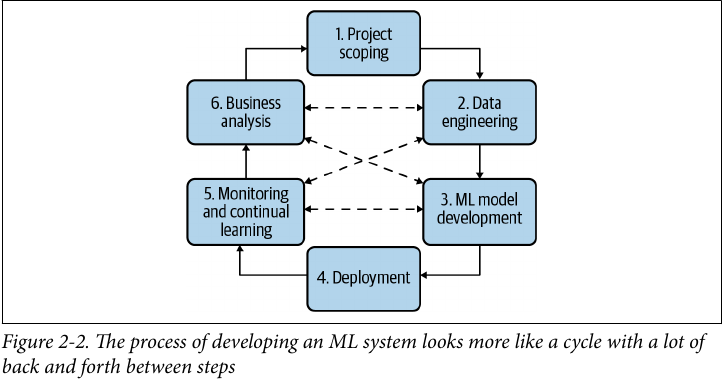
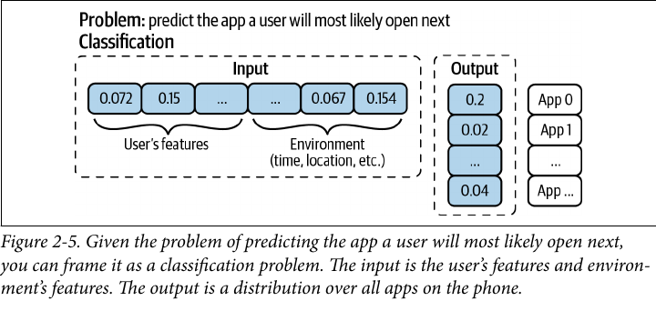
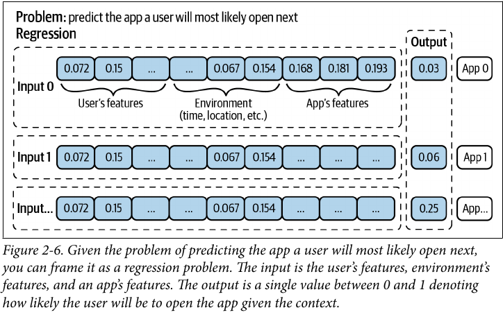

[toc]

----------

# Introduction to ML Systems Desgin

- This chapter will show case how we would think about designing a ML system.

## Chapter Outline

1. Discuss System **Objectives** and translate them into **ML Objectives**.
2. Set **requirements** for project development. (reliability, scalability, maintainability, adaptability)
3. Frame all the above into a problem that ML can solve
4. Start working on the ML part of the problem.

----------

## Business & ML Objectives

- The metric you track must be tied to the business objective in someway.
- e.g. It doesn't matter if you have 94% or 94.2% accuracy, unless it affects the business objective positively.
- e.g. In Netflix, they created something called the **take-rate** which is the $\frac{\text{Number of quality plays}}{\text{Number of recommendations a user sees}}$.
  - It was found that thehigher the take-rate the more streaming hours and lower cancellation rates by user.

- Some companies try things like A/B tesing and choose the best model based on the business objective despite of what the ML metrics say.

### Requirements for ML Systems
- Most systems have these 4 characteristics
  1. Reliability
  2. Scalability
  3. Maintainability
  4. Adaptability

#### Reliability

- The system should perform the correct function at the desired level of performance
- The problem is that ML fails silently, how would you know if a prediction is wrong if we don't have a ground truth to compare it with?

#### Scalability

- As your system grows, you'll find that you need more and more resources to serve people.
- Modern cloud services have automatic scaling, i.e. increasing the number of servers as the load increases.
- Another problem is that sometimes, the number of models increase, so your way of model management must be automatic as you can't monitor and retrain 100+ models manually.

#### Maintainability

- Maintainability is often ignored in ML unlike in software engineering.
- It's important to set up your infrastructure in a way that different contributors can work together and hand each other's work.
- This includes code documentation, code and data versioning.
- Models should be reproducible so that even when the original authors aren't around, other people can work on the model.

#### Adaptability

- Model should have some capacity to discover aspects for performance improvements and allowing updates without **service interruption**.
- As ML systems are part code and part data, and data can change quickly, so system should be able to quickly evolve.

----------

## Iterative Process of ML development

1. Project Scoping
    - Set up goals and objective and constraints
    - This phase involves stakeholders
    - Estimate and allocate resources
    - Structure and organize teams for the project
2. Data Engineering
    - Handling data from different sources and formats
3. ML Model Development
    - Training data should now be ready.
    - We'll extract features and develop initial models
4. Deployment
5. Monitoring and continual learning
6. Business Analysis

----------

## Framing ML Problems

### Classification vs Regression

#### Hierarchical Classification

- A form of classification used when you have many classes.
- You don't do the classification on one step, but for example you first classify the image as fashion or furniture, then you classify the image as a specific type of fashion or furniture.

----------

### Example on Framing ML Problems

- We are trying to predict which app is the user going to use next.
- A naive setup would be a **multiclass classification task**.
- Using the user's and environemnt's features as input, we output a probability distribution for every single app on the phone. (assuming there are $N$ apps)
- This is **bad** as with every app added, you might have to retrain the whole model from scratch, or atleast the parts that depend on $N$

- A better way to frame this would be a **regression problem**, where the input is the user's and environment's features and the app features.
- The output would be a value between 0 and 1. the higher the value, the more likely the user is to use that app.
- Now when you add a new app, you need to only change the type of encoding of the app features, and not the whole model.

----------
### Objective Functions

TLDR; Decoupling in the case of multiple objectives should happen before training the model.
- When dealing with multiple objective functions.
- Imagine that you're building a system to rank items on users' newsfeeds. The original goal is to maximize users' engagement, which is achieved through the following three objectives.
  1. Filter out spam
  2. Filter out NSFW content
  3. Rank posts by engagement: how likely users will click on it.

- The problem is that optimizing for engagement only will lead to ethical concerns as system will learn to prioritize extreme content which gets moreclicks.
- So to solve this we add two new objectives
  1. Filter out spam
  2. Filter out NSFW
  3. Filter out misinformation
  4. Rank posts by quality
  5. Rank posts by engagement

- There is a problem with the criteria above, two objectives are in conflict with each other. A post might be engaging but is of questionable quality.
- We create an objective function that combines all the objectives into one.

  $L = \alpha Loss_{engagement} + \beta Loss_{quality}$ 
    and train the model to optimize this function.
- We can try out different values of $\alpha$ and $\beta$ to see which one works best.
- The problem with this approach is that to change $\alpha$ and $\beta$ we need to retrain the model.

- Another approach is to train two models, one minimizng $Loss_{engagement}$ and the other minimizing $Loss_{quality}$.
- We would have $quality\_model$ which predicts the quality of each post and $engagement\_model$ which predicts the number of clicks on each post.
- Then we can tweak $\alpha$ and $\beta$ without retraining the model.