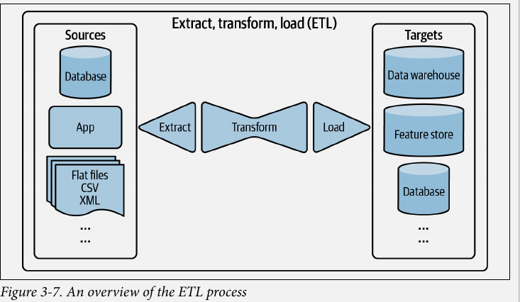
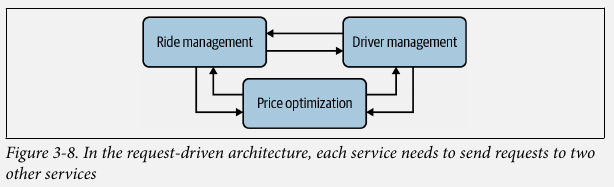
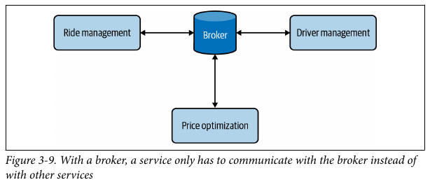
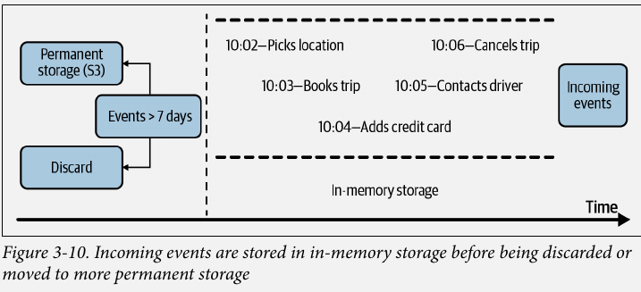

# Data Engineering Fundamentals

## Data Sources

### User Input

- One way of getting your data is user input

- A general rule is that "If it is even remotely possible for users to input wrong data, they are going to do it"

    - If you let them upload files, make sure to check the file format.
  
- Users also have little patience, in most cases, when we input data, we expect the results immediately
  - Therefore, user input tends to require fast processing

****

### System-generated data

- Given by different components of the system, e.g. logs and system outputs (like model predictions)
****

- **Logs** can be generated quickly and frequently which comes with **two problems**:
    1. Too many logs give too many signals, so you won't know which signals are relevant to your system
    2. Where will you store that many logs ??
       - Logs can be stored in low access-frequency storage systems which less costly than normal storage. 

****

### Internal Databases

- No new info

****

### Third-party data

- First-party data is the data that your company already collects about your users or customers
- Second-party data is the data collected by another company on their own customers that they will make available to you
- Third-party data companies collect data on the public who **aren't their direct customers**

****

## Data Formats

- Storing your data isn't always straight forward, you have to think about some stuff
  1. How will that data be used in the future ?
  2. How do I store **multimodal data** ? (e.g a sample containing an image and text)
  3. Prioritize reading speed vs writing speed ?
  4. Where do I store my data so that it is cheap and still fast to access
  5. How do I store complex models so that they can be loaded and run correctly on different hardware ?

****
**Data Serialization**

  - The process of converting a data structure or object state into a format that can be stored/transmitted and reconstructed later

****

- Common features to think about are Format, Binary vs Text, is it Human-readble? .

| Format | Binary/Text | Human-readable | Example use cases|
|--|--| --- |--|
|JSON|Text| Yes| Everywhere|
|CSV|Text| Yes| Everywhere|
|Parquet|Binary| No| Hadoop, Amazon Redshift|
|Avro|Binary primary| No| Hadoop |
|Protobuf|Binary primary| No| Google, TF(TFRecord)|
|Pickle|Binary| No| Python, Pytorch Serialization|

### JSON

- It is relatively hard to change the schema of json files across a dataset.
- They also take a lot of space

****
### Row-Major vs Column-Major format

- Some data formats are row major and some are column major.
- Pandas DataFrames and Parquet Files are column major
- NumPy and CSVs are row major

****
### Text vs Binary Format

- No new info
****

## Data Models

- No new info
- Discusses relational vs NoSQL databases (graph and document based dbs)

****

## Structured vs Unstructured data

- It is hard to properly plan your **structured** data, as business requirements change over time.
- **Unstructured data** do have some structure to them, as we need that to read the data later on
  - However, you can change the structure.
  - e.g. a text file that has each line consisting of `name, number` is still unstructured data as you can add a new line not following the same pattern, unlike a relational db.

|Structured Data| Unstructured Data|
|---------------|-------------------|
|Schema clearly defined| Might have a schema but doesn't have to follow it|
|Easy to search and analyze| Fast Arrival|
|Can handle data with specific schema| handles data from any source|
|Schema changes will cause a lot of trouble| Worry about change to schema is **shifted to the downstream application** that uses this data|
|Stored in **data warehouses**| Stored in **data lakes**|

****

## Data Storage Engines and Processing

Storage Engine = database

- There are two types of workloads that databases are optimized for:
  1. Transactional processing
  2. Analytical processing

- We'll also cover ETL (Extract, Load, Transform)

****

### Transactional and Analytical Processing

#### Transactional DBs

- A transaction in the digital world refers to any type of action: tweeting, ordering a ride through uber-like application... etc
- These transactions are inserted as they are generated, and occasionally updated, or deleted when they're no longer needed.
  - This type of processing is known as Online Transaction Procesing (OLTP)
- As these transactions involve users, they need to be processed fast (low latency), be highly avilable (so user can make a transaction at any time)
- Transactional DBs are designed to **process online transactions** and satisfy the **low latency** and **high availability** requirements.

- **N.B.** ACID refers to  Atomicity ,Consistency, Isolation, Durability

- Not all transactional DBs need to be ACID, as some developers find ACID to be **too restrictive**
  - Systems that don't meet the ACID criterial are sometime called **BASE** (Basically Available, Soft state, Eventual consistency)

- As each transaction is processed separately, transactional DBs are **row-major**, so they are not suitable for questions like "what is the average price for all the rides in san francisco?"
  - For that we need an **analytical DB**

#### Analytical DBs

- They are efficient with queries that allow you to **look at the data from different view points**.
- Called **online analytical processing** (OLAP)

#### Recent Advances

- Both the terms **OLTP**, and **OLAP** have become **outdated**.
1. Due to the advancement of technology, we can now have transactional dbs that can handle analytical queries like **CockroachDB**, and analytical DBs that can handle transactional queries like **Apache Iceberg** and **DuckDB**.
2. In OLAP and OLTP, **storage** and **processing** are **tightly-coupled**
     - This may result in the same data being stored in multiple DBs and using different engines to solve different types of queries.
     - Compute is a new paradigm introduced in the last decade to **decouple** storage from processing which is adopted by many data vendors like **BigQuery**, **Snowflake**, and **IBM**
        - In this paradigm, data can be stored in the same place, with a processing layer on top that can be optimized for different queries 
3. "online" has become an overloaded term, that can mean different things
   - used to mean **connected to the internet**
   - Now **online processing** refers to **data is immediately available for ip/op**
****

## ETL vs ELT
### ETL: Extract. Transform, and Load

- ETL refers to the general pirpose of **processing and aggregating** the data into the format you want.

#### ETL Process

1. **Extract**
     - Getting the data from all your data source/**s**
     - Here you need to **validate** your data and reject data that doesn't meet your requirement
       - For **rejected data**, you might have to notify the sources of the error.

2. **Transform**
    - This is where **most of processing** is done.
      - Like joining data from different sources (e.g. source 1 uses "Male", "Female" and source 2 uses "M", "F")
    - You apply operations such as **transposing**, **de-duplicating**, **sorting, aggregating, deriving new features and more data validation**

3. **Load**
    - Deciding how often to load your transformed data to the target destination, which can be a **file, database or a data warehouse**

### ELT: Extract, Load, and Transform

- As data kept getting bigger, companies had this idea: "Why not store all data in a **data lake** and let the **application** that needs the data deal with the processing ?"

- This resulted in **ELT**, which is a paradigm that allows for the **fast arrival of data** since there's no processing before the data arrives
- However, as the **data** keeps on **growing**, this idea becomes **less attractive**
  - The application would need to search through a **massive amount of raw data** to get the data you want.

### ELT vs ETL in practice

- As companies weigh the pros and cons of storing structured vs unstructed data, vendors evolved to offer **hybrid solutions**
- These solutions combine the **flexibility** of the data lakes and the **data management** of data warehouses.
- Examples include **Databricks and Snowflake**, these are called **data lake-house solutions**
****

## Modes of Dataflow

- Discusses how to share data between different processes that **don't share memory**

- There are **three** main modes of dataflow
  - Data passing through **databases**
  - Data passing through services using **requests**
    - These request could be **REST** or **RPC** **APIs**
  - Data passing through a **real-time transport** like **Apache Kafka** and **Amazon Kinesis**

****

### Data passing through databases

- This is the **easiest** way of sharing data, where for two processes A & B, A can write to the database and B can read the data written by A.
- This doesn't work for **two reasons**
  1. Requires two services to be able to **access the same db** which is infeasible especially if the two processes are run by two different companies.
  2. Requires both processes to access data from databases
     - Reading and writing from databases can be **slow**, making it **unsuitable**  for apps with **strict latency requirements** e.g. almost all consumer-facing applications

****

### Data passing through services

- Different services can be part of the same application.
  - Structuring different components of your application as separate services allows each component to be **developed, tested and maintained independently of one anohter**.
    - This is called the **microservice architecture**

**Example on microservices**

- Imagine you're an ML engineer working on the price optimization problem for Uber, let's assume for simplicity that they only have 3 services

  1. **Driver management service**
    - Predicts how many drivers will be available in the next minute in a given area
  2. **Ride management service** 
    - Predicts how many rides will be requested in the next minute in a given area
  3. **Price optimization service** 
     - Predicts the optimal price for each ride
     - The price should be low enough for riders to be willing to pay
     - The price should be high enough for drivers to be willing to drive and for the company to make a profit.

- Each time a user requests a ride, we run the price optimization service which in turn takes input from driver and ride management systems to predict the optimal price.

- **N.B.** in practice, they would use some sort of caching, so that the services are queried only once per minute and the results are stored in some sort of cache until the next call.
 
****
#### REST vs RPC

- REST: REpresentational State Transfer
- RPC: Remote Procedure Call

Detailed analysis is beyond the scope of this book, but one major difference is that
  - REST was designed for **requests over networks**
  - RPC "tries to **make a remote network service look the same as a function call in the programming language**"

****

### Data passing through a real-time transport

- Imagine the Uber case above, but the 3 services were talking to each other instead of 1 service querying the other 2.

- As previously studied in Event-Driven programming, this causes a tight coupling, we need an interface between each service and the other in order to make the above setting work.

- This will only get worse as the number of services increase.

- To solve this, we use a **broker**.

- The broker is a **message queue** that allows for **asynchronous communication** between services.
- Technically, you could think of a database as a broker, but you'd face the problems discussed earlier
- So we use an **in-memory storage** for data passing among services.
- A piece of data broadcast to a real-time transport is called an **event**, and this is called **event-driven**.
  - The **real-time transport** is sometimes called an **event bus**

- **Request-driven** architecture works well for systems that rely more on **logic**, while **Event-driven** architecture works better for **data-heavy systems**

****
The two most common real-time transports are **pubsub** (short for publish subscribe), and **message queue**.

#### pubsub

- In the pubsub model, any service can publish to different **topics**
- Any service can subscribe to any topic to read the data published on it.
- A service that produces data doesn't care what other services consume their data.

- pubsub model often have a **retention policy**
  - Data will be retained in the real-time transport for a certain period (e.g. seven days) before being **deleted** or **moved to permanent storage**.

Examples:

  - **Apache Kafka**
  - **Amazon Kinesis**

#### message queue

- In a message queue model, an event often has **intended consumers**
  - an event with an intended consumer is called a **message**
- The message queue is responsible for **getting the message to the right consumer**.

Examples:
  - **Apache RocketMQ**
  - **RabbitMQ**

****

## Batch processing vs Stream Processing

- Once data arrives in data storage engines like DBs, data lakes, or data warehouses, it becomes **historical data** as opposed to **streaming data**.
- Historical data is often processed in **batch jobs**. (jobs kicked off periodically)

- Companies came up with distributed systems like **MapReduce** and **Spark** to process batch data efficiently.
****
- Data in **real-time transports** like Kafka is called streaming data
- Computations on streaming data can also be kicked off periodically, but the periods are usually much shorter that the periods for batch jobs (e.g. every five minutes instead of every day) or whenever the need arises (whenever a user orders a ride)
****

**Stream processing** when done right can give **low latency** as data is processed as soon as it is generated (no overhead of writing and reading from DBs).

- Many believe that stream processing is less efficient than batch processing as you can't leverage tools like MapReduce or Spark, but this is not always the case for **two reasons**
  1. Streaming technologies like **Apache Flink**  are proven to be **scalable** and **fully distributed**
  2. The strength of stream processing is in **stateful computation**
    - e.g. if you compute the average user engagement during a 30-day trial
      - Batch: You'll have to run this every day and do the computation for the last 30 days.
      - Streaming: Continue computing only the new data and joing it with the older computation preventing redundancy.

- As batch processing happens much less frequently than stream processing, it is often used to compute features that change less often.
  - **Batch features** : features extracted through batch processing aka **static features**
    - e.g. Driver rating (if driver has 10k ratings, a new one won't affect him)

  - **Streaming features**: features extracted through stream processing aka **dynamic features**
    - e.g. Median price of the last 10 rides in this area
****

- For many problems, you need **both** batch and streaming features, so your infrastructure needs to allow you to process streaming data as well as batch data and join them together to feed into your ML model.

- To do computation on data streams, you need a stream computation engine.
  - For simple streaming computation, you might be able to get away with the built-in stream computation capacity of real-time transports like Kafka, but Kafka is **limited in its ability to deal with various data sources**

- **Apache Flink** is a stream computation engine that can deal with various data sources and is **scalable** and **distributed**.
- Stream processing is more difficult because the data amount is unbounded and the data comes in at variable rates and speeds.
- It's easier to make a stream processor do batch processing than the other way around.
  - Apache Flink's core maintainers have been arguing for years that batch processing is a special case of stream processing.

****

