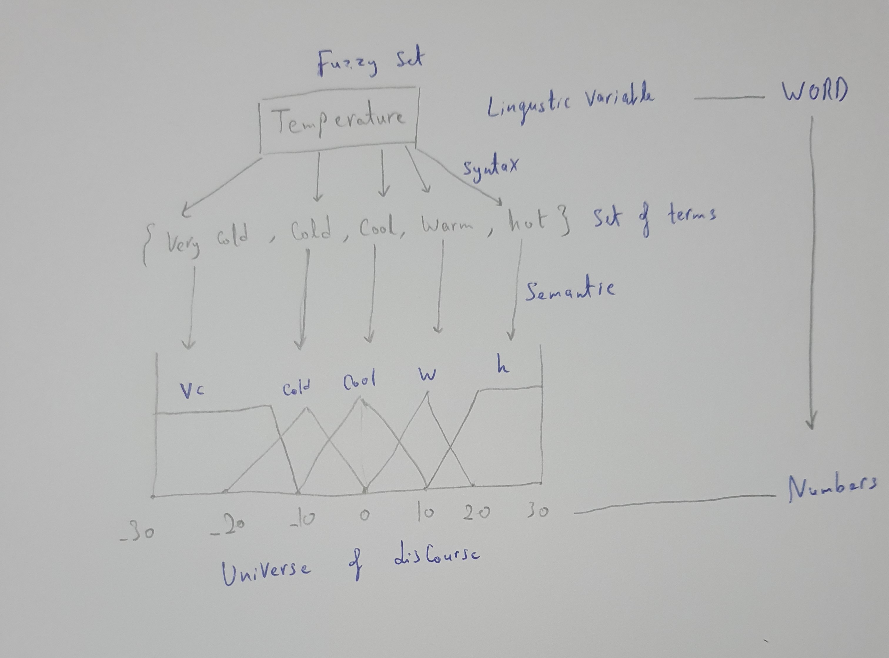

# **<u>Fuzzy Logic & Inference</u>**

### **<u>Definition</u>**

Fuzzy Logic : it means computing things with words.

The motivation behind this is that the language carries a lot of information in a very compressed way which we could greatly utilize.
$$
\text{Linguistic Variable} = \lt x , T(x),U,G,M\gt
$$
where 

- x : Variable name
- T(x) : Set of terms
- U : Universe of discourse
- M : Syntax Rules

Example:

Notice that the set of terms are odd number , you can add as much as you need but when you add other terms , you get a more complex system with more computation.

### <u>**Defining Fuzzy sets**</u>

When defining classical sets ( the one we know usually )
$$
A = \{ x | x\epsilon X \text{ and } x \text{ is } \Delta \}
$$
Where Delta is a certain property. ( x is a man or x is a woman).

Defining Fuzzy Sets
$$
A_{fuzzy} = \{(\,x,\mu_A(x)\,)\,| \,x\,\epsilon\, X ,\, \mu_A(x)\,\epsilon\,[0,1]\}
$$
$\mu_A(x)$ is called a membership function. It defines how much x belongs to A.

Since A is now a linguistic variable , we can modify its meaning.

Example : We say that a 40 year old belongs to old people set with a membership of 0.3 , while an 80 year old will belongs with a membership of 0.9. (values differ based on function)

------

### **<u>Using Results of  a fuzzy set</u>**

Assuming we know what $\mu_A$ is (e.g. old , bright , cold ..)
$$
\mu_A^{Conc} = Conc(A) = [ \,\mu_A(x)\,]^2 \\ \, \\
\mu_A^{Dil} = Dil(A) = [ \,\mu_A(x)\,]^{0.5}
$$

Conc stands for *Concentration* . i.e. cold -> very cold

Dil stands for *Dilation* . i.e. cold -> more or less cold

This enables us by just knowing $\mu_A$ to know a lot more like these examples.
$$
\mu_{very\,A} = Conc(A)\\
\mu_{\text{more or less A}}= Dil(A)\\
\mu_{very\,very\,A} = Conc(Conc(A))\\
\mu_{not\,very\,A} = 1 -Conc(A)\\
\mu_{more\,A} = A^{1.25}\\
\mu_{less\,A} = A^{0.75}\\
$$
There is a lot of vagueness of why is Conc raised to the power of 2 , or Dil to the power of half. Using any of the numbers depends on context and the problems at hand.(same with $\mu_{more\,A}\,\text{and}\,\mu_{less\,A}$) 

This means that we have **high degree of freedom**. This is expected because we are measuring human thought (linguistics) by using fuzzy logic. and no two people can agree how much hotter is more hot. so it all depends on perspective.

