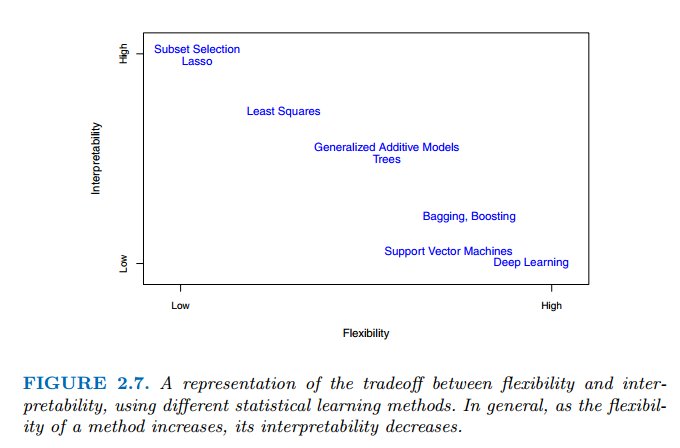
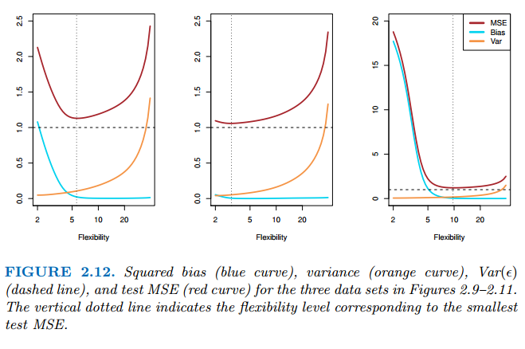

ISLR

[toc]

# Statistical Learning

# 2.1 What is Statistical Learning?

Assume we are trying to estimate $Y$ which is the number of sales for some company based on $x_1, x_2, x_3$ which are TV ads, Radio ads and Newspaper ads respectively.

- More generally, suppose that we observe a *quantitative response* $Y$ and $p$ different predictors,$X_1,X_2,....,X_p$.

- We assume there is some relationship between $Y$ and $X = (X_1,X_2,....,X_p$)$ which can be expressed in the very general form

  
  $$
  Y = f(X) + \epsilon
  $$
  

  Here $Y$ is some fixed but unknown function of $X_1,X_2,....,X_p$, and $\epsilon$ is a random *error* term, which is independent of $X$ and has mean zero.

  In this formula $f$ represents the systematic information that $X$ provides about $Y$.

  

In essence, Statistical Learning refers to a set of approaches for estimating $f$.

****

## 2.1.1 Why estimate $f$?

There are two main reason to estimate $f$: *prediction* and *inference*

### Prediction

The goal in here is to try to predict $Y$ using
$$
\tilde Y = \tilde f(X)
$$
where $\tilde f$ represents our estimate for $f$, and $\tilde Y$ represents the resulting prediction for $Y$. 

In Prediction, $\tilde f$ is often treated as a black box in the sense that one is not typically concerned with the exact form of $\tilde f$ as long as it yields *accurate predictions* for $Y$.

- The *accuracy* of $\tilde Y$ as a prediction for $Y$ depends on two quantities, which we will call 

  the reducible error and the irreducible error.

- In general, $\tilde f$ will not be a perfect estimate for $f$, and this inaccuracy will introduce some error.

  This error is *reducible* because we can improve the accuracy of $\tilde f$ by using the most appropriate statistical learning technique to estimate $f$.

- However, even if it were possible to form a perfect estimate for $f$, where $\tilde Y = f(X)$, our prediction would still have some error.

  This happens because $Y$ depends on $\epsilon$, which by definition *cannot be predicted*.
  
  This represents the irreducible error because no matter how well we estimate f, we
  cannot reduce the error introduced by ϵ.

$\epsilon$ represents all the things that can't be measured, like the mood of the buyer and the seller when selling the house, obviously it had an effect on the price but how can you measure that ?

Consider the following equation of the *expected value of the error in prediction*
$$
E(Y-\tilde Y)^2= E[f(X) + \epsilon + \tilde f(X)]^2
\\ \text{} \ \text{} \ \text{} \ \text{} \ \text{} \ \text{} \ \text{} \ \text{} \ \text{} \ \text{} \  \text{} \  \text{} \  \text{} \  \text{} \  \text{} \  \text{} \  \text{} \  \text{} \  \text{} \  \text{} \  \text{} \  \text{} \  \text{} \  \text{} \  \text{} \  \text{} \  \text{} \  \text{} \  \text{} \ 
[f(X) - \tilde f(X)]^2 + \text{Var}(\epsilon)
$$
where $[f(X) - \tilde f(X)]^2$ is the reducible error and $\text{Var}(\epsilon)$ is the irreducible error.

The focus of the book is to minimize the *reducible error* using different approaches.

****

### Inference

When using statistical learning for Inference, $\tilde f$ *cannot* be treated as a black box, because we need to know its exact form.

****

Sometimes the situation requires you to model for both *inference* & *prediction*.

****

## 2.1.2 How do we estimate $f$?

Most statistical methods for prediction can be characterized as either *parametric* or *non-parametric*   

### Parametric Methods

Parametric methods involve a two-step model based approach

1. Make an assumption about the *functional form* of $f$. i.e. $f$ is linear
   $$
   f(X) = \beta_0 + \beta_1 X_1 + \beta_2X_2 + ...+\beta_pX_p
   $$
   This is very simple as instead of having to estimate an arbitrary $p$ -dimensional function $f(X)$, We only need to estimate $p + 1$ coefficients $\beta_0, \beta_1 .... \beta_p$

2. After a model has been selected, we need a *procedure* to use the *training data* to *fit* or *train* the model.

   We need to estimate the parameters $\beta_0, \beta_1 .... \beta_p$ such that
   $$
   Y \approx \beta_0 + \beta_1 X_1 + \beta_2X_2 + ...+\beta_pX_p
   $$

- The potential disadvantage of the parametric approach is that the model we choose will usually not match the *true unknown form* of $f$.
- So if the model is too far from the true $f$, then our estimate will be poor.
- We can try to address this problem by choosing flexible models that can fit many different possible functional forms for $f$.
- But in general, fitting more flexible models requires estimating a greater number of parameters. More complex models may lead to *overfitting*, which essentially means they follow the *errors*, or *noise* too closely.

****

### Non-Parametric Methods

Non-parametric methods do not make *explicit assumptions* about the functional form of $f$, instead they seek an estimate of $f$ that gets as close o the data points as possible without being too rough or wiggly.

Such models can have a major advantage over parametric approaches: by *avoiding the assumption* of a particular functional for for $f$, they have the potential to accurately fit a *wider range of possible shapes* for $f$.

However they do suffer from a major *disadvantage*, since they don't reduce the problem of estimating $f$  like parametric models do, a *very large number of observations* is required in order to obtain an accurate estimate for $f$. (far more than what's needed for a parametric approach)

****

## 2.1.3 Trade-Off between Accuracy & Interpretability

When aiming for *interpretability* we use less flexible models as they are more interpretable.

*more flexible models* have higher accuracy as they can generate a much wider range of possible shapes to estimate $f$.

### Why choose more restrictive method for prediction?

Keep in mind that a very flexible model is more likely to *overfit* the data.

****

# Assessing Model Accuracy

## The Bias-Variance Trade-Off

It is possible to show that the expected test MSE for a given value $x_0$ can always be decomposed into the sum of *three fundamental quantities*: the *variance* of $\tilde f(x_0)$, the *squared bias* of $\tilde f(x_0)$ and the *variance* of $\epsilon$
$$
E(y_0 - \tilde f(x_0))^2 = \text{Var}(\tilde f(x_0)) + [\text{Bias}(\tilde f(x_0))]^2 + \text{Var}(\epsilon)
$$

- This equation tells us that we need to *low variance* and *low bias* in order to *minimize* the loss.

### Variance

- The amount by which $\tilde f$ would change if we estimated it using a different training dataset.
- Methods with low *flexibility* have lower variance as changing the dataset won't change the shape of $\tilde f$ by much

### Bias

- The error that is introduced by *approximating* a possibly complicated real-life problem by a *simpler* model.

****

According to the Equation above, The relative rate of change of squared bias and variance determines whether the test MSE increases or decreases.

- When increasing flexibility, The bias of the model decreases while the variance increases. 

- The test MSE will decrease if the decrease in variance is higher than increase in bias.
- It will stay this way until there comes a point where the bias doesn't decrease as much and the variance keeps increasing which worsens the test MSE

****