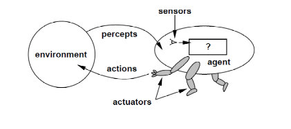

[toc]

# **<u>CS188 - Introduction</u>**

- The modern view of AI nowadays is trying to make agents that **act rationally**

  - what does **rationality** mean in the world of AI?

    **<u>Rational</u>**: **maximally** achieving predefined goals or **maximizing** your **expected utility**

  - Rationality only concerns the **decisions** not the thoughts behind them.

  - Goals are expressed in terms of the **utility of the outcome**.

****

The Berkeley lectures don't cover chapter 2, that talks about agents, however, it is covered in lectures, so I'll just summarize it from the slides

****

# **<u>University Lecture 2 - Agents</u>**

## **<u>Agents</u>**

- An agent is **anything** that

  - **perceives** its **environment** through **sensors**
  - **acts** upon that environment using **actuators**

  

- An agent can be a **software program**.

****

### **<u>Agent function and agent program</u>**

- The **agent function** maps from **percept histories** to **actions**.
- The **agent program** **implements** the agent function to run on a **physical architecture**.
- It is important to keep the two ideas distinct
  - The **agent function** is an **abstract** mathematical description.
  - The **agent program** is a **concrete implementation**, running within some physical system.

****

### **<u>Rationality</u>**

- Rationality depends on

  1. Performance measure
  2. Agent's (prior) knowledge
  3. Agent's percepts to date
  4. Available actions

- **Rational Agent** definition

  For each possible **percept sequence**, a rational agent should select an **action** that is **expected to maximize the performance measure**, given the evidence provided from the **percept sequence** and whatever **build-in knowledge** the agent has.

- We take the **expectation** of the utility due to **uncertainty** in the **environment** (stochastic and partially-observable)

****

#### <u>**Rationality vs Omniscience**</u>

- Rational $\neq$ omniscient
- Omniscient means knows everything
- Rationality means maximizing the **expected** performance, while perfection (omniscient) maximizes the **actual** performance.

****

### **<u>Learning and autonomy</u>**

- A rational agent should be **autonomous**
  - It should learn what it can to compensate for **partial or incorrect prior knowledge**.
- e.g. a vacuum-cleaning agent that can predict where and when additional dust will appear

****

## **<u>Task Environment</u>**

- To design a rational agent, we need to specify a **task environment**
  - a **problem specification** for which the agent is a solution
- **PEAS**: used to **specify** a **task environment**
  - **P**erformance measure
  - **E**nvironment
  - **A**ctuators
  - **S**ensors
- Check examples in slides and/or tutorials if needed

****

## **<u>Environment Types</u>**

- **Fully** observable vs **Partially** observable

  Fully observable iff the agent's sensors give it access to the **complete state** of the **environment** at **each point in time**

- **Deterministic** vs **Stochastic**

  Deterministic iff the **next state** of the environment can be **completely** determined by the **current state** and the **action** executed by the agent

**N.B.** an environment that is **fully observable** and **deterministic** has **no uncertainty**.

- **Episodic** vs **Sequential**

  Episodic iff the **next action** doesn't depend on the **previous actions** in previous episodes

- **Static** vs **Dynamic**

  Static iff the environment **doesn't change** while the agent is **choosing which action to take**.

  i.e. time taken by the agent to decide doesn't matter

  **Semi-dynamic** when the environment doesn't change but **time affects the score(utility function) of the agent**.

- **Discrete** vs **Continuous**

  Discrete if the number of **distinct percepts and action is limited**.

- **Single agent** vs **Multi agent**

  Single agent iff the agent operates by **itself** in the environment

  - If multi agent, there might be **coordination, cooperation, communication or random behavior** between the agents.

- The real word is **partially observable**, **stochastic, sequential, dynamic, continuous, multi agent**.

- you can check examples in tutorial and/or lectures

****

## **<u>Agent Structure</u>**

- Agent = Architecture + Program

- The job of AI is to **design** the **agent program** that **implement** the **agent function**

- <u>**Simple Reflex agent**</u>

  This agent selects actions on the basis of the **current** percept only, **ignoring** the rest of the **percept history**.

  Can't handle **partially observable** or **complex** environment

- <u>**Reflex Agent with State** (Model based reflex agents)</u>

  can handle **partially observable environments**.

  This type tries to model the uncertainty of the environment it is in to make decisions.

- <u>**Goal-based Agents**</u>

  Embed the **goal** that describes the agent's desirable behavior

  These agents usually first find plans then execute them

  More **adaptive**  to environments than reflex agents

- **<u>Utility-based Agents</u>**

  Goals alone **are not enough**  to generate **high quality behavior** in **<u>most</u>** environments

  The **utility** defines performance measure and can **combine multiple goals** into a **single utility function**.

- **<u>Learning Agent</u>**

  Allows the agent to operate in **initially unknown** environments and adapt to it

  **<u>Components of a learning agent</u>**

  - **Learning element**: Improves the agent performance
  - **Critic**: gives feedback to the learning element on how the agent is doing and **determines** how the performance element **should be modified to do better in the future**
  - **Problem generator**: **suggests** actions that will **lead to new and informative experiences** (responsible for exploration)
