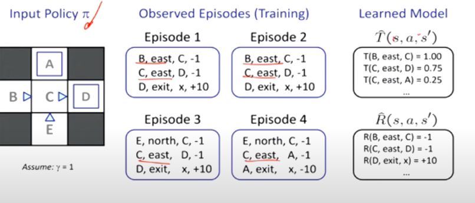
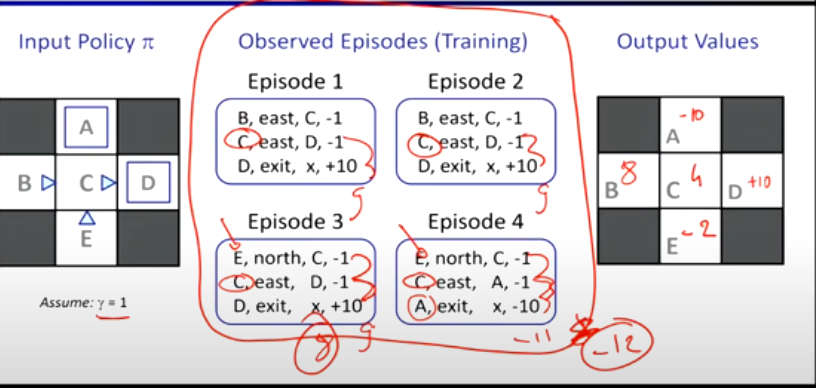
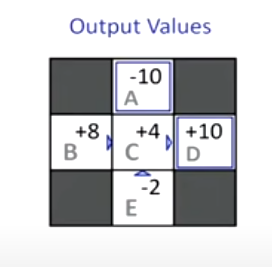
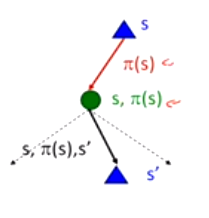
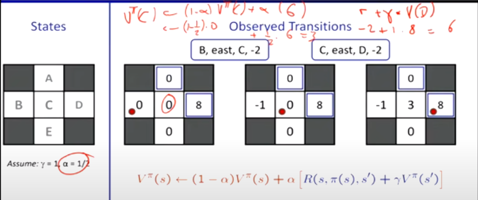

[toc]

<div style='page-break-after: always;'></div>

# <u>**Reinforcement Learning**</u>

## <u>**RL Map in CS188**</u>

```
                --- Model Based                            --- Direct Evaluation
                |                                         |
RL in CS188 ----|                 ---- Passive RL  -------|
                |                |                        |
                --- Model Free --|                         --- Indirect Evaluation
                                 |
                                  ---- Active RL
```

## <u>**RL vs MDPs**</u>

- The main different between RL and MDPs is that in MDPs that **environment is fully observable**
  - You know the Reward function $R(s,a,s')$ and the Transition function $T(s,a,s')$
- While in RL, you don't know the Reward function $R(s,a,s')$ or the Transition function $T(s,a,s')$

****

- MDPs had
  - set of states $s \in S$
  - set of actions per state $A$
  - A **model** $T(s,a,s')$.
  - A **reward function** $R(s,a,s')$.
- The goal was to find the **optimal policy** $\pi^*(s)$
- In RL, we don't know the model or the reward function.
  - i.e. You don't know **which states are good** or **what the actions do**.
  - You have to **try** out actions and states to learn.

****

- In MDPs, you can come up with an **offline solution**
  - i.e. figure out the policy before you start playing the game.
- In RL, you can come up with an **online solution**
  - i.e. interact with the environment and figure out the policy as you play.
  - In Grid world, before the agent falls into the fire, the agent doesn't know that the fire is bad.

****

## <u>**Model Based Learning**</u>

- In Model Based Learning, you **approximate** a model based on experiences.
- then solve for values **as if** the learned model were correct.
  - Since, you have $T(s,a,s')$ and $R(s,a,s')$, you can use Value and Policy Iteration.

****

<u>**Step 1**</u>: Learn empirical MDP model

- Count outcomes $s'$ for each $s,a$
- Normalize to get an estimate of $\hat{T}(s,a,s')$
- Discover each $\hat{R}(s,a,s')$ when you experience $(s,a,s')$

<u>**Step 2**</u>: Solve the learned MDP

- Use value or policy iteration to solve the MDP

****

### <u>**Example**</u>



- Each episode is a run of the game. (similar to epoch in ML)
- After 4 episodes, you got these values and approximated a model $T(s,a,s')$ and $R(s,a,s')$ that you can solve with MDPs.

****

### <u>**Questions**</u>

- Are Actions and States known ?
  - They may be known or unknown, but even if they are known, it is still an RL problem as you don't know the reward function or the transition function.
  - If you don't know them, you will atleast know the start state and then take actions from there and build your model.
- Does policy change throughout the game ?
  - You don't want to follow the policy 100% of the time, you want to **explore**.
- Where does the reward function come from ?
  - A human designer has to design it.
- Are there different ways to estimate probabilities ?
  - Yes, the count was used in the example above for the sake of simplicity, however there are other methods.
  
****

## <u>**Model Free vs Model Based**</u>

### <u>**Intuitive Example**</u>

- This example isn't RL related, it juts shows the difference between Model Free and Model Based.
- If we want to calculate the **expected age** of a classroom, we can do it in two ways
  - Correct way is $E[A] = \sum_{a} P(a)\times a$  

|Model Based | Model Free |
|-----------|-----------|
|$$P(a) = \frac{\text{num}(a)}{N} \\ \ \\E[A] \approx \sum_a \hat{P}(a) \times a$$ | $$E[A] \approx \frac{1}{N} \sum_i a_i$$ |

- In model based, we approximated the age distribution.
- In model free, we used the sample to implicitly approximate the distrbution without actually doing it.

****

## <u>**Model Free Learning**</u>

### <u>**Passive Reinforcement Learning**</u>

- We don't get to pick what actions we take, we jut execute the policy and learn from the experience.
  - **N.B.** Even though you don't pick the actions, you **still take them** so this is not offline planning.

#### <u>**Direct Evaluation**</u>

- In Direct Evaluation, you compute values for each state under $\pi$

##### <u>**Idea**</u>

- Average together the observed sample values
  - Act according to $\pi$
  - Every time you visit a state, write down what the **sum of discounted rewards** turned out to be
  - Average those samples

##### <u>**Example**</u>



- Here, we have a bunch of observations, since we are in passive RL, we don't care about anything except the sum of discounted rewards.
- A was visted once, and we got a reward of -10.
- C was visited 4 times, and we got a reward of 9,9,9, - 11 respectively
  - Average sum of discounted rewards = 4
- B was visited 2 times, and we got a reward of 8, 8
  - Average sum of discounted rewards = 8
- and so on...

****

##### <u>**Problems with Direct Evaluation**</u>

- What is good about direct evaluation ?
  - Easy to understand.
  - No need to know the transition function or the reward function.
  - It **eventually** computes the correct average values, using just transitions

- What is bad about it ?
  - Wastes information about state correlations.
    
    For example, E has a score of -2, while c has a score of 4.
    This doesn't make sense as E has to pass through c which makes them highly correlated, so it doesn't make sense to have completely different utilities
    - This is analogous to incosistent heuristics, when we talked about search
  - Each state is learned **separately**
  - Takes a long time to learn
    - If given enough data it'll converge, but we want to learn as much as possible with as few data as possible.

****

### <u>**Temporal Difference Learning**</u>

- TD Learning is a passive RL algorithm.

#### <u>**Why not use Policy Evaluation**</u>



- Use Bellman Updates to calculate $V$ for a fixed policy
  $$V_0(s) = 0 \\ \ \\
  V^\pi_{k+1}(s) \leftarrow \sum_{s'} T(s, \pi(s), s') [ R(s, \pi(s), s') + \gamma V_k^\pi(s')]$$

- <u>**Problem**</u>
  - We don't know the values of $R$ and $T$.

- <u>**Key Question**</u>
  - How can we do this update to $V$ w/o knowing $T$ and $R$.

##### <u>**Sample-Based Policy Evaluation**</u>

- We want to improve our estimate of $V$ by computing these averages
  - $$V^\pi_{k+1}(s) \leftarrow \sum_{s'} T(s, \pi(s), s') [ R(s, \pi(s), s') + \gamma V_k^\pi(s')]$$

- <u>**Idea**</u>
  - Take samples of outcomes $s'$ (by doing the action) and average them
    - Sample 1 : $R(s, \pi(s), s_1') + \gamma V^\pi_k(s_1')$
    - Sample 2 : $R(s, \pi(s), s_2') + \gamma V^\pi_k(s_2')$
    - Sample 3 : $R(s, \pi(s), s_3') + \gamma V^\pi_k(s_3')$
  - Then we can update $V^\pi_{k + 1}(s) \leftarrow \frac{1}{n} \sum_i \text{sample}_i$

- Problem is that, the agent learns by acting, so you can't just put your agent somewhere and see what happens. (i.e. it has to reach that position) as the environment might not allows you to reset everytime to reach these positions

#### <u>**Temporal Difference Learning**</u>

- This solves the problem of the environment not allowing us to reset the position.
- <u>**Idea**</u>
  - We learn from every experience.
    - Every time we experience a transition $(s, a, s', r)$, we update $V(s)$.

- <u>**How does temporal difference learn values ?**</u>
  - Policy is still fixed.
  - It computes the **running average** of $V(s)$, which moves the current value of the state towards the sampled value.

$$\text{Sample of } V(s): \ \ \ \text{sample} = R(s, \pi(s), s') + \gamma V^\pi(s')$$

$$\text{Update to } V(s): \ \ \ V^\pi(s) \leftarrow (1 - \alpha) V^\pi(s) + \alpha \text{sample}$$

$$\text{Rewriting of update} \ \ \  V^\pi(s) \leftarrow V^\pi(s) + \alpha(\text{sample} - V^\pi(s))$$

- Even of original estimate of $V(s)$, due to the properties of running average, it will not matter as you get more samples.
- <u>**Decreasing learning rate**</u> $\alpha$ can give converging averages.
- Only the state you just left gets updated.

****

##### <u>**TD Learning**</u>



$\text{Update to } V(s): \hspace{1em}V^\pi(s) \leftarrow (1 - \alpha) \times V^\pi(s) + \alpha \times \text{sample}$


- At the start, all values are zero
- We then have the **first transition**, (B, EAST, C, -2)
  - $\text{sample} = [R(B, EAST, C) + \gamma V(C)] = -2$
  - We update $V(B) \leftarrow (1 - \frac{1}2) . 0 + \frac{1}2 . -2$
  - So $V(B) = -1$
- **Second Transition** , (C, EAST, D, -2)
  - $\text{sample} = [R(C, EAST, D) + \gamma V(D)] = -2 + 8 = 6$
  - We update $V(B) \leftarrow (1 - \frac{1}2) . 0 + \frac{1}2 . 6$
  - So $V(C) = 3$

****

##### <u>**Problems with TD Learning**</u>

- TD value learning is a model-free way to do **policy evaluation**, mimicking Bellman updates with running samples averages
- However, if we want to turn our values into policicies, we need to learn the Q-values
  - $\pi(s) = \arg \max_a Q(s, a)$
  - $Q(s, a) = \sum_{s'} T(s, a, s') [ R(s, a, s') + \gamma V(s')]$

- **Idea**: learn Q-values, not values
- Makes action selection a model-free tool.
- So using TD Learning only, we **cannot get a new policy**.

****

## <u>**Active Reinforcement Learning**</u>

- You don't know the values of $R$ and $T$.
- You **choose the actions** now. (no longer just following a policy)
- <u>**Goal**</u>: learn the optimal policy

****

### <u>**Q-Value Iteration**</u>

- If we want to do value iteration (just like in MDPs), we do the following
    $$V_{k+1}(s) \leftarrow \max_a \sum_{s'} T(s,a,s') [ R(s,a,s') + \gamma V_k(s')$$

- If we rephrase  that in terms of Q-values, we get
  $$Q_{k+1}(s,a) \leftarrow \sum_{s'} T(s,a,s') [ R(s,a,s') + \gamma \max_{a'} Q_k(s',a')$$

- We can't do value iteration as we don't know how to deal with a sample that goes through a maximimum.
- But through using Q-values, we remove the max from the equation, and we can now use sampling to estimate and update the Q-values

### <u>**Q-Learning**</u>

- Q-Learning: it is a **sample based** way to do **Q-value iteration**
- You learn $Q(s,a)$ as you go
  - Receive a transition $(s, a, s', r)$
  - Consider the old estimate $Q(s,a)$
  - Consider the new sample estimate
    - $\text{sample} = R(s, a, s') + \gamma \max_{a'} Q(s',a')$
  - Use the new estimate (sample) and plug into a running average
    - $Q(s,a) \leftarrow (1 - \alpha) \times Q(s,a) + \alpha \times \text{sample}$

#### <u>**Q-Learning Properties**</u>

- Q-learning converges to **optimal policy**, even if you're acting **sub-optimally**
- This is called **off-policy learning**
- **Problems**
  - You have to explore enough points
  - You have to decrease the learning rate $\alpha$ as you spend more time exploring
  - However, if you decrease it too quickly, you won't be able to correct old mistakes/noise
- Basically, doesn't matter how you select actions as long as you pass by all the actions a sufficient amount of times.

