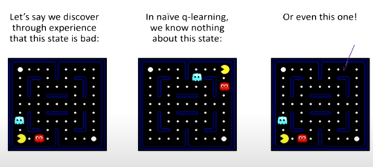
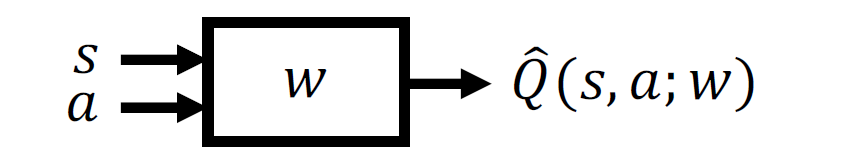

[toc]

# <u>**Reinforcement Learning - II**</u>

## <u>**Q-Learning (Revision)**</u>

- We'd like to do Q-value updates to each Q-state
    $$Q_{k+1}(s,a) \leftarrow \sum_{s'} T(s,a,s') [ R(s,a,s') + \gamma \max_{a'}Q_k(s',a')$$
  - This is not possible as we don't know $T$ and $R$.
- Instead of using $T$ and $R$, we approximate them using a running average of samples
  
  $$Q(s,a) \approx r + \gamma \max_{a'}Q(s',a')$$.
  - Then we apply update using the running average
  $$Q(s,a) \leftarrow (1 - \alpha) Q(s,a) + \alpha [r + \gamma \max{a'} Q(s',a')]$$

### <u>**Q-Learning properties**</u>

- Q-learning converges to optimal policy even if you act suboptimally   
  - This is called **off-policy learning**

- <u>**Caveats**</u>
  - You have to explore enough (visit each state an adequate amount of times)
  - You have to have a decreasing learning rate, so at the start you learn a lot from samples and as you go on you place less emphasis on the samples
  - But you have to not decrease it too quickly, if this happens you won't learn a lot from new samples.
  - Doesn't matter how you select your actions as long as you explore enough.

****

## <u>**Exploration vs Exploitation**</u>

### <u>**Exploration**</u>

- There are several schemes for forcing exploration
  - Simplest scheme : random actions ($\epsilon$-greedy)
    - Before each action, there is a probability of $\epsilon$ of choosing a random action, probability ($1 - \epsilon$) to pick the best action (according to the agent)
  - <u>**Problems**</u>
    - You do eventually explore the whole space, but you keep taking randoma actions even after you know what the best actions are.
    - Solution: use a decaying $\epsilon$.
    - Another solution: Use **exploration functions**

#### <u>**Exploration functions**</u>

- Random actions have a problem which is that they explore a fixed amount. (exploration isn't **fairly** distributed among states)
- Exploration functions explore states that have not been established as bad states (yet) and eventually stop exploring

- <u>**Exploration function**</u>

- Takes a value estimate $u$ and a visit count $n$,and returns an optimistic utility
  e.g. $f(u,n) = u + \frac{k}{n + 1}$ where $k$ is a constant
  - If $n =0$, i.e. state not visited before, it'll have a value of $u+k$
  - but if $n \gg 0$, i.e. state visited a lot before, $\frac{k}{n+1}$ will be a very small number that can be neglected, so $f(u,n) \approx u$
  $$
    \text{Regular Q-update} : Q(s,a) \leftarrow_\alpha  R(s,a, s') + \gamma \max{a'} Q(s',a') \\
    \text{Modified Q-update} : Q(s, a) \leftarrow_\alpha R(s, a, s') + \gamma \max{a'} f(Q(s',a'), N(s',a'))
  $$
  **N.B.** $\leftarrow_\alpha$ is short for update while taking a weighted average.

****

## <u>**Regret**</u>

- Since all approaches that use Q-Learning eventually achieve optimal performance, we have to be able to measure which approaches are better.
- Some approaches achieve the optimal result in a smaller amount of steps than others.
   - Those approaches have less **regret** (i.e. made less mistakes along the way)
- Minimizing regret goes beyond learning the optimal policy.
  - It requires the **optimal learning** to be optimal (you learn the fastest way possible)
- You can't have 0 regret, as you don't know how the environment behaves, so the agent is bound to make mistakes.

****

## <u>**Approximate Q-Learning**</u>

### <u>**Generalizing Across States**</u>

- Basic Q-Learning keeps a table of **all q-values**
- In realistic situation, we can't possibly lean about all the states
  - You can't visit all states when planning.
  - Too many states to hold the q-tables in memory.
- Instead we want to **generalize**
  - Learn about some **small number of training states**
  - Generalize that experience to **new, similar states**.

****
- If we look at these 3 states
  
  - If the agent sees state 1, it will learn that state 1 is bad.
  - However, if it sees state 2, which is nearly identical but inverted, it will know nothing about that.
  - If it also sees state 3, which is identical to state 1 but with a pellet missing from the top right, it will know nothing about that if you use tabular Q-learning.

#### <u>**Feature Based Representations**</u>

- The solution to generalizing is using **feature based representations**
  - Features are functions from states to real numbers (often 0/1) that capture the **important properties** of the state
  - Example features:
    - Distance to closest ghost.
    - Distance to closest dot.
    - Number of ghosts.
    - 1 / $\{$distance to dot$\}^2$.
    - Is pacman in a tunnel ? (0/1).
    - ....etc.
  - Can also describe a q-state(s,a) with features.

#### <u>**Linear Value Functions**</u>

- We can represent the Value or Q-Value of any state using a few weights:
  $$V(s) = w_1 f_1(s) +w_2 f_2(s) + ... + w_n f_n(s)\\
  Q(s,a) = w_1 f_1(s,a) + w_2 f_2(s,a) + ... + w_n f_n(s,a)$$

- Advantage: The experience is summed up in a few powerful numbers
- Disadvantage: You are prone to misrepresenting the states, either by adding wrong features or by forgetting important ones.
  - If you forget some features, two states may be the same but in reality there is some lost information that wasn't covered by the features.

- The weights them selves can be learned using Q-Learning just like we did before.
- The weights learned won't be perfect, as the performance of the model will depend on how well you the features represent the state.

****

#### <u>**Approximate Q-Learning**</u>

$$Q(s,a) = w_1 f_1(s,a) + w_2 f_2(s,a) + ... + w_n f_n(s,a)$$

- Q-learning with **linear** Q-functions:
  $$\text{transition} = (s,a,r,s')\\
  \text{difference} = [r + \gamma \max_{a'}Q(s',a')] - Q(s,a)\\
  Q(s,a) \leftarrow Q(s,a) + \alpha [\text{difference}]$$ 
  - But we don't want to update the Q functions directly, we want to update them through the weights
  - So, this is the equation used 
    $$w_i \leftarrow w_i + \alpha [\text{difference}] f_i(s,a)$$
    This is derived in the same way as **linear regression**.

- The representation of the states doesn't have to be **linear**, any **function approximator** can be used.
  - e.g. NN
  

****
## <u>**Policy Search**</u>

### <u>**Simplest policy search**</u>

- Start with an initial linear value function or Q-function
- Nudge each feature weight up and down to see if the policy is better than before.

#### <u>**Problems**</u>

- How can you tell the policy got better ?
- Need a lot of sampling.
- Impractical if there are many features.

****

### <u>**Policy Search (lecture)**</u>

- Policy search considers **parameterized** representations of the policy $\pi$ that have far fewer parameters $\theta$ than there are states in the space.
- Since the policy is a **discontinuous** function if the parameters, we can't use gradient based search
- Consequently, policy search methods often use a **stochastic policy** repreesentation. $\pi_\theta(s,a)$ which specifies the **probability of selecting action a in state s**.
    $$\pi_\theta(s,a) = P(a|s,\theta)$$
- The goal is to find a policy that maximizes the **policy value** $\rho(\theta)$
- The **policy value** $\rho(\theta)$ is the **expected utility** when $\pi_\theta$ is executed.
- This optimization can be solved using
  1. Gradient based methods if $\rho(\theta)$ is differentiable
  2. Local search methods such as hill climbing
     - You change the parameters $\theta$ and see if the policy value is better.

- One popular representation for the policy is the **softmax** function.
- Softmax policy becomes **nearly deterministic** if one action is much better than the others.
- The softmax gives a **differentiable function** of $\theta$, hence the value of the policy $\rho(\theta)$ is a diffentiable function of $\theta$.

$$\pi_0(s,a) = \frac{\exp{\hat Q_\theta(s,a)}}{\sum_{a'} \exp{\hat Q_\theta (s,a')}}$$
****
