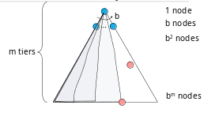
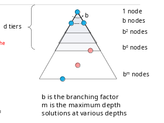
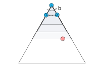
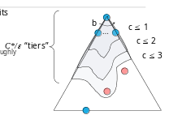

# **<u>Lectures</u>**

- **<u>Reflex Agents</u>**

  Don't consider the **future consequences** of their actions.

  May have memory or a model for the world's current state

  - Reflex agents **can be**rational.

- **<u>Planning agents</u>** (not in uni lecture slides)

  Asks **what if**. Decisions are based on a **hypothesized consequences of actions**.

  Must have a **model of how the world works**.

  **Optimal**: Achieve goal in minimum cost

  **Complete**: If the solution exists, you'll find it

  **<u>Replanning</u>**: Plans only a part of the whole thing, and re-plans after some time

****

## **<u>Search problems</u>**

- A search problem consists of
  1. A state space (set of all possible states that could take place).
  2. A **successor** function (takes an action and predicts the next state of the world along with the **cost of the action**).
  3. A **start state** and a **goal test** (test to determine whether goal is reached).
- A solution is a **sequence of actions** (plan) which transforms the **start state** to a **goal state**.
- To solve a search problem, you have to **model** it correctly.

****

## **<u>Abstraction</u>**

- Means that we **remove the details**.
  - e.g. If we take the road x, we don't care what radio channel was playing
  - This makes modeling problems easier

****

## **<u>State Space Graphs and Search Trees</u>**

### **<u>State Space Graphs</u>**

- A mathematical **representation** of a **search problem**.
  - Nodes are **abstracted world configurations**.
  - Arcs represent **successors**
  - The **goal test** is a **set of goal nodes**.
- In a state space graph, each state occurs only **once**.
- Practically, the graph cannot be built in memory, but it's a useful idea.

### **<u>Search Trees</u>**

- The search tree starts with the **start state** (the initial state is the **root node**).
- **Children** of each node are it's **successors**.
  
- Each node represents a **state**, but we think about it as a **series of steps** from the root to the node.

- Like the **state space graph**, we can't build the tree for most application, but it's good to think about the problem in one of these ways.

****

#### **<u>Searching with a Search Tree</u>**  

- Searching is done by **expanding tree nodes**
- During search, we mantain a **frontier** of nodes under consideration.
- We try to expand as **few** nodes as possible.

****

#### **<u>General Tree Search</u>**

```python
def tree_search(problem, strategy):
  # examples of strategies are BFS, DFS and others

  # frontier is initialized with start state
  frontier.add(initial_state)

  # keep looping until frontier is empty
  while not frontier.is_empty():
    # based on the strategy, remove a node from
    # the frontier
    current_node = frontier.pop_node(strategy)
    # if the node is the goal, return the solution
    if problem.goal_test(current_node):
      return path_of_current_node
    # if not the goal, expand and add children to frontier
    for child_node in current_node.children:
      frontier.add(child_node)
  # if frontier is empty, then no solution exists
  return None
```

- **N.B.** We declare success when the goal is **removed** from the frontier, not when it is added.

****

#### **<u>Graph Search</u>**

- Since a state in a tree can be repeated multiple times, our agent will repeat the same actions which leads to **redundancy**.
- To avoid this, we can use **graph search**.
- We modify the tree search by adding a data structure that contains the **nodes that were previously explored**.
  - Newly generated nodes that match previously generated nodes can be **discarded** instead of being added to the frontier.

```python
def graph_search(problem, strategy):

  # frontier is initialized with start state
  frontier.add(initial_state)

  # initialize the explored set to be empty
  explored = set()

  while not frontier.is_empty():
    current_node = frontier.pop_node(strategy)

    if problem.goal_test(current_node):
      return path_of_current_node
    
    explored.add(current_node)

    for child_node in current_node.children:
      if child_node not in explored and child_node not in frontier:
        frontier.add(child_node)
    
  return None
```

****

## **<u>Informed vs Uninformed Search</u>**

- Uninformed search is when you **can't tell how far a state is from the goal**.
  - i.e. the agent has **no additional information** about the state other than the ones provided in the problem definition.

****

## **<u>Evaluating Search Algorithms</u>**

- We can evaluate search algorithms based on
  1. **Completeness**:
       - If the solution exists, a **complete** algorithm is **guaranteed** to find it
  2. **Time complexity**
      - Measured in terms of **number of nodes generated during search**
  3. **Space Complexity**
      - Measured in terms of **maximum number of nodes stored in memory at once**.
  4. **Optimality**
      - Does the algorithm find the **lowest cost** (optimal) solution, if there's more than one solution.

### **<u>Complexity Notation</u>**

- Complexity is measured in terms of **three** quantities.
    1. $b$: branching factor (number of successors of any node)
    2. $d$: depth of the **shallowest goal node**
    3. $m$: max length of any path in the state space.

****

## **<u>Uninformed Search Strategies</u>**

### **<u>1. Depth First Search</u>**

- Expands the deepest node first.

- **Time Complexity**
  - If $m$ is finite takes time $O(b^m)$ as it could process the whole tree
- **Space Complexity**
  - Frontier will have $O(bm)$ nodes.
  - This is because tree will reach max depth $m$ and on it's way each one of the nodes branches $b$ nodes.
- **Complete**
  - If no repeated states (graph search), it'll find the solution (complete).
  - If states can be repeated (tree search), it can get stuck in an infinite loop and not find a solution (not complete).
- **Optimal**
  - Not optimal, it finds the **"leftmost"** solution regardless of the cost

****

### **<u>2. Breadth-First Search</u>**

- Expands the shallowest node first.

$d$ is the depth of the shallowest goal node.

- **Time Complexity**
  - Is $O(b^d)$
    - As the search will stop at level $d$ when we find a solution.
- **Space Complexity**
  - At the last level, the frontier will have $O(b^m)$ nodes.
- **Complete**
  - if $d$ is finite, it is complete
- **Optimality**
  - If all arcs have the same cost, BFS is optimal.

****

#### **<u>BFS vs DFS</u>**

- DFS is better when there are **memory limitations**. (DFS $O(bm)$ vs BFS $O(b^m)$)
- If the goal is shallow $d \ll m$  BFS is better

****

### **<u>3. Iterative Deepening</u>**

- Tries to combine DFS's **space** advantage with BFS's **time/shallow-solution** advantage
  - Also provides the **completeness** of BFS


**Steps**
1. runs DFS with depth limit = 1, if no solution
2. runs DFS with depth limit = 2, if no solution
3. runs DFS with depth limit = 3 and so on

- Isn't that **redundant**?
  - Since most work is done on the deepest level (nodes in deepest level = all other nodes combined)
    - therefore, it is not **that** redundant.

- The hard part about **iterative deepening** is **picking an appropriate depth limit**.

****
### **<u>4. Uniform Cost Search</u>**
- Expands the **cheapest** node first (lowest cost).
- Uses a **priority queue** as a data structure for the **frontier**.
  - The priority is determined based on the **cumulative path cost**

- **Time Complexity**
  - If the solution costs $C^*$ and arcs cost atleast $\epsilon$, the **effective depth** is roughly $\frac{C*}\epsilon$
  - Takes $O(b^\frac{C*}\epsilon)$
- **Space Complexity**
  - Frontier will have $O(b^\frac{C*}\epsilon)$ nodes in the last level searched.
- **Completeness**
  - It is **complete** if there are no negative edges.
- **Optimality**
  - Yess

- **Problems**
  - Explores options in **every "direction**
  - No information about goal location.

****
