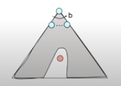
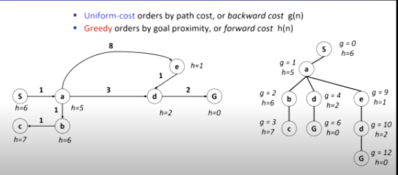

[toc]

# **<u>Revision</u>**

## **<u>Search Problem</u>**

- You are given some stuff like
  - States
  - Actions and cost
  - Successor function
  - Start state and Goal Test
  And you have to find the path from start to goal.

## **<u>Search tree</u>**

- **Nodes**: represent plans for reaching states
- Plans have costs (sum of action costs)

## **<u>Search algorithm</u>**

- Systematically builds a search tree (the better the search algorithm, the less nodes it'll build)
- Chooses an ordering of the **frontier**
- **Optimal**: finds the least cost plans.

****
# **<u>Search Heuristics</u>**

- During last lecture, we saw that we had **optimal algorithms** like Uniform Cost Search, but it had a problem that it **explored options in <u>every direction</u>**, with no information about goal location.
- To solve this problem, we introduce **heuristics**
- A heuristic is
  - A function that **estimates how close** a **state** is to a **goal**.
  - Each search problem might have a **different heuristic**.
- It's preferred that the heuristic used can be **easily computed**.
- At the goal, the heuristic is zero.
- Heuristics are more of an **art**, there can be more than one heuristic for the same problem.
- e.g. Manhattan distance and Euclidean distance for pathing problems.

****
# **<u>Informed Search Algorithms</u>**

- Some definitions:
  - $f(n)$ is the evaluation function used in the **priority queue** when picking from the frontier
  - $h(n)$ is the heuristic function
  - $g(n)$ is the cost of the path from the start to the node
## **<u>Greedy best-first search</u>**

- Expands the node that seems **closest to the goal** according to the **heuristic function only.** ($f(n) = h(n)$)
- A **common** case is that Best-first search takes you straight to the **wrong** goal (not optimal).
- **Worst-case**: Works like a badly guided DFS.
  

- One tradeoff in the Greedy BFS, is that it **doesn't consider the past** (ignores $g(n)$ and uses $h(n)$ only), this leads to **quicker computation**.
  - This also leads to the algorithm **not being optimal**.

****
## **<u>A\* Search</u>**

- $f(n) = g(n) + h(n)$, i.e. uses **both** the **heuristic** and **path cost functions** to determine which node to expand.
  
  You can try solving this using Greedy-BFS and A\* to see the difference.
- Is A\* optimal?
  - Only optimal if the heuristic is **admissible**.

### **<u>Admissable Heuristics</u>**

- A heuristic $h$ is **admissible** (optimistic) if:
    $$0 \leq h(n) \leq h^*(n)$$ 
    where $h^*(n)$ is the **true cost** to a nearest goal. We don't have access to $h^*(n)$, but mathemtically, it exists.
- **Coming up with <u>admissible heuristics</u>** is most of what's involved in **using A\* in practice**.

- **How to know** that a heuristic is admissible?

| Admissable Heuristic | Inadmissable Heuristic |
| :---       |          :--- |
| Optimistic            | Pessimistic           |
| Heuristic is lower than the actual goal   | Heuristic is higher than the actual goal    |
| Slow down bad plans but **never outweigh true costs** | **Break optimality** by **trapping good plans on the fringe**|
****
#### **<u>Proof of A\* Optimality with an admissable heuristic</u>**

****
