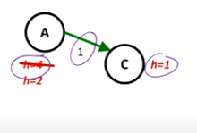

[toc]

# **<u>Revision</u>**

## **<u>Search Problem</u>**

- You are given some stuff like
  - States
  - Actions and cost
  - Successor function
  - Start state and Goal Test
  And you have to find the path from start to goal.

## **<u>Search tree</u>**

- **Nodes**: represent plans for reaching states
- Plans have costs (sum of action costs)

## **<u>Search algorithm</u>**

- Systematically builds a search tree (the better the search algorithm, the less nodes it'll build)
- Chooses an ordering of the **frontier**
- **Optimal**: finds the least cost plans.

****
# **<u>Search Heuristics</u>**

- During last lecture, we saw that we had **optimal algorithms** like Uniform Cost Search, but it had a problem that it **explored options in <u>every direction</u>**, with no information about goal location.
- To solve this problem, we introduce **heuristics**
- A heuristic is
  - A function that **estimates how close** a **state** is to a **goal**.
  - Each search problem might have a **different heuristic**.
- It's preferred that the heuristic used can be **easily computed**.
- At the goal, the heuristic is zero.
- Heuristics are more of an **art**, there can be more than one heuristic for the same problem.
- e.g. Manhattan distance and Euclidean distance for pathing problems.

****
# **<u>Informed Search Algorithms</u>**

- Some definitions:
  - $f(n)$ is the evaluation function used in the **priority queue** when picking from the frontier
  - $h(n)$ is the heuristic function
  - $g(n)$ is the cost of the path from the start to the node
## **<u>Greedy best-first search</u>**

- Expands the node that seems **closest to the goal** according to the **heuristic function only.** ($f(n) = h(n)$)
- A **common** case is that Best-first search takes you straight to the **wrong** goal (not optimal).
- **Worst-case**: Works like a badly guided DFS.
  

- One tradeoff in the Greedy BFS, is that it **doesn't consider the past** (ignores $g(n)$ and uses $h(n)$ only), this leads to **quicker computation**.
  - This also leads to the algorithm **not being optimal**.

****
## **<u>A\* Search</u>**

- $f(n) = g(n) + h(n)$, i.e. uses **both** the **heuristic** and **path cost functions** to determine which node to expand.
  
  You can try solving this using Greedy-BFS and A\* to see the difference.
- Is A\* optimal?
  - Only optimal if the heuristic is **admissible**.

### **<u>Admissable Heuristics</u>**

- A heuristic $h$ is **admissible** (optimistic) if:
    $$0 \leq h(n) \leq h^*(n)$$ 
    where $h^*(n)$ is the **true cost** to a nearest goal. We don't have access to $h^*(n)$, but mathemtically, it exists.
- **Coming up with <u>admissible heuristics</u>** is most of what's involved in **using A\* in practice**.

- **How to know** that a heuristic is admissible?

| Admissable Heuristic | Inadmissable Heuristic |
| :---       |          :--- |
| Optimistic            | Pessimistic           |
| Heuristic is lower than the actual goal   | Heuristic is higher than the actual goal    |
| Slow down bad plans but **never outweigh true costs** | **Break optimality** by **trapping good plans on the fringe**|
****
#### **<u>Proof of A\* Optimality with an admissable heuristic</u>**

****
#### **<u>Creating Optimal Heuristics</u>**
A good way to create heuristic functions is to try to solve a **simplified version of the problem**.

You'll find that there's a trade off.

- An **accurate** heuristic function takes more time to compute, but makes you explore **less nodes**
- As the accuracy gets lower, you will explore more nodes but the cost of each node is lower than it would be with the more accurate heuristic.

You can create two heuristics $h_1$ and $h_2$ and make the final heuristic be $max(h_1(x),h_2(x))$.

- This takes more computation but might lead to a higher accuracy.

****
## **<u>Graph Search</u>**

- **Graph Search** performs the same as Tree search but with 1 major difference
  - Graph search doesn't visit the same node twice
    - It does so by keeping a **set** of visited nodes and not revisiting any node that's already in the set

- Graph search is still **complete**
  - We only exclude parts of the tree that we **already visited**.

- However, Graph Search is **not always optimal**.
  - In A* search, we need the **heuristic function** to be **consisent** in case of graph search

### **<u>Heuristic Consitency</u>**

- A heuristic if consistent if
  - $$h(A) - h(C) \leq cost(A,C)$$ 

If $h(A) = 4$, $h(C) = 1$ and $cost(A,C) = 2$, we find that $h(A) - h(C) \nleq cost(A,C)$ which means function is **not consistent**.
However, if we change $h(A) = 2$ then we find that $h(A) - h(C) \leq cost(A,C)$ which means function is **consistent**.

#### **<u>Consequences of consistency</u>**
- The value of $f$ along a path **never decreases**.
- We know that $h(A) \leq cost(A,C) + h(C)$
  This means that
  $$f(A) = g(A) + h(A) \leq g(A) + cost(A,C) + h(C) = f(C)$$

# **<u>Notes</u>**
I didn't include the proof of optimality in Tree Search or Graph search, feel free to watch it from the [video](https://www.youtube.com/watch?v=Mlwrx7hbKPs&list=PLsOUugYMBBJENfZ3XAToMsg44W7LeUVhF&index=3) if needed.