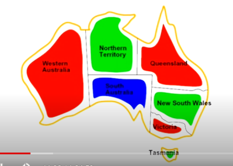
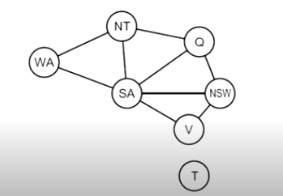
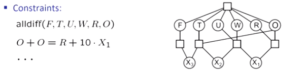

[toc]

# **<u>Constraint Satisfaction Problems</u>**

First, we'll start by revising what we did in the previous chapter.

## **<u>Search</u>**
  - Search was used when the world was assumed to be : **single agent**, deterministic, fully observed and discrete
  - Used to solve **planning problems**
    - We cared about the **path to the goal**
    - different paths have **different costs and depths**
    - heuristics give **problem specific-guidance**

- **<u>Identification</u>**
  - Identification is **assignments to variables**.
  - The goal itself is important, **not the path**.
  - All the paths are **at the same depth**(most of the time).
  - CSPs are a specialized class of **identification problems**.
    - This gives us more to work with. therefore, we have different algorithms more suitable for this type of problems.

****

## **<u>Search vs CSPs</u>**

### <u>**Standard Search problems**</u>
  - State is a **black box**, you can only call `get_successor(state)` and `is_goal(state)`
  - The goal and the successor could be **any** function(i.e. lots of possibilities).

### <u>**Consraint Satisfaction problems(CSPs)**</u>
  - A special **subset** of **search problems**
  - A state is defined by **variables** $X$ with values from a **domain** $D$.
  - Goal test is a **set of constraints** that specify **allowable combination of values** for the variables.

- The representation of CSPs is different from standard search problems.
  - This allows us to use more specific algorithms that solve these types of problems faster.

- Representation of **Map Coloring Problem** (Map of Australia)
  
  - The goal is to color the map with [red, green, blue] such that no two adjacent states have the same color.
  - **<u>Variables</u>**
    - $X = [\text{WA, NT, Q, NSW, V, SA, T}]$ represents the states of the map. (WA = Western Australia ... etc).
  - **<u>Domains</u>**
    - $D = [\text{red, green, blue}]$ represents the colors of the states.
    - If we only had Variables and Domains, we could assign all values to red and just be done.
  - **<u>Constraints</u>**: adjacent regions must have different colors
    - **<u>Implicit</u>**: $\text{WA} \neq \text{NT}$ Effectively, implicit constraints are a snippet of code, that can be used to check whether constraints are violated or not.
    - **<u>Explicit</u>**: $\text{(WA, NT)} \in \{ \text{(red, green), (red,blue),....}\}$
  - **<u>Solutions</u>**
    - In CSPs, solutions are **assignments satisfying all constraints** .

****
### **<u>Constraints Graph</u>**

- In the graph, we **variable** corresponds to a **node** in the graph.
- The **edge** between two nodes represents a **constraint** between the two nodes.
- The constraint graph tells you that there is a **constraint** between two nodes but **doesn't tell you what it is**.
- **Binary CSP**: each constraint relates **at most** two variables.
  - In Binary constraint graphs, nodes are vairables and arcs are constraints.
- General purpose CSP algorithms use the **graph structure**  to **speed up search**.
  - e.g. Tasmania isn't adjacent to any other state, so there is no need to check it.
- **Constraint graph**
  
  - You can see that there is a **constraint** between multiple variables.
  - We represent the constraint by a box and draw a line from each participating variable to that box.

