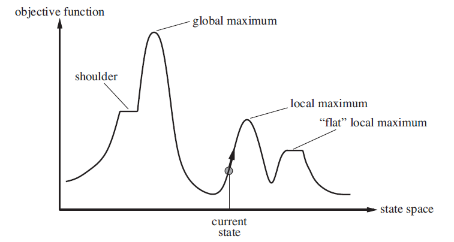
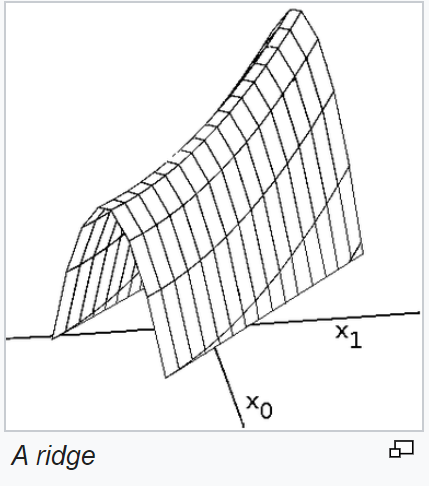

[toc]

# <u>**Local Search**</u>

- We'll talk about these algorithms
  - Hill Climbing
  - Simulated Annealing
  - Local beam search
  - Genetic Algorithms

- In previous lectures, the algorithms we discussed needed to find a **path to the goal**, However in many cases, the path is **not importatnt**, all we care about is the **goal state itself**
  - e.g. N-queens problem, you don't care how it happened, you just care about the final state.
- **Local search** is suitable to these kinds of problems, where we **don't care about the path**, but only the goal state.
  - Local search algorithms operate using a **single node** called the **current** **node** instead of saving a complete path.
  - Local search is useful for solving **pure optimization problems** i.e. finding the best state w.r.t an **objective function**

- Previous search algorithms can't maximize/minimize an objective function as there's **no goal test**.
  - Only have the option of exhaustive search.

## <u>**Advantages of Local Search**</u>

- **Small memory** usage, usually a **constant amount**
- Often find **reasonable** solutions in large or infinite state spaces.

****

### <u>**State Space Landscape**</u>



- Each point on the x-axis represents a state, and the y-axis represents the objective function value.

****

## <u>**Hill Climbing**</u>

### <u>**Algorithm**</u>

```python
def hill_climbing(problem, state):

    # assign the current to the initial state
    current = initial_state
    while True:
        # get all the neighbors of current
        neighbors = problem.get_neighbors(state)
        # pick the neighbor with the highest value
        max_neighbor = max(neighbors)
        
        # if current is better than neighbor, return current
        if max_neigbor < current:
            return current
        # if neighbor is better, make current = neighbor and repeat the loop
        current = max_neighbor
```

- The algorithm above moves in the **direction of increasing value** until it reaches a **peak** (no neighbor is better than the current)
- At each step, the algorithm only saves the **current node** (its state and value to be precise)
- Hill climbing is sometimes called **greedy local search** because it picks the best option with no regard to others.

### <u>**Drawbacks**</u>

- This algorithm can get stuck in local minimas/maximas.
- Another problem are **plateaus**
  - <u>**Plateau**</u>: Flat local maxima or minima or shoulder (look at the image below)


- In a higher dimension (state represented by more than 1 dimension), these plateaus are sometimes presented in a form of **ridges**



- In a ridge, all the neighboring points point downwards (if that ridge is a local maxima).
- This is very difficult for **greedy algorithms** to navigate.

****

### <u>**Optimizations?**</u>

- In the algorithm, we only take a step if the neighbor is higher than the current (if equal we return the current).
- This is a problem if the state we are in lies in a **shoulder**

- To fix this problem, we allow movement if the neighbor is **equal** to or **greater** than the current.

- In a flat region, the algorithm might get stuck, so we have to put a limit on the number of movements if the neighbor is equal to the current.

- This increases the number of steps taken to solve the problems, but also results in a higher success percentage.

****

### <u>**Variants of Hill Climbing**</u>

- <u>**Stochastic Hill Climbing**</u>
  - Choose a random neighbor to move to
  - Coverges more slowly, but has more success percentage in some cases.

- <u>**First choice hill climbing**</u>

  - Generates successors randomly until one is better than the current
  - Useful when there are many neighbors

- <u>**Random-restart hill climbing**</u>
  - Conducts a series of hill climbing searches, from **randomly generated initial states**
  - It is complete with probability approaching 1

****

## <u>**Simulated Annealing**</u>

- It's a middle ground between taking random steps and always taking the best step.

```python
def simulated_annealing(problem, initial_state):
    # assign the current to the initial state
    current = initial_state
    for t in range(1, inf):
        # get all the neighbors of current
        neighbors = problem.get_neighbors(current)
        
        # schedule just determines the rate by which T (temperature) decreases
        T = schedule(t)
        # if T increases too much, we stop
        if (T == 0):
            return current
        
        # pick a random neighbor
        next_node = random.choice(neighbors)

        # get the difference between the neighbor and the current node
        delta = next_node.value - current.value

        # if neighbor is better, current = neighbor and repeat the loop
        if (delta > 0):
            current = next_node
        else:
            # if neighbor is worse, we accept it with probability e^(delta/T)
            p = math.exp(delta / T)
            if (p > random.random(0, 1)):
                current = next_node
```

- The idea is that by allowing some bad moves, you could get out of local minimas.
- As T decreases, the probability of accepting bad moves decreases.
  - This makes it more likely to explore bad options early on, and less likely as we continue iteration.
- If we decrease T slowly enough, simulated annealing will converge to the global optimum with a probability approaching 1. (will be close to exhaustive search)

****

## <u>**Local beam search**</u>

- We keep track of $k$ states instead of just one.
  - start with $k$ randomly generated states
  - At each iteration, all the successors of all $k$ states are generated
  - If any one is a goal state, stop else we select the $k$ **best successors** from the complete list and repeat

- How is that different than running $k$ random-restart searches?
  - In a random-restart search, each search process runs **independently**  of others.
  - In local beam search, useful information is passed among the $k$ parallel threads.

### <u>**Drawbacks**</u>

- Local beam search can suffer from a **lack of diversity**, as the top $k$ states quickly become **concentrated** in a **small region** of the state space

### <u>**Variations**</u>

- <u>**Stochastic beam search**</u>

  - Instead of picking the $k$ best states, we pick $k$ random states.
  - The probability of the state being picked is an increasing function of its value.

****

## <u>**Genetic Algorithms**</u>

- A **genetic algorithm** is a variant of **stochastic beam search** in whcih successor states are by **combining two parents** rather than modifying a single state.
- GAs begin with a set of $k$ randomly generated states called the **population**.
- A state is represented as a **string** over **a finite alphabet** (often a string of 1's and 0's).
- We differeniate between states using a **fitness functions**.
    - The better the state the higher the value of the fitness function.
- The **probability of being chosen for reporucing** is directly proportional to the fitness function.
- The next generation is chosen by **selection, crossover and mutation**.
- Like stochastic beam search, genetic algorithms combine an **uphill tendency** with **random exploration**.
- Early on, the population is **quite diverse**, so crossover (like simulated annealing) frequently takes large steps in the state space early in the search and smaller steps later on when the population is more similar.
- Genetic algorithms are used in optimization problems.
