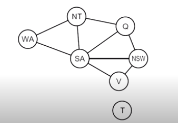
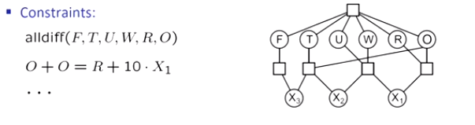

[toc]

# **<u>Constraint Satisfaction Problems</u>**

First, we'll start by revising what we did in the previous chapter.

## **<u>Search</u>**

- Search was used when the world was assumed to be : **single agent**, deterministic, fully observed and discrete
- Used to solve **planning problems**
  - We cared about the **path to the goal**
  - different paths have **different costs and depths**
  - heuristics give **problem specific-guidance**

- **<u>Identification</u>**
  - Identification is **assignments to variables**.
  - The goal itself is important, **not the path**.
  - All the paths are **at the same depth**(most of the time).
  - CSPs are a specialized class of **identification problems**.
    - This gives us more to work with. therefore, we have different algorithms more suitable for this type of problems.

****

## **<u>Search vs CSPs</u>**

### <u>**Standard Search problems**</u>

- State is a **black box**, you can only call `get_successor(state)` and `is_goal(state)`
- The goal and the successor could be **any** function(i.e. lots of possibilities).

### <u>**Consraint Satisfaction problems(CSPs)**</u>

- A special **subset** of **search problems**
- A state is defined by **variables** $X$ with values from a **domain** $D$.
- Goal test is a **set of constraints** that specify **allowable combination of values** for the variables.

- The representation of CSPs is different from standard search problems.
  - This allows us to use more specific algorithms that solve these types of problems faster.

- Representation of **Map Coloring Problem** (Map of Australia)
  
  - The goal is to color the map with [red, green, blue] such that no two adjacent states have the same color.
  - **<u>Variables</u>**
    - $X = [\text{WA, NT, Q, NSW, V, SA, T}]$ represents the states of the map. (WA = Western Australia ... etc).
  - **<u>Domains</u>**
    - $D = [\text{red, green, blue}]$ represents the colors of the states.
    - If we only had Variables and Domains, we could assign all values to red and just be done.
  - **<u>Constraints</u>**: adjacent regions must have different colors
    - **<u>Implicit</u>**: $\text{WA} \neq \text{NT}$ Effectively, implicit constraints are a snippet of code, that can be used to check whether constraints are violated or not.
    - **<u>Explicit</u>**: $\text{(WA, NT)} \in \{ \text{(red, green), (red,blue),....}\}$
  - **<u>Solutions</u>**
    - In CSPs, solutions are **assignments satisfying all constraints** .

****

### **<u>Constraints Graph</u>**



- In the graph, we **variable** corresponds to a **node** in the graph.
- The **edge** between two nodes represents a **constraint** between the two nodes.
- The constraint graph tells you that there is a **constraint** between two nodes but **doesn't tell you what it is**.
- **Binary CSP**: each constraint relates **at most** two variables.
  - In Binary constraint graphs, nodes are vairables and arcs are constraints.
- General purpose CSP algorithms use the **graph structure**  to **speed up search**.
  - e.g. Tasmania isn't adjacent to any other state, so there is no need to check it.
- **Constraint graph**
  
  - You can see that there is a **constraint** between multiple variables.
  - We represent the constraint by a box and draw a line from each participating variable to that box.

****

### <u>**Varietes of CSPs**</u>

- <u>**Discrete Variables**</u>

  - <u>**Finite Domains**</u>

    - Size $d$ means $O(d^n)$ complete assignments. ($d$ = # of values in domain, $n$ = # of variables)
    - E.g. Boolean CSPs like Boolean satisfaction problems.

  - <u>**Infinite domains**</u> (integers, strings ... etc)
    - E.g. Job scheduling.
    - Linear constraints are solvable, but non-linear constraints are not.

- <u>**Continuous variables**</u>

  - e.g. start/end times for Hubble Telescope observations.
  - Linear constraints are solvable in polynomial time by Linear Programming.

****

### <u>**Varieties of Constraints**</u>

- <u>**Varieties of constraints**</u>

  - **Unary** constraints involve a **single variable** (equivalent to reducing domains)
    - e.g. $\text{SA} \neq \text{Green}$
  - **Binary** constraints involve **two variables**
    - e.g. $\text{SA} \neq \text{Green}$
  
  - **Higher order** constraint involve **3 or more** variables.

- <u>**Preferences (soft constraints)**</u>

  - e.g. red is better than green.
  - Often represented by a **cost** for each variable assignment.

****

## <u>**CSP Standard Formulation**</u>

- Each state is defined by the **values assigned so far**.
- Initially, we have no values assigned to any variables.
- <u>**Successor function**</u>: assign a value to an unassigned variable.
- <u>**Goal test**</u>: All variables are assigned and satisfy the constraints.

### <u>**Naive Approach**</u>

- If we have a CSP with $n$ variables, each of domain size $d$.
- The naive approach would be to run bfs/dfs on our problem.
  - The branching factor at the top level is $nd$, 2nd level is $(n-1)d$ and so on.
  - This would result in a tree with $n!d^n$ leaves, even though there are only $d^n$ assignments.
- Can this be improved?
  - <u>**CPS commutativity**</u>: assigning $x_1$ = blue, then $x_2$ = green is the same as assigning $x_2$ = green, then $x_1$ = blue.
    - This can be exploited to search for less states.
    - If we only consider **a single variable**  at each node in the search tree (# of leaves would be $d^n$).

****

### <u>**Backtracking Search**</u>

- Backtracking is just DFS but with **two** improvements for CSPs.
  1. We only consider **a single variable**  at each node in the search tree (# of leaves would be $d^n$).
  2. Checks constraints by considering values which **don't conflict <u>previous</u> assignments**
  - This requires some extra computation at each assignment.

****

## <u>**Improving Backtracking**</u>

- <u>**Inference**</u> (Filtering)

  - Can we detect failures earlier ?

- <u>**Ordering**</u>

  - Which values should be assigned next?
  - What order should the domain values be tried?

- <u>**Structure**</u>

  - Can we use the structure of the constraint graph to speed up search?

****

### <u>**Inference**</u> (Filtering)

#### <u>**Forward Checking**</u>

- In forward checking,we keep track of **domains** for the **unassigned variables**
- On each assignment, forward checking removes the values that don't satisfy the constraints from unassigned variables.
- If some unassigned variable has an empty domain, we backtrack.

### <u>**Constraint Propagation**</u>

- In CSPs, an algorithm can search or do a specific type of **inference** called **constraint propagation**
- <u>**Constraint propagation**</u>: using the constraints to reduce the number of legal values for a variable, which in turn reduces the legal values for the other variables.
- <u>**Constraint propagation**</u>: reason from constraint to constraint
- This may be done as a preprocessing step or during search.
- Preprocessing could even solve the whole problem.

#### <u>**Arc Consistency**</u>

- An arc $X \rightarrow Y$ is consistent iff for every $x$ in the tail, there is some $y$ in the head that can be assigned w/o violating any constraints.
- A graph is **consistent** if **all** the arcs in it are consistent.
- If we delete a value from a domain to make an arc consistent, we have to recheck all the neighboring arcs that point to the variable (the one we removed items from its domain).

##### <u>**Algorithm**</u>

```python

def AC3(csp):

  # we start with the queue that has all the unchecked arcs
  while not csp.queue.is_empty():
    # we pop the first arc in the queue
    (Xi, Xj) = csp.queue.pop()

    # we check if that arc is consistent
    if revise(csp, Xi, Xj):
      # if it were not consistent, we will make it consistent

      # after we make it consistent, we check if the domain of the variable Xi is empty
      if len(csp.domains[Xi]) == 0:
        # if it is we return False, and we backtrack
        return False

      # If not, then we add all the neighbors of Xi to the queue
      # this is done as we removed an element from the domain of Xi
      # removal of this element may have made neighboring arcs inconsistent.
      for Xk in csp.neighbors[Xi]:
        csp.queue.push((Xk, Xi))
    
    return true

def revise(csp, Xi, Xj):
  revised = false

  # gets all constraints between Xi and Xj
  break_constraint = csp.constraints[Xi][Xj]

  # loops through all values in the tails domain
  for x in csp.domains[Xi]:
    # for each value of the tails domain, we loop over all values in the heads domain
    satisfies_constraint = false
    for y in csp.domains[Xj]:
      # if any value in the head satisfies the constraint, then that arc is consistent
      if not break_constraint(x, y):
        satisfies_constraint = true
        break
    # if the arc is not consistent, we remove the value from the tails domain
    if not satisfies_constraint:
      csp.domains[Xi].remove(x)
      revised = true

  return revised
```

<u>**Runtime**</u>: $O(cd^3)$.
The revise function is $O(d^2)$ and the AC3 function is $O(cd)$.

****

### <u>**Arc Consistency Limitations**</u>

- After enforcing arc consistency, we can have one solution or multiple solutions.
- The problem is that we can have **no solutions** (and not know it).

****

## <u>**Ordering**</u>

### <u>**Variable Ordering: Minimum Remaining Variable**</u>(MRV)

- We choose the variable with the **least number of legal values**.
- Why do we choose min instead of max ?
  - Because in CSPs, since you always assign **all the variables** if you are going to backtrack, it is better to do it early as this prunes the tree
  - Called **fail fast** ordering

- MRV doesn't help in choosing the first region (what if all regions have the same number of legal values?)

<u>**Degree Heuristic**</u>

- Choose the variable with the **highest degree** (largest number of neighbors) in the constraint search graph.

****

### <u>**Value Ordering: Least Constraining Value**</u>

- We pick the value that rules out the **fewest values** in the **remaining variables**.
- In MRV, we picked the most restrictive move as we had to go through all the **variables** anyway
- In LCV, we pick the least restrictive move as we don't have to go through all the **values**.

