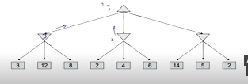
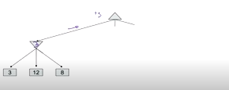
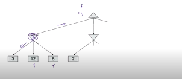
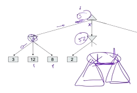
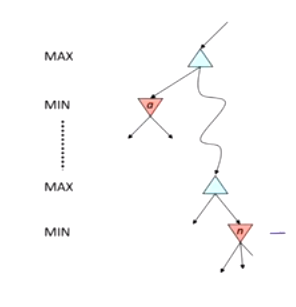
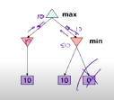

[toc]

<div style='page-break-after: always;'></div>

# <u>**Types of Games**</u>

### **<u>Classification</u>**

- Deterministic, Stochastic
- One, Two or more players
- Zero sum ?
- Perfect information (can you see the state)?

### <u>**Solution**</u>

- Solution for this is a **policy** which **recommends a move from each state**.

****

## <u>**Deterministic Games**</u>

- Formulation of the problem:
  - States: $S$ (start at $s_o$)
  - Players $P={p_1, p_2,...,p_n}$ (usually take turns)
  - Actions: $A$ (may depend on player/state)
  - Terminal Test: $S \rightarrow \{t,f\}$
    - Is the game over or not in the current situation?
  - Terminal Utilities: $S\times P \rightarrow R$
    - Every state has a **score**
    - Simple games may have only 3 states { Win, Lose, Draw } while others may have more than that

- Solution for a **player** is a **policy** $S \rightarrow A$

****

## <u>**Zero-sum games**</u>

|Zero-Sum Games | General Games|
|:-------------|:-------------|
|Agents have **opposite** utilities, this allows us to only have 1 number as a measure of performance, where agent one tries to maximize and agent 2 tries to minimize that number| Agents have **independent** utilities|
|If one agent maximizes the utility, the other's best option is to **minimize** the **same utility** | Co-operation, indifference and competition are all possible |
|Adversarial, pure competition||

****
## <u>**Adversarial Search**</u>

- It's a type of search, where you have to take into account the actions of another agent.

### <u>**Minimax Search**</u>

- Works for **deterministic, zero-sum** games
  - Tic-tac-toe, chess, checkers
  - One player maximizes the result
  - The other player minimizes the result

- <u>**Minimax Search**</u>
  - Contains a state-space search tree
  - Players **alternate turns**
  - Compute each node's **minimax value**
    - The best achievable utility against an **optimal** adversary

```python
def minimax(state, player):
    if state.is_terminal or :
        return state.utility(player)
    if player == 1:
        return max_value(state)
    else:
        return min_value(state)

def max_value(state):
  v = -inf
  for successor in state.get_successors():
    v = max(v, value(successor))
  return v

def min_value(state):
  v = inf
  for successor in state.get_successors():
    v = min(v, value(successor))
  return v

```
- **N.B.** if the game goes on for a long time, you can set a certain depth and just estimate the value of the state and return it instead of the utility.
#### <u>**Minimax Properties**</u>

- Minimax is only optimal if the opponent plays **optimaly**
- **Complexity**
  - Exhaustive search (like DFS)
  - Time: $O(b^m)$
  - Space: $O(bm)$
- **Example**, chess $b \approx 35, m \approx 100$
  - Exact solution is infeasible
  - Improvements ???

### <u>**Alpha Beta Pruning**</u>

#### <u>**Explanation**</u>

- If we are going to apply minimax on the following tree
    
- We will walk step by step and check whether we can skip the calculation of some of the nodes
- At the start, we don't know anything about the tree, so we'll have to go through everything
    
- After the first step, the minimizer -at depth 1- returns 3 to the maximizer, so we know the value at the root will be $\geq 3$.

- 
  At the next step, we check the first node at the minimizer which has the value of 2, this means that the ouput of the minimizer will be $\leq 2$.
  Since we know that
    1. Root $\geq 3$
    2. Minimizer $\leq 2$
  We don't need to compute the rest of the nodes/subtrees (the ones in blue)
  

****

#### <u>**Algorithm**</u>



- General Configuration (MIN version)
  - If you are computing the MIN-value at some node $n$
  - We loop over $n$'s children to get its value
  - Who cares about $n$'s value ? The **MAX** node above it
  - Let $\alpha$ be the best value that **MAX** can get by any choice point **along the current path from the root**
  - If $n$ becomes worse than $\alpha$, **MAX** will avoid it, so we can stop considering the rest of $n$'s children (as it is already bad enough that it won't be played)

- The MAX version is the opposite of this.

****

#### <u>**Implementation**</u>

- $\alpha$ is **MAX**'s best option on path to the root.
- $\beta$ is **MIN**'s best option on path to the root.

```python
def max_value(state, alpha, beta):
  v = -inf
  for successor in state.get_successors():
    v = max(v, value(successor, alpha, beta))
    if v >= beta:
      return v
    alpha = max(alpha, v)
  return v

def min_value(state, alpha, beta):
  v = inf
  for successor in state.get_successors():
    v = min(v, value(successor, alpha, beta))
    if v <= alpha:
      return v
    beta = min(beta, v)
  return v

```

- **N.B.** $\alpha$ and $\beta$ are always passed down the tree, not upwards.

****

#### <u>**Properties**</u>

- This pruning has **no effect** on minimax value computed for the root
- Values of intermediate nodes **might be wrong**
  - Children of the root may have the wrong value

  - If we take the left node, we have a guaranteed 10
  - The right node gives us $\leq 10$, so we just pass 10 instead, however it is **not guaranteed** to be 10
  - So, if we were to choose between the two paths above, we have to choose the guaranteed 10.
- To solve this problem, we have 3 options
  1. Keep track of which one was first (as the first choice was guaranteed)
  2. Prune on $\lt$ instead of $\leq$ to prevent ties (this will lead to worse performance)
  3. If two values are the same, run minimax on them and take the larger one.

- Good child ordering **improves the effectivesness** of pruning
- With **perfect ordering**
  - Time complexity **drops** to $O(b^{m/2})$
  - Doubles the depth
  - Full search of chess is still hopeless.

- This is called **metareasoning**
  - It is when you compute to **decide what to compute**.

****

## <u>**Resource Limits**</u>

- In practice, we can't explore until we reach the leaves
- So, we use **depth-limited search**
  - We act normally, until we reach a certain depth
  - Once that depth is reached, we use an **evaluation function** and use it to return a utility for the **non-terminal positions**.

- Using depth limited search, the **guarantee for optimality is gone**
- What if you don't know if you'll be able to run the whole thing ?
  - Use **iterative deepening**
  - And whenever you finish increase the depth and re run the algorithm.
  - When the time comes where you need to make a decision, take the best one computed until now.

### <u>**Evaluation Functions**</u>

- If we choose a bad evaluation function, that can't properly differentiate between states at **ALL** depths, this will lead to bad decisions (as you don't have enough information).
- **Ideal function**: returns the actual **minimax value** of the position.
- **In practice**: typically a **weighted linear sum of features**
  $\text{Eval}(s) = w_1f_1(s) + w_2f_2(s) + .... +w_n f_n(s)$ 
  e.g. $f_1(s) = $ (# of white queens - # of black queens) as an example for chess.
  - Machine learning can be applied to evaluate the positions.

- After a certain depth, you won't need the evaluation function as you'll be able to reach the end state
  - e.g. if the game has a depth of 50, and you can process a depth of 8
  - At the begining, you'll have to use the eval functions as you can only do from $0 \rightarrow 8$.
  - However, at depth 42, you can reach the end by doing $42 \rightarrow 50$.

- Evaluation functions will typically perform better the deeper you are into the tree.

- Just like A* seach, there is an important trade off between the complexity of the features and the time taken to compute them.


****

### <u>**Synergies between Evaluation function and Alpha-Beta Pruning**</u>

- We had previously mentioned that if we find the good nodes first, this will increase the amount of pruning done.
  - We can use the evaluation function to expand the **most promising nodes first**

- If your evaluation function can provide upper/lower bound for states, they can be used in pruning instead of calculating the subtree all the way.

****
