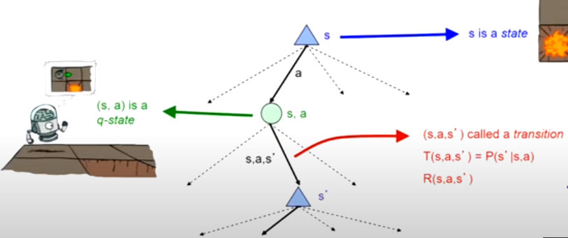
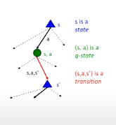
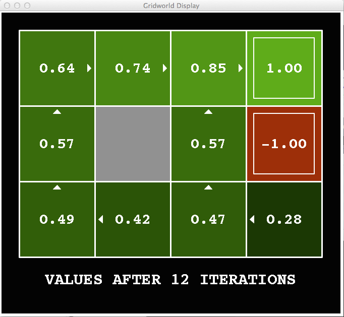
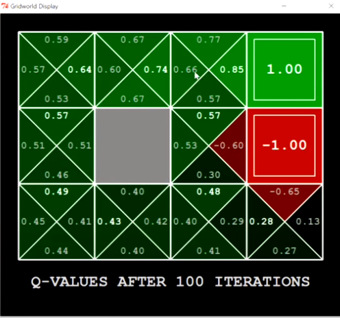
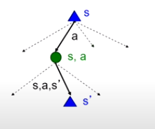
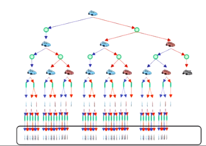

[toc]

# MDPs

## Introduction

- MDPs are a generalization of previous search problems, where the search is **non-deterministic**
- You know which actions you can take, but you're not certain where that action will lead you.

<u>**Example**</u>

- If a robot is at tries to move north, there is a 80% chance to move north, a 10% to move east or west respectively due to errors.

- in MDPs, the costs are called **rewards**

<u>**Example**</u>

- In maze navigation, There are two types of rewards:
  - Small "living" reward each time step (can be negative)
  - Big reward at the end (good or bad) (exit map or die)

****

### <u>**MDP Definition**</u>

- MDP is defined by
  - A set of **states** $s \in S$
  - A set of **actions** $a \in A$
  - A **Transition function** $T(s, a, s')$
    - If you are at state $s$ and you take action $a$, you will end up in state $s'$ with a probability of $T(s, a, s')$
      - i.e. $T(s, a, s') = P(s'|s,a)$
    - $s'$ is not unique, one action at state $s$ can possibly lead to many states
    - also called the **model** or the **dynamics**
    - A **reward function** $R(s, a, s')$
      - Sometimes, it is just $R(s)$ or $R(s')$ i.e. only the state matters not the action that led you there.
    - A **start state**
    - Maybe a **terminal state**
      - A game in MDPs could go forever, so you need to account for that when defining your algorithms

- MDPs are **non-deterministic search**
  - One way to solve them is **expectimax**
  - We'll have more ways soon.

****

## <u>**What is Markov about MDPs**</u>

- **Markov** in AI usually means that given the **present state**, the future and the past are **independent**.
- For MDPs, Markov means that action outcomes depend only on the **current state**
  $$P(S_{t+1} = s'| S_t = s_t, A_t = a_t, S_{t-1} = s_{t-1}, ...., A_0 = a_0, S_0 = s_0) = P(S_{t+1} = s' | S_t = s_t, A_t=a_t)$$

- This is similar to search, where the successor function could depend only on the current state (not the history).
- You need to formulate the states in your problem in order to satisfy that markov property
  - e.g. add extra attributes for the state, like number of food pellets left.

****

## <u>**Policies**</u>

- Unlike deterministic search, **solution**  for MDPs can't be a plan as we don't know how to sequence will be executed.
- The solution for an MDP is to get an **optimal policy** referred to as $\pi^*$
- A policy $\pi$ is a function that maps from **state** to **action** i.e. $\pi: S \rightarrow A$
  - An optimal policy is one that **maximizes expected utility** if followed.
  - An explicit policy defines a **reflex agent**
- Expectimax didn't compute entire policies.
  - It just computed the utility for a **single action** each time it was run.
  - We could use expectimax as one of the ways to compute the policy.

## <u>**MDP Search Trees**</u>

- Each **state** in the MDP project an **expectimax-like** search tree.  

- If you're in state $s$, and you take an action $a$, you'll end up in a **q-state** $(s,a)$
  - a q-state is an **unrealized state**, you've taken an action but that action can lead into multiple other states and you don't know in which one you'll end up.
  - from a q-state, a **transition** to $s'$ is expressed as $(s,a,s')$.

****

## <u>**Utilities of Sequences**</u>

### <u>**Agent Preferences**</u>

#### More or less rewards ?

- Agent are generally trying to maximize their rewards to maximize their utility.

#### Now or later ?

- Agents will generally prefer immediate rewards than rewards in the future.
  - You would definitely prefer a 100\$ now to a 110\$ after 10 years.
  - You would most probably also prefer a 110\$ after 2 minutes rather than a 100\$ after now.
- For some agents, this might not matter.
- You have to encode the effect of time in your model.

##### <u>**Discounting**</u>

- This allows the agent to understand that future rewards are worth less than present rewards.
- We set a **discounting factor** $\gamma$ and each step we take in the future, the utility for that reward $n$ steps in the future is multiplied by $\gamma^{n}$
  - The utility of a reward of value $3$ that is taken 2 timesteps  is $3\cdot \gamma^{2}$

###### <u>**Why discounting ?**</u>

- Sooner rewards are worth more.
- Helps the algorithm converge.

****

## <u>**Stationary Preferences**</u>

- If we assume that agent preferences are stationary, then if the agent prefers sequence $[a_1, a_2,...]$ over $[b_1, b_2,... ]$.
  - Then the agent will prefer $[r, a_1, a_2,...]$ over $[r, b_1, b_2,...]$
- In that case, there are only two ways to define utilities:
  - **Additive utility**: $U([r_0, r_1, r_2,...]) = r_0 + r_1 + r_2 + ....$
  - **Discounted utility**: $U([r_0, r_1, r_2,...]) = r_0 + \gamma r_1 + \gamma^2 r_2 + ....$

****

## <u>**Finite vs Infinite Horizons**</u>

- A finite horizon means that there is a fixed time $N$, after which the agent will stop.
  - Similar to **depth limited search**
- A finite horizon will sometimes lead to **policy changes**.
  - Thus, finite horizons yield **non stationary** policies
  - This is similar to how the decision making changes in sports as you near the end of the game.
- If there is no time limit, the optimal policy is **stationary.**

****

## <u>**Infinite Utilities**</u>

- If the game lasts forever, you have to handle that the agent will try to exploit that and get infinite rewards.

### <u>**Solutions**</u>

#### <u>**Finite Horizon**</u>

- Terminate the episodes after a fixed number of steps $T$.
- Gives **non-stationary policies** ($\pi$ depends on time left).

#### <u>**Discounting factor**</u>

- Use $0 < \gamma < 1$
  - While the game might last forever, the rewards from the later time steps will be negligble.

- Smaller $\gamma$ is equivalent to a **smaller horizon** (shorter game) as the agent will focus on the near future only.

#### <u>**Absorbing state**</u>

- Guarantee that for every policy, a **terminal state** will be reached eventually.

****

## <u>**Quantities to measure in MDP search tree**</u>

- The value (utility) of a state $s$
  - $V^*(s)$ is the **expected utlity** starting in state $s$ and acting optimally.
    

- The value (utility) of a q-state $(s,a)$
  - $Q^*(s,a)$ is the **expected utility** starting in state $s$ and taking action $a$. (you've already acted optimally)
  
  You'll notice that the value of each state is the maximum q-state value for all actions. 

- The **optimal policy**
  - $\pi^*(s)$ is the **optimal action** from state $s$

****

## <u>**Bellman's Equation**</u>

- If we want to get $V^*(s)$, we don't know how to directly get it, but we can relate it to the q-states below it as follows

$$
V^*(s) = \max_a \  Q^*(s,a) \\
Q^*(s,a) = \sum_{s'} P(s'|s,a) . [R(s,a,s') + \gamma V^*(s')]
$$

- This formula assumes that, we get the reward of the state you're going to.
- In the lectures, it is written as follows
  
  $$V^*(s) = R(s) + \gamma \max_a \sum_{s'} P(s'|s,a) V^*(s')$$
- This assumes that, when we exit a state we get the reward of the current state, not the one we're going.

- These are called **one-step lookahead equation**.
****

## <u>**Value Iteration Algorithm**</u>

- If we look at the tree, we'll find two problems
  1. States are repeated
     - Solve each problem once and cache the result
  2. Tree is infinite
     - Do a depth-limited computation, with increasing depth until change is small
     - Deep parts of the tree don't matter if $\gamma < 1$

### <u>**Time Limited Values**</u>

- We define $V_k(s)$ is the optimal value of $s$, if the game ends in $k$ time steps from now.
  - This would be equivalent to a **depth $k$ expectimax** from state $s$.
- This is easier to compute than $V^*(s)$, and allows us to deal with infinite trees.

### <u>**Algorithm**</u>

1. We start by calculating $V_0(s)$ for all states, (no time steps lefts means an expected reward sum of zero)
2. Given a vector of $V_k(s)$ values, we do expectimax for each state for a depth of 1
   $$V_{k+1}(s) \leftarrow \max_a P(s'| s,a) [ R(s,a,s') + V_k(s')$$
   Bellman's equation relates $V_k$ and $V_{k+1}$, and we know $V_k$, so we can use this algorithm to calculate $V_{k+1}$, until we reach  the desired height.
3. Repeat until convergence

- **N.B.** Each iteration increases the depth by one
  - In that iteration, you compute $V_{k+1}$ for **all states**.

#### <u>**Complexity of each iteration**</u>

- $O(S^2A)$

#### <u>**Optimality**</u>

- There is a proof that this converges to an optimal value.
- Policy may converge before values do
  - i.e. Actions will remain the same, and only the values change.

