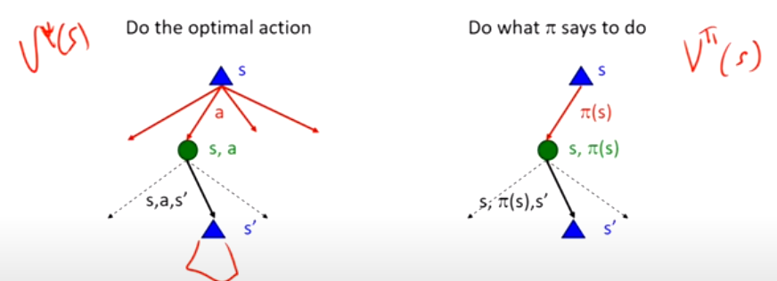
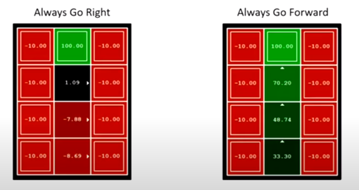
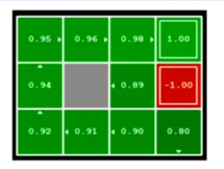
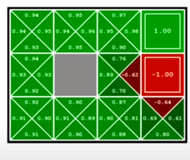

[toc]

# <u>**MDPs - II**</u>

## <u>**Recap for MDPs**</u>

- an MDP is just an **undeterministic search**.
- An MDP is defined by:
  - States $S$
  - Actions $A$ (i.e. you know all the actions that you can take)
  - Transitions $T(s, a, s')$
  - Rewards $R(s, a, s')$
  - Start state $S_0$

- Quantities that can be computed for an MDP
  - Policy $\pi$ Maps states to actions
  - Utility $=$ sum of discounted rewards
  - Values
    - A value of a state is the **expected utility** you'll get from that state if you act optimally
  - Q-value
    - Expected future utility from a q-state (you picked the action but don't know what'll happen)

****

## <u>**Bellman Equations**</u>

- A Bellman equation can take multiple forms.
- Basically, any equation that can write the quantities of an MDP (Values, Q-values, Policy) in terms of the same quantities with a $n-$step look ahead (usually $n=1$) can be called a Bellman equation.

### <u>**Value Iteration**</u>

- Last lecture, we saw how the Value Iteration method, uses a Bellman Update using Time-limited values to compute the value of each state.

- Each Time-limited value $V_k(s)$ is an approximation of the utility of $s$ if the game ends in $k$ time steps from now.
****

## <u>**Policy Methods**</u>

### <u>**Policy Evaluation**</u>

- Policy Evaluation takes in a policy (doesn't have to be optimal) and outputs the expected utility of each state if it follows that utility.
- How is this **different** ?
    
  - The difference is that, we already **know the action**, i.e. there is no $\max_a$ in our Bellman equation.

#### <u>**Utilities for a Fixed Policy**</u>

- This is a basic operation that computes the **utility** of a state under a **fixed** (generally **non-optimal** policy)
- If we have a state $s$ and a **fixed-policy** $\pi$
  - $V^\pi(s)$ is the **expected total discounted reward** starting in $s$ and following the policy $\pi$.
  
  $$V^\pi(s) = \sum_{s'} T(s, \pi(s), s') [ R(s,\pi(s), s' + \gamma V^\pi(s')]$$
  - **N.B.** 
    - There is no $\max_a$ as we know what action we will take according to our policy.
    - This is now a **linear system of equations** that's more easily solved.

#### <u>**Example**</u>

****
#### <u>**Computation**</u>

- Calculation is similar to how we used **time-limited values** in value iteration
- We'll turn the recursive **Bellman equations** into updates.

  $$V_0^\pi(s) = 0 \\
  V_{k+1}^\pi(s) \leftarrow \sum_{s'} T(s, \pi(s), s') [ R(s,\pi(s), s' + \gamma V_k^\pi(s')]$$

- Efficiency: $O(S^2)$ per iteration
  - However since each branch doesn't always lead to all other states, branching factor is often less than $S$.

****

### <u>**Policy Extraction**</u>

- We used **Policy Evaluation** to take a policy and get a number.
- We will now use **Policy extratction** to take in numbers and get a policy.

#### <u>**Extracting Policies from Values**</u>

- If we don't have a policy and **only have state values**, how do we extract that best policy from those values ?

$$\pi(s) = \arg \max_a \sum_{s'} T(s,a,s') [ R(s,a,s') + \gamma V(s')] $$

- Since we already know all the values, we know $V(s')$ which allows us to solve the equation and get the action that leads to maximum expected utility.

#### <u>**Extracting Policies from Q-values**</u>

- If we don't have a policy and **only have Q-values**, how do we extract that best policy from those q-values ?

$$ \pi(s) =  \arg \max_a Q(s,a) $$

- Important lesson: Actions are **easier to extract** from q-values than values.

****

### <u>**Policy Iteration**</u>

- Why policy iteration, when we already have value iteration ?

#### <u>**Problems with Value Iteration**</u>

1. **Computation**
  - $O(S^2A)$ per iteration
2. The **max** value at each state rarely changes
3. The policy often converges long before the values.

****

#### <u>**Policy Itertation Algorithm**</u>

1. **Policy Evaluation**: Calculate the utility of some fixed policy until it converges.
2. **Policy Improvement**: Update the previous policy using one-step look-ahead with the evaluation from step 1.

- Repeat Steps 1 and 2 until the policy converges.

- This is **Policy iteration**
  - It is **optimal**
  - Converges (much) faster under some conditions

##### <u>**Math**</u>

- **Evaluation**:
  $$V_{k+1}^\pi(s) \leftarrow \sum_{s'} T(s, \pi(s), s') [ R(s,\pi(s), s' + \gamma V_k^\pi(s')]$$ 
- **Improvement**:
  $$\pi_{i+1}(s) = \arg \max_a \sum_{s'} T(s,a,s') [R(s,a,s') + \gamma V^{\pi_i}(s')]$$
  - We have $V^{\pi_i}(s')$ from the previous iteration
  - the improvement step has complexity of $O(S^2A)$ just like value iteration (it is essentially the same as value iteration).

##### <u>**Number of iterations ???**</u>

- When you use Polciy Iteration, you have to pick how many times to iterate (Policy Evaluation) before taking a step in the policy improvement.
  - There is no optimal way to pick them, there are always tradeoffs.
- If you cycle between iteration and improvement often enough, you'll always converge. 

- **N.B.** 
  - You don't always start the evaluation with $V_0^{\pi_{i+1}}(s) = 0$.
  - Instead, you use the old values from the previous iteration $V_0^{\pi_{i+1}}(s) = V_{k_n}^{\pi_i}(s)$ where $k_n$ is the last time limited value. 

****

## <u>**Value Iteration vs Policy Iteration**</u>

- Both of them compute the same thing, In the end we want the optimal actions for each state (optimal policy).
- **Value iteration**
  - Every iteration updates **both** the values and (implcitly) the policy.
  - We don't track the policy, but taking a max over actions implicitly recomputes it.

- **Policy Iteration**
  - We do several passes to update utilities with a fixed policy ($O(S^2)$ instead of $O(S^2A)$).
  - After the policy is evaluated, a new policy is chosen $O(S^2A)$.
  - If policy converges, we stop.

****
