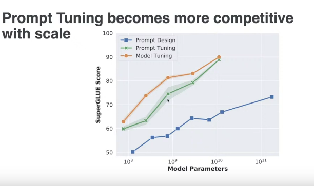
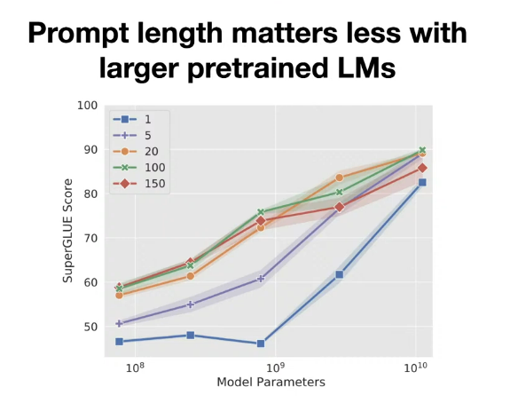
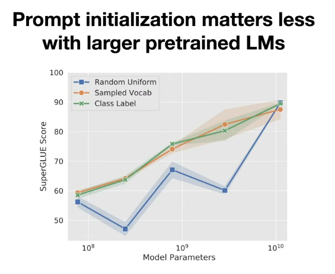

# Prompt-based learning

- Until this lecture, we've talked about the pretrain -> fine-tune paradigm.
- This lecture, we'll discuss how to add the least amount of parameters to a model while still adapting it to downstream tasks.
- This is useful as it allows us to take large models, and adapt them to new tasks with minimal parameters.
----------

## Zero-shot, One-shot & Few-shot settings

- In the three settings above, we don't add any parameters to the model.
- We also don't fine-tune the model (no gradients are computed after the pretraining phase)
- **N.B.** This is not the same as prompt based learning

### Zero-shot setting

- We describe the task using a prompt

```python
prompt="""
Translate English to French:
cat =>
"""
```

### One-shot setting

- We describe the task using a prompt and give 1 example

```python
prompt="""
Translate English to French:
cat => chat
dog =>
"""
```

### Few-shot setting

- We describe the task using a prompt and give a few examples

```python
prompt="""
Translate English to French:
cat => chat
dog => chien
mouse =>
"""
```

- In GPT3, the number of examples is 100.

----------


## Prompt-based learning

- As the models are now extremely large, replicating the pretrained model and fine-tuning it for each task is not feasible.
- Prompt-based learning tries to solve this problem by having a single model that can be adapted to different tasks by giving it a prompt.
- How is this different than T5?
    - In T5, the prompt would be something like `translate English to French:`, in prompt-based learning, the prompt would be something like `<TOK1><TOK2> The movie was great` where `<TOK1>` and `<TOK2>` are randomly (sometimes not random) initialized tokens, that tell the model that we are doing a sentiment analysis task.
    - In T5, all the parameters of the model are changed during backprop. In prompt-based learning, only the parameters of the prompt tokens are changed during backprop. (The rest of the model params are frozen).

- Since all of the parameters are the same, you could fine-tune different tasks in the same batch (as only the prompt tokens are different from 1 task to another).

### Performance



- This works better with **larger models**.



- The number of the prompts added before each task affects the performance, However the effect decreases as the model  gets larger.
- They settled down on using 100 prompt tokens per task.



- The initial value of the prompt tokens affect the performance of smaller models, but not larger models.

----------

## Prompt Pretraining

- You could pretrain the prompt tokens by giving them a lot of examples of the task.
- Later on, you can finetune them on a different task and it would give better results

<!-- TODO: Check this in the paper -->
- I think that the two tasks need to have the same labels for this to work, but not 100% sure about this.

----------

## Notes

- This field of research is relatively new (late 2021), so there aren't a lot of papers on it.
- At the time you're seeing this, different approaches may have been developed.

----------
