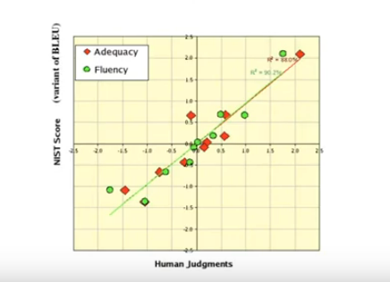
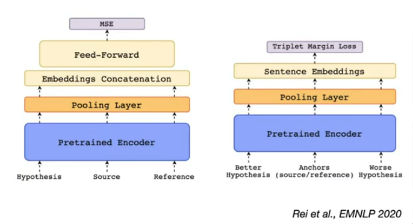

# Evaluating Text Generation

- So far, we've only seen perplexity as an automatic measure to evaluate language models.
- However, it doesn't work well for summarization and translation and some other tasks.

- What is used today is:
  - `BLEU` (Bilingual Evaluation Understudy) score for MT
  - `ROUGE` (Recall-Oriented Understudy for Gisting Evaluation) score for summarization
  - BERT-based models are also used.
  - Human Evaluation

----------

## What is MT good (enough) for?

- Not good enough for **dissemination** which is translating a whole book into another language.
- A little more useful for **communication**
  - something like interpretation is very hard for MT. (much easier to translate a whole sentence rather than word by word)

----------

## Problems with MT Evaluation

- Different translations of the same sentence can be equally good.
- e.g.
  - Egyptian officers are responsible for airport security.
  - Egypt is in charge of the security at this airport.
  - The safety of the airport is in the hands of the Egyptian officers.

- During evaluation, you care about
  - Adequacy: How well does the translation capture the meaning of the source sentence?
  - Fluency: How grammatically correct is the translation?

### Automatic Evaluation
 $\text{precision} = \frac{|\text{output} \cap \text{reference}|}{|\text{output}|}$ and is $\text{recall }=\frac{|\text{output} \cap \text{reference}|}{|\text{reference}|}$.

#### BLEU Score
Takes the geometric mean of the n-gram precision. (n = 1, 2, 3, 4)

$$
BLEU = \min(1, \frac{\text{len(ouput)}}{\text{len(reference)}}) \times (\prod_{n=1}^4 \text{precision}_n)^{\frac{1}{4}}
$$
- Includes a **brevity penalty** to try and account for the absence of recall measurement.
- It is noisy so doesn't mean a lot for 1 sentence, but gives a good idea of how well the system is doing over the whole corpus.

- Why not use recall ?
  - With precision, it is easier to add multiple references and compute the precision over all of them. (if an n-gram is present in any of the references, it is counted as correct)
  - Recall is not meaningful with multiple references.

- BLEU captures local grammatical correctness(due to n-grams), but not global correctness.

### Problems with BLEU Score

- All words are of the same significance
- It doesn't care about the order of the words
- Scores are meaningless
- human translators also score low on BLEU

### Why use BLEU after all ?

- BLEU has a **high correlation** with human evaluation.
  

- This is how metrics are ranked, to say that your metric is better than another, it has to have a higher correlation with human evaluation.

----------

## ROUGE Score

- A recall based counter part to BLEU.
- Measures what % of the words in the reference are present in the output.
- Used mainly for text summarization.
- This is useful for text summarization as we care that the meaning is captured in the summary more than anything else, so we want to make sure that the words in the reference are also in the output.
- ROGUE needs to be modified as a model that outputs the unchanged input will score high on the ROGUE score.

----------

## Learned Evaluation Metrics

### BLEURT (BLEU + BERT)

- Take a BERT model and fine-tune it to predict the BLEU score of a sentence pair.
- then fine tune that model on small supervised datasets of human quality judgements

- Problems:
  - Human judgements are noisy, so the model will also be noisy.
  - Wouldn't be available for low resource languages.

### COMET

- Recommended for MT evaluation over BLEU.

----------

