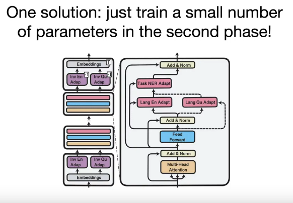
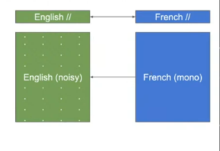
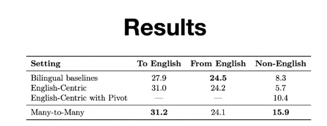
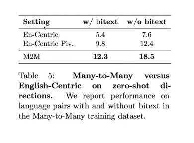
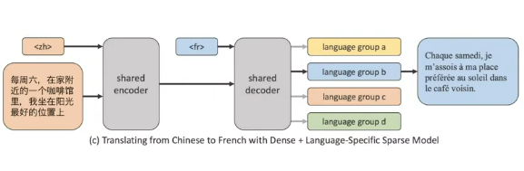
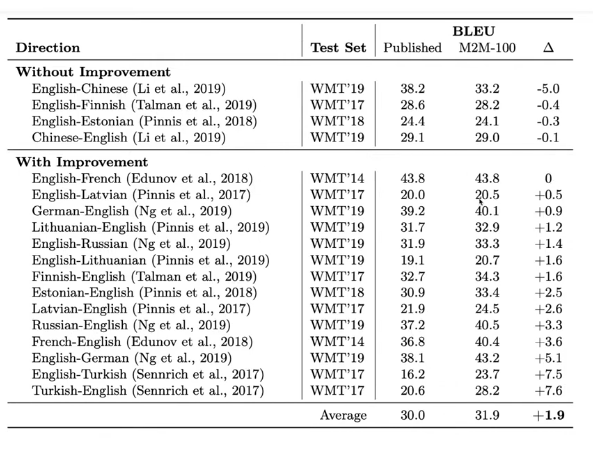

# Multi-Lingual Transfer Learning

## Approach

- The approach in multilingual transfer learning is to train the model in a self supervised manner on a large corpus that containts text from a **mixture of languages**.
- The early layer deal with language specific tokens, but the deeper layers don't really interact with them, so in a low resource language, we might not be able to learn the sentiment analysis task, but we can learn the language specific tokens and use the knowledge from another language to learn the sentiment analysis task.

- Even if two languages are morphologically/syntactically different, the model can pick up the semantics behind these languages and share that knowledge across different languages.
- We **could** employ something like prompt based learning to learn language specific features (not sure if it would work).
  
## Cross-lingual zero-shot learning

- If we have a model trained on two languages A & B.
- We want to perform sentiment analysis on language B, but we only have labelled data for language A.
- We could fine-tune the model on language A.
- Then use Zero-shot/one-shot/few-shot learning to predict the sentiment of language B.

## Tokenization Challenges

- When using different languages, we need to be aware of our choice of tokenizer and how it affects the languages used.
- In mT5, they just use SentecePiece on the whole multi-lingual corpus.
- In ByT5, they use the byte-level tokenizer.

----------

## Target Language Adaptation

1. If you only care about transferring to a specific target language B, then after pretraining on many languages, you can perform fine-tuning on language B using self-supervised learning.
   - This might result in the model forgetting the multi-lingual knowledge it learned earlier (called **catastrophic forgetting**)

2. We can add language specific parameters to the model called adapters, and freeze the rest of the model. (similar to prompt based learning)
    

----------

## Multilingual Transfer in MT

### Back Translation

- Used when
  - Small parallel dataset
  - Huge monolingual corpus in **target language**.

- How is this done ?
  1. Train a **target** to **source** model $M_{t2s}$
  2. Use $M_{t2s}$ to translate the **target** corpus to **source** corpus.
  3. Use the **union** of the noisy data from step 2 and the parallel data from step 1 to train a **source** to **target** model $M_{s2t}$.
   

- This causes an improvement in BLEU score.

### Many-to-Many Translation

- If we want to have a Spanish-Romanian model, we can use a Spanish-English model and an English-Romanian model.
- As we have more data for English-X pairs.

- Bilingual Baseline: Trained only on a specific Source -> Target direction
- English Centric: Trained on English -> Target or Source -> English, at test we feed X -> Y
- English Centric: Trained on English -> Target or Source -> English, at test we feed Y -> English -> X

#### Zero-shot Translation

## Language Specific Parameters

Results

----------
