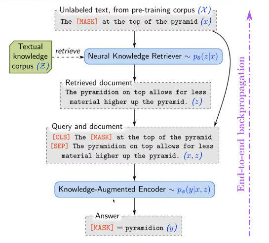
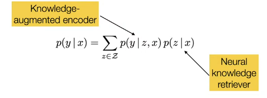
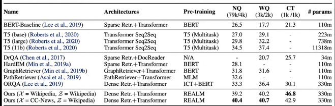
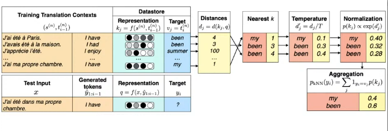
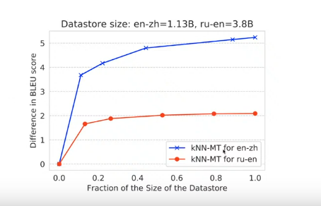

# REtrieval-Augmented Language Modelling (REALM)

- The idea of this is that if you have a text `The [MASK] at the top of the pyramid`, if the goal is to predict the word `[MASK]`, wouldn't it be beneficial for the model if you added a relevant Wikipedia article to the input?
  - Your input would be `The [MASK] at the top of the pyramid [SEP] The pyramidion on top allows for less material higher up the pyramid.`
- Without this addition, the model would have to learn that fact and store it somewhere in its parameters, but with the retrieval augmentation, the model can just use the new paragraph as a reference to extract the information it needs.

- How can we train this ?

----------

## Training

- The goal is to predict $p(y|x)$, where $y$ is the masked word and $x$ is the context.

- The problem is phrased as (where $z$ is the document/article/paragraph to augment the context with):
  

### Knowledge Retriever

- Defined using a dense inner product model:
  $$
    p(z|x) = \frac{exp(f(x, z))}{\sum_{z'}exp(f(x, z'))}\\
    f(x, z) = \text{Embed}_{\text{input}}(x)^T\text{Embed}_{\text{doc}}(z)
  $$
    - Both document and input embeddings are retrived from the `[CLS]` token of the BERT model.
    - The BERT model is different than the one used for retrieval
    - Embed function is just BERT
      $$
        \text{Embed}_{\text{input}}(x) = W_{\text{input}}\text{BERT}(x)\\
        \text{Embed}_{\text{doc}}(z) = W_{\text{doc}}\text{BERT}(z)
      $$ 

#### Cost of training

- It is impossible to compute the whole pipeline for each paragraph, and normalize that way.
- Instead, we cache all the paragraph encodings and use an algorithm for dense matrix multiplication and compute the similarity between the context and the paragraph encodings.
- We then take the top $k$ paragraphs and use that to normalize the probabilities computed.
- This is a huge approximation but it still produces good results as most documents have near zero probability.

----------

## Maximum inner product search (MIPS)

- Algorithms that approximately find the top $k$ paragraphs for a given context.
- Scales sublinearly with the number of paragraphs at the cost of less accuracy. (significance depends on the problem at hand).

----------

## Refreshing the index

- When you train the model for a bit, you need to update the cached paragraph embeddings.
- This can't be done every batch, so they update the batches every $n$ batches.

----------

# Evaluation on open-domain QA

- In open-doman QA, you are not given a paragraph with the answer inside.
- Results
  

- Notice that REALM has 3 times the parameters of BERT, this is because it has 3 BERTS
  1. Doing MLM (we get the `[CLS]` from) 
  2. Embeds the documents (get the`[CLS]` for the document from)
  3. Does the final prediction using the input and documents retrieved.

----------

# Retrieval in MT

- We store that embeddings from the words during training (the amount of embeddings are very large (Billions))
- We then perform some similarity measure and retrieve the top $k$ word pairs.
- We take this distribution and name it $p_{KNN}$
- What if we hadn't seen a similar word order?
  - If we rely on $p_{KNN}$, we would get a probability of 0 for the word pair.

- This is why we use a mixture of the two distributions:
  $$
    p_{mix} = \alpha p_{KNN} + (1-\alpha)p_{LM}
  $$
  - $\alpha$ is a hyperparameter that controls the amount of retrieval augmentation.

- This is very computationally intensive.
- It was shown that you can discard a huge part of the Datastore, while still improving the BLEU score.
    

   

