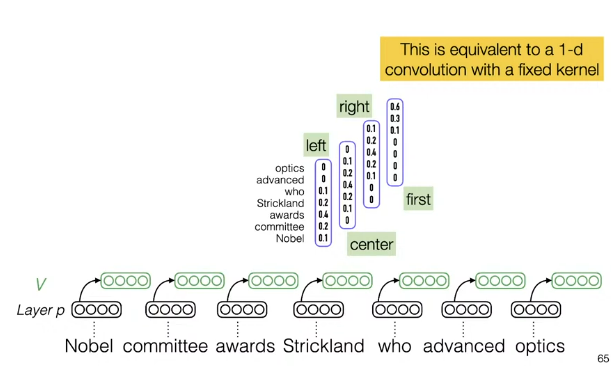
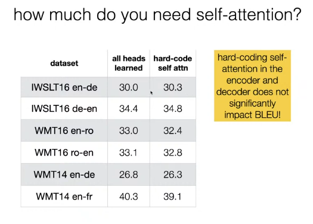
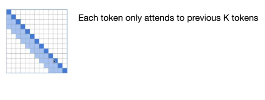
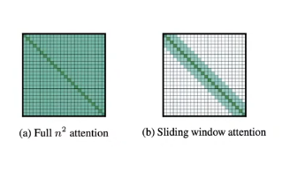
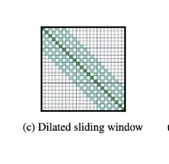
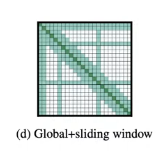
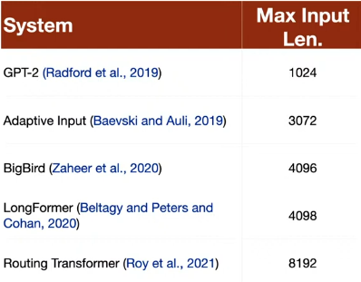
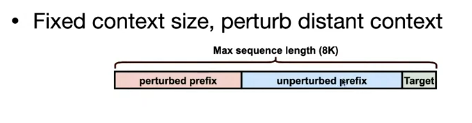

# Efficient Transformers

- One of the reasons transformers are slow is that the complexity of the attention is $O(n^2)$
- People have tried to reduce this complexity by using different attention mechanisms.

## Hard Coded Self-Attention

- The idea behind that is that we try to mimic what we thing the transformer is doing and hard code the attention scores for different attention heads
- For example, one head can always look at the beginning of the sentence, another head can always look at the end of the sentence,  another could have a gaussian distribution around certain positions and so on.

- There are three types of attention in the transformer
  - Encoder Attention, Decoder Attention, & cross attention
- We can't really hard code cross attention as we don't understand the representation of the other sentence.

- Some papers also tried having the attention scores as parameters and trained them.

### Results

- We can see that in this task, the results aren't that much worse.(reduction in performance was in the bigger model en-fr)
- Efficiency wise, the hard coded attention is much faster than the transformer.
  - Hard-coding attention and reducing cross attention heads allowed us to use $27\%$ more tokens per batch
  - Decoding speed increases by $30\%$ over the baseline transformer.

### Conclusion

- If latency is important for your task, consider drastic simplification to your neural models.
- It can make them faster without sacrificing too much performance.

## Examples on Fixed Attention Patterns

### Local Attention

### Longformer Attention patterns

- There is also the Dilated Sliding Window

    
    - Here we increase the size of the window but we miss some tokens in it.
    - But since there are many layers, we can still get the "missed" information from other layers
- Global + Sliding Window

    
    - Mixes the local attention with some certain positions from the sentence.

- The longformer can scale up to 4k tokens and still be efficient by mixing between these attention mechanisms.

### Linformer

- Produces a low-rank approximation of the $N \times N$ attention matrix by projecting the $N \times d$ keys and the $N \times k$ values into a $k \times d$ matrix.
- Then attention doesn't depend on the sequence length.

----------

# # of tokens in a Transformer

- But does the model make use of all the tokens even if it can fit into its memory?
- There was an experiment set where you ruin (perturb) the first n tokens and see how much the model is affected. (shuffle, replace with random tokens, etc)
  

- It was found that the performance stays the same until you perturb the last 2000 tokens
  - i.e. model makes use of the last 2k tokens even if it could handle more hardware wise.

## How to solve this ?

- Mohit (instructor) thinks that this is due to the pretraining objective.
- To do LM or MLM, we only need the local context (previous 500 words for most predictions, maybe 1000 for some)
  - The model doesn't need to learn more than that in order to do the pretraining task successfully.

- So, we need to come up with a new pretraining task that requires the model to learn more than just the local context.
  - Instead of just training bigger models with more data.

----------

# Dealing with long documents

- The best way to deal with long documents right now is to split them into smaller chunks and then feed them to an encoder.
- and then concatenate the embeddings to form a representation for the document.
- The problem is that this breaks the dependency between the chunks, so people are trying to think of better ways, but for now that's the best we got.

