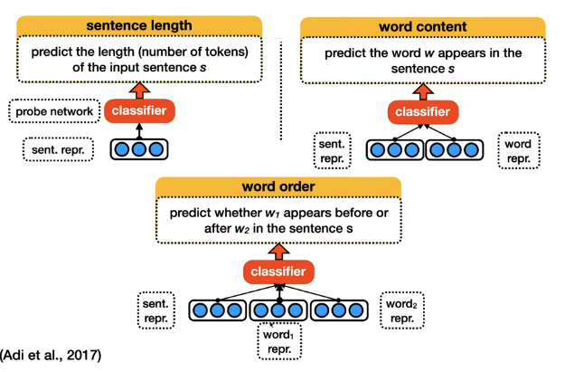
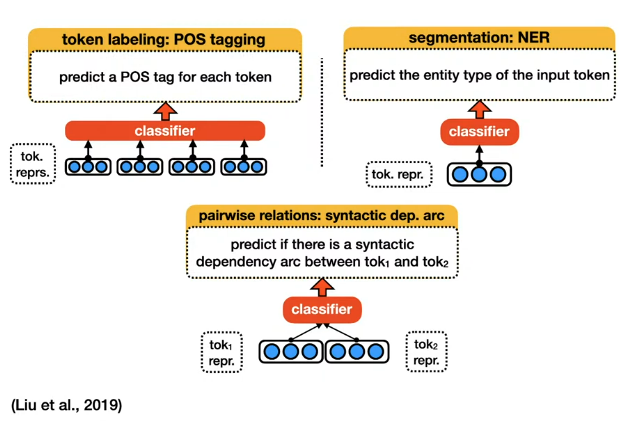

# Probing Pretrained Models

- We want to know what properties are learned by the pretrained models.

## BERTology
- People tried to check which words were the most important when coming up with the predictions in BERT.
- A simple way to do this is to compute the loss and check the gradients.
- The words with the highest gradient (L2 Norm of gradient) in the backprop are the ones that are most important for the prediction.

- This is a way to check one example at a time, what if we want to know if a model has a certain property ? does the model understand addition ?
----------

# What is a linguistic probe task?

- We have
  1. A model
  2. A phenomenon we want to check
- The goal is to check if the model has understood this phenomenon.
- This is done through the representations it outputs.

## How to do this ?

- First we freeze the parameters of our model, and create a model called the probe network (it is preferred that it has low complexity)
- The lower complexity the probe network has, the more certain we are of our results.
- If the probe network is complex, how can you know whether the phenomenon was learned by the model or the probe network ?

    

    

- If our model scores well and we have a simple enough classifier, we know that our model encodes the length of the sentence.

----------

## Injecting a linguistic phenomenon into the model

- We can finetune the model using the loss of the probe network.
- if BERT struggles then reformulate the loss as
  $$
    \mathcal{L} = \mathcal{L}_{\text{BERT}} + \lambda \mathcal{L}_{\text{probe}}
  $$ 

