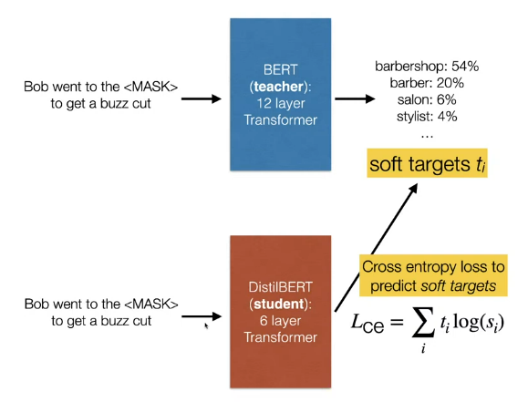
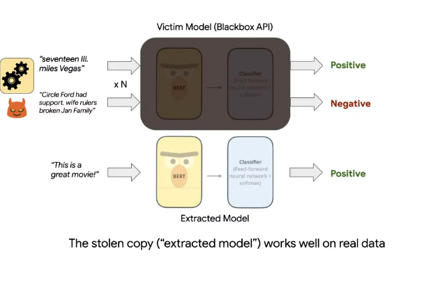
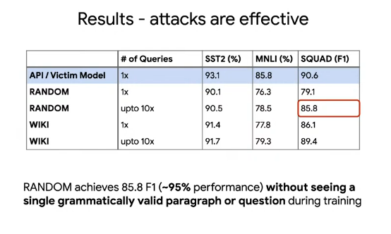

# Knowledge distillation

- We have a small model (**student**) and a much larger model (**teacher**)
- We want to train the student to **mimic** the predictions of the teacher.

## Distillation process

- Why do we compute the loss over the whole vocabulary?
  - After the top-$k$ tokens, you'll find that the tokens don't mean much in terms of semantics.
  - But the model can still learn syntactic information from the tokens.

----------

We can also distill other parts of the teacher, not just its final prediction.

    - Attention models
    - Hidden layers

----------

## The Lottery Ticket Hypothesis

- After fitetuning a model, remove the parameters with the lowest magnitude in each layer.
- After setting to zero, reset the weights of the remaining parameters to the values before fine-tuning, and re do the fine-tuning.
- Keep in mind that this will have the same number of parameters, but many of them are zeros, so you can make use of sparse multiplication otherwise this didn't make sense.

### Results
- This means that mose parameters in the network are not used.

----------

## Model Theft (Extraction) from API

- How is this different from distillation ?
    1. The goal is theft, not compression
    2. We have no training data.

----------

### Example

- 2 way were tried to extract the model from its API
  1. Query using random words to generate a dataset.
  2. Query using random paragraphs from wikipedia articles to generate a dataset. 

