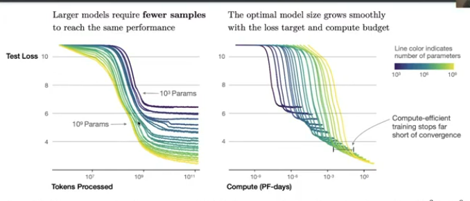

# Scaling Laws for Large LMs

- The goal of this lecture is to figure out the answer to the following question:
  - Given a **fixed compute budget**, what is the optimal **model size** and **training dataset size** for training a transformer LM?

----------

## Scaling Laws (findings)

- Performance depends strongly on **scale**, weakly on **model shape**:
  - Scales consists of 3 factors
    1. **Number of parameters** $N$
    2. The **Size of the dataset** $D$
    3. The amount of **compute** $C$ used for training
   - Withing reasonable limits, performance depends weakly on other architecural choices such as depth vs width.
- **Universality of overfitting**: Performance improves as long as we scale $N$ and $D$ in tandem, but enters a regime of diminishing returns when either is fixed while the other increases.
  - The performance penalty depends predictably on the ratio $\frac{N^{0.74}}{D}$.
  - i.e. Every time we increase the model size by x8, we need to increase the data by roughly x5 to avoid a penalty. (observed empirically).
  - It was found in the Chinchilla paper that data and model should be increased equally, and the error from before was due to not adjusting the learning rate correctly.

- **Sample Efficiency**: Large models are more sample-efficient than smaller models. i.e. they reach the same level of performance with fewer optimization steps and fewer data points
  
    - So assuming you have 1 day of infinite compute, you should train a larger model on less data, rather than a smaller model on more data.

- There is a finding on batch size in the paper but not discussed in the lecture.

