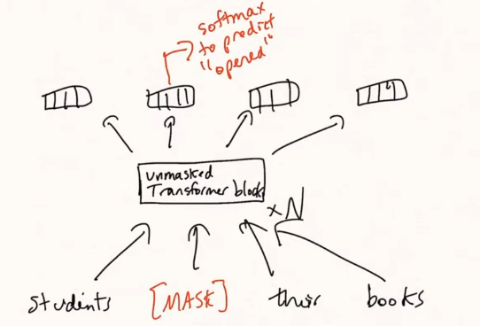

## Transformers Hacks

- These hacks work based on experiments and the reason for why they work is unknown

1. You should add a learning rate scheduler in your training loop
2. Label smoothing improves the results slightly in text generation tasks
   - They think it's because a one-hot vector label would make the model over confident, even though multiple words may fit in the next position.

## Transformer Variants

1. Encoder-Only
2. Encoder-Decoder
3. Decoder-Only
4. Prefix Language Model
   - Prefix language model is a decoder-only model.
   - It has a similar purpose to encoder-decoder models.
        
    - We apply a partial mask to the input sequence.
    - This is used when you have a ready decoder-only and you can then fine-tune it as a prefix LM.

----------

## BERT

### Masked LM

### Sentiment Analysis

----------

### Multi-Sentence Classification

- This includes things like Sentence Entailment.

----------

### Extractive Question Answering

- We take all the tokens after the `[SEP]` token, and pass them through 2 models.
  1. Predicts whether the token is the start of an answer
  2. Predicts whether the token is the end of an answer.

- During train time, this is easy to deal with, but during inference, we need to find the best answer.
  - We take the start and end that maximize $p_{start}(i) * p_{end}(j)$
  - Exclude the cases where $j < i$
  - Exclude spans longer than some threshold (depends on the problem)
- It is possible that the span doesn't have the maximum $p_{start}(i)$ or the maximum $p_{end}(j)$

----------

# T5 and Text-to-Text Problems

## Self Supervised Learning Task - Denoising

- There are tokens in the model `<x>`, `<y>` may be others
- If we have a sentence `Students opened their books`, we feed the model `<x> opened <y>` and the label is `<x>Students<y>opened their books`

- Why is it better than a Language Model ?
  - This has the context from the entire sentence, whereas a language model has the context from only the previous words.
  - Denoising requires global knowledge about the sentence.

----------

## Fine Tuning T5

- While in BERT, you would create a classification head with 3 labels to solve the sentence entailment problem (contradiction, entailment, neutral).
- In T5, the model would output the words `contradiction`, `entailment`, `neutral` and as text. (the head is the same and outputs a probability over $|V|$ words)

- Wouldn't the model be likely to predict something other than the 3 labels?
  - No, the model would learn during finetuning that those 3 labels will optimize the loss and therefore give zero probability to other words.

- You could limit the vocabulary to the 3 words, but that 
  1. wouldn't be necessary as the model learns not to output other words
  2. That would limit the model, some models can solve more than 1 downstream tasks at once.

----------

## Decoding in Text Generation

- Decoding here refers to the process of picking a token from the model based on the probabilities from the final softmax.
- There are several approaches
  1. Greedy Decoding
  2. Beam Search
  3. Sampling
     1. Top-k Sampling
     2. Nucleas Sampling 

- In text generation, most people use nucleas sampling as it makes the model more diverse, But in tasks like Translation, when you need a specific sentence, people use beam search.
### Greedy Decoding

- Pick the token with the highest probability

### Beam Search

- Discussed before

### Sampling

- You could sample from all the vocabulary given the probabilities from the softmax.
- However, since you sample a considerable amount of times, you will eventually end up with some non-sensical words.

- To fix that people use top-k sampling and nucleus sampling.

- Think about how Top-k and Nucleas would perform in the above case.

#### Top-k Sampling

- You sample from the top-k words with the highest probability.
- This way there is a much smaller change of picking a word that doesn't fit

- The higher the value of $k$, the more diverse and the risker your model will be.
- The lower the value of $k$, the more conservative (less diverse) and the safer your model will be.

#### Nucleus Sampling

- You sample from the top words, that allow you to cover the top $p\%$ of the probability mass.
