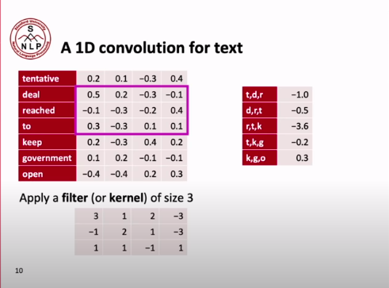
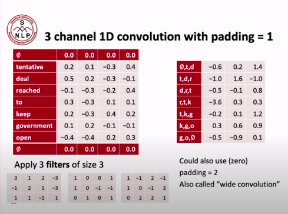
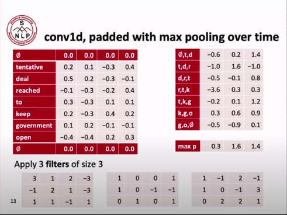
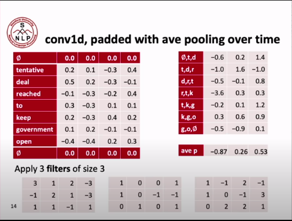
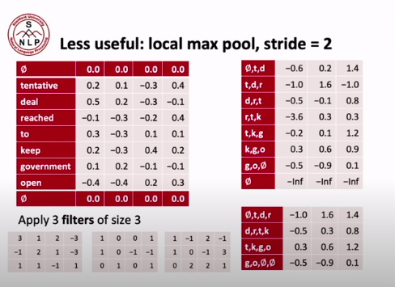
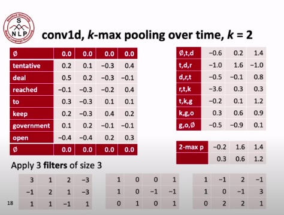
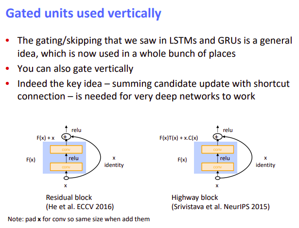
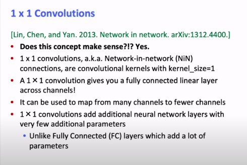

[toc]

# **<u>L11_CS224N</u>**

# **<u>ConvNets in NLP</u>**

What happens is that we do **1D Convolution** on the **word embeddings**

Assuming we only apply **1 filter** the result dimension will be 
$$
(n - k +1)\times 1
$$
where $k$ is the filter size, $n$ is the number of words.

However, if we have $f$ filters and $p$ paddings. output will be
$$
(n - k + 1 + 2p) \times 1
$$

****

Just like Images, we hope that each channel/filter will learn different things.

i.e. One channel will give high output if the language is polite. Or be high if it talks about food.

****

## <u>**Pooling**</u>

### **<u>Max Pooling</u>**

This is used when you wonder if any of the channels were activated anywhere.

i.e. If we consider col 1 to be politeness, we check whether any of the words in the sentence was polite and we will get the most polite word since we get the highest activation value.

****

### **<u>Avg Pooling</u>**

Similar to Max Pooling this would get the average politeness within the words.

****

Max pooling is actually more commonly used as NLP is sparse by nature, so even if the sentence was polite, it will contain filler words that are not related to politeness like he, the, and .... etc

****

## <u>**Less useful operations**</u>

### **<u>Local max pool</u>**

This is the same to what is done in CV but not highly effective here.

You group each two columns together and take the max value of the two and this halves the size of the matrix.

****

### **<u>k-max pooling overtime</u>**

At $k = 2$, takes the two max values from each column while keeping their order.

****

### <u>**dilated convolution**</u>

Still don't get

****

To look at a bigger part of the sentence, you can

1. Have bigger kernel size $k$
2. Have deeper convolutional networks
3. Use dilated conv layers

****

## **<u>Our growing toolkit</u>**

- **<u>Bag of vectors</u>**

  Surprisingly good baseline for simple classification problems. especially if followed by a few ReLU layers

- **<u>Window model</u>**

  Good for **single word classification** for problems that don't need wide context e.g. **POS, NER**

- **<u>CNNs</u>**

  good for classification, need zero padding, hard to interpret, **easy to parallelize on GPUs**. Efficient and versatile

- **<u>RNNs</u>**

  not the best for classification, much slower than CNNs, good for **sequence tagging** and **classification**, great for **language models**, can be amazing with **attention mechanisms**

- **<u>Transformers</u>**

  Don`t know yet but the hype is real

CNNs are better than RNNs when comparing whether two sentences are similar or not.

****

## **<u>Gated units used vertically</u>**

After the success of LSTM has been proven, people tried to apply the ideas of **skip connections** and **gates** in the **vertical** direction.

This led to **Residual blocks** and **Highway blocks**.

**Residual blocks** can compute any function that the **Highway block** can compute, so non of these has the edge on the other. choosing between them is empirical.

****

## **<u>Batch Normalization</u>**

Batch normalization is similar to **Z-transform** in statistics
$$
Z=\frac{x-\mu}\sigma
$$
but is done for each batch.

****

## **<u>1x1 Convolutions</u>**

also called **Network-in-Network**.

- Useful to map many channels into smaller channels by doing **position specific fully connected layers**
- Can be useful to add non linearities in a cheap way. (especially parameter wise)

****

## <u>**CNN in Translation**</u>

- Use CNN for **encoding**
- Use RNN for **decoding**

as CNN are good decoders.

****

## <u>CNNs are good in classification</u>

In NLP problems, CNNs aren't as deep as Vision problems.

****

## <u>Quasi-RNNs</u>

- Since RNNs are a standard building block for deep NLP but they are slow (no parallelization)
- Idea: Take the best and parallelizable parts of RNNs and CNNs

