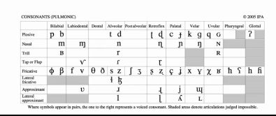
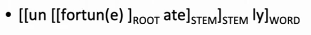
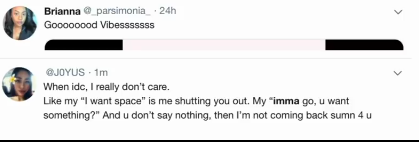

# **<u>L12_SubwordModels_CS224n</u>**

## **<u>Human language sounds</u>**

### **<u>Phonetics and phonology</u>**

Phonetics is the **sound stream**.

In languages, there is a small set of **phonemes** that we can use to cover all the words and vocabulary. (i.e. any word being spoken is a combination of **phonemes** extracted from that set).

This set of phonemes can change as time passes by.

****

## **<u>Morphology: Parts of words</u>**

- **<u>Morphemes</u>**: The smallest **semantic** unit.

  

This can be utilized by using **character n-grams** which were found to work better than some of the hand engineered stuff.

****

## <u>Words in writing systems</u>

Writing systems vary in how they represent words.

- No word segmentation (**no spaces**). i.e. Chinese

- Words (mainly) segmented

  - Clitics

    - **Separated** : **Je vous ai apporte** des bonbons

      In french those words are joined together

    - **Joined** : فقلناها = ف + قال + نا + ها

  - Compounds?

    - **Separated** : life insurance, high school ... etc
    - **Joined** : German like languages sticking multiple words together.

****

## **<u>Models below the word level</u>**

- Need to handle **large, open vocabulary**

  - **Rich morphology** in other languages

  - **Transliteration** 

    Translating names involves just rewriting the same thing with different morphemes to be pronounced correctly

    Christopher -> Krystof

  - **Informal Spelling**

    

****

## **<u>Character-Level Models</u>**

****

## <u>Sub-word models: two trends</u>

1. **Same** architecture as for word-level model:

   - Using smaller units "*word pieces*"

2. **Hybrid architectures**

   Main model has words; something else for characters

****

### **<u>Byte pair encoding</u>**

We set the length of our vocabulary to be $|V|$ and then keep doing the byte pair encoding algorithm to generate new words/ parts of words and add them to out vocabulary until we reach $|V|$ words in our vocabulary.

Our vocabulary will be the **characters** (started with them) + **sub-words & words** generated from byte pair encoding

****

### <u>Wordpiece/Sentencepiece model</u>

Rather then the **char n-gram** count, uses a **greedy approximation** to maximizing language model log likelihood to choose the pieces

- ​	Add **n-gram** that maximally reduces perplexity

Has 2 versions

1. **Wordpiece model**

   Tokenizes inside words

2. **Sentence piece model**

**BERT** uses a variant of the **wordpiece model**

- hypatia = h ##yp ##at ##a

****

