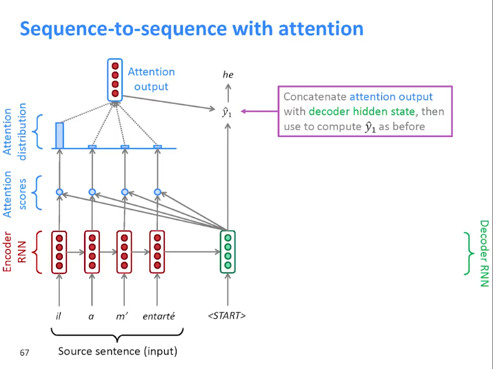

# <u>L19_Waterloo</u>

## **<u>Attention and Transformer Networks</u>**

### **<u>Attention in CV</u>**

Used to **highlight important parts of an image** that contribute to a desired output

### **<u>Attention in NLP</u>**

- Aligned machine translation
- Language modeling with **Transformer networks**(built mostly with attention)

****

## <u>Sequence Modeling</u>

| RNNs                                     | Transformer Networks                                         |
| ---------------------------------------- | ------------------------------------------------------------ |
| Not good at long range dependencies      | Facilitate long range dependencies (as they are connected with attention) |
| Gradient vanishing and explosion         | No gradient vanishing and explosion                          |
| Large # of training steps                | Fewer Training steps                                         |
| Recurrence prevents parallel computation | No recurrence which facilitates parallel computation         |

****

## **<u>Attention Mechanism</u>**

- Mimics the retrieval of a **value** $v_i$ for a **query $q$** based on a **key** $k_i$ in database

- $\text{attention(q, k, v)} = \sum_i \text{similarity(}q,k_i)\times v_i$ 

- 

  In MT, the **query** $q = s_t$ which is the hidden state of the decoder, The **key** and the **value** are the same (hidden state of the encoder) $k_i = v_i = h^{(t)}$.

  We calculate the **similarity** between the **query** (decoder hidden state) and the **key** (all encoder hidden states) to form **attention scores** then get **attention distribution**

  Then we multiply **our similarity measure** (attention distribution) with **the values** (encoder hidden state) to get the attention.------------------------- $\text{attention(q, k, v)} = \sum_i \text{similarity(}q,k_i)\times v_i$ ---------------------------

****

## <u>Transformer Network</u>

From the freaking Attention is all you need paper

- **Encoder-decoder** based on **attention** (no recurrence)