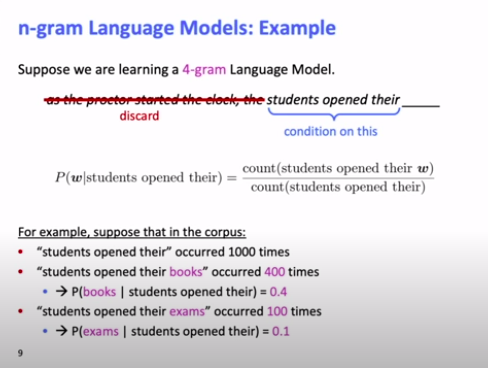
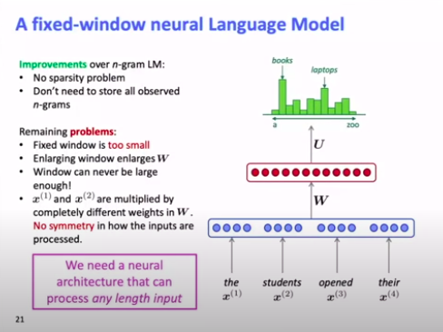
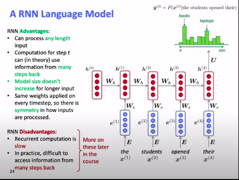
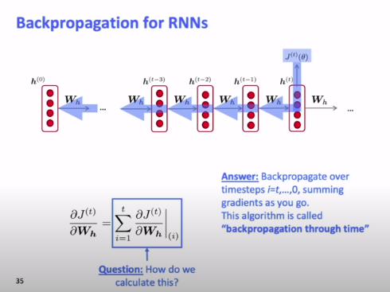
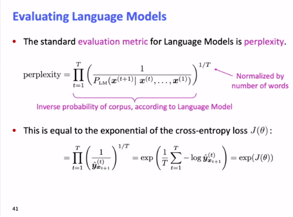
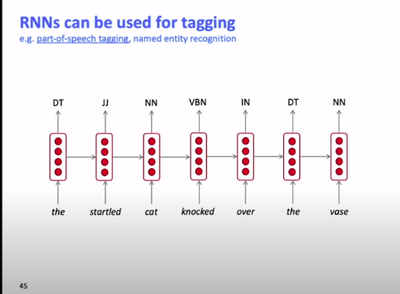
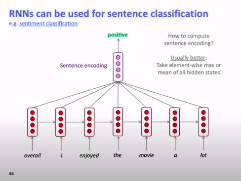
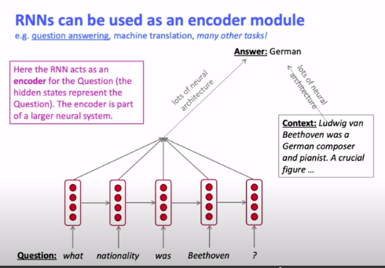
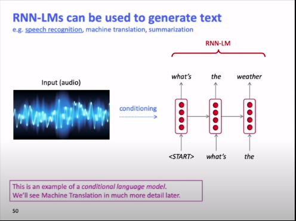

# **<u>L6_CS224n</u>**

## **<u>Language Modeling</u>**

**Language Modeling** is the task of predicting what word comes next.

More formally: give a sequence of words $x^{(1)},x^{(2)},.....x^{(t)}$, compute the probability distribution of the next word $x^{(t+1)}$:
$$
P(x^{(t+1)}|x^{(t)},....,x^{(1)})
$$
where $x^{(t+1)}$ can be any word in the vocabulary $V=\{w_1,w_2,....,w_{|V|}\}$

A system that does this is called **Language Model**.

An alternative way of thinking about a Language Model is as a system that **assigns probability to a piece of text**.

i.e. for a given text $x^{(1)},....,x^{(T)}$, the probability of this text (according to the language model) is:
$$
P(x^{(1)},....,x^{(T)}) = P(x^{(1)}) \times P(x^{(2)}|x^{(1)}) \times \ ......\ \times P(x^{(T)}|x^{(T-1)},.....,x^{(1)}) \\= \Pi_{t=1}^TP(x^{(t)}|x^{(t-1)},....,x^{(1)})\ \ \ \ \ \ \ \ \ \ \ \ \ \ \ \ \ \ \ \ \ \ \ \
$$

****

## **<u>Learning Language Models</u>**

### <u>n-gram Language Models</u>

This was the way to go in the **pre- Deep Learning Era**

#### <u>what is an n-gram?</u>

A n-gram is a chunk of **n consecutive words**

for the sentence: the students opened their ____

- **uni**grams: "the", "students", "opened", "their"
- **bi**grams: "the students", "students opened", "opened their"
- **tri**grams:  "the students opened", "students opened their"
- **4-**grams: "the students opened their"

****

#### <u>n-gram Language Model Idea</u>

Collect statistics about how frequent different n-grams are, and use these to predict the next word.

****

 n-gram models makes an **simplifying assumption**:

- The next word $x^{(t+1)}$ depends only on the preceding $n-1$ words.

$P(x^{(t+1)}|x^{(t)},....,x^{(1)}) = P(x^{(t+1)}|x^{(t)},....,x^{(t-n+2)})$ (assumption)

​										 $= \frac{P(x^{(t+1)},x^{(t)},....,x^{(t-n+2)})}{P(x^{(t)},....,x^{(t-n+2)})}$  (conditional prob)

 										$= \frac{P(\text{n-gram})}{P(\text{(n-1)-gram})}$

##### How to get n-gram and (n-1)-gram probabilities ?

- By **counting** them in some large corpus of text

  $\approx \frac{\text{count}(x^{(t+1)},x^{(t)},....,x^{(t-n+2)})}{\text{count}(x^{(t)},....,x^{(t-n+2)})}$ (statistical approximation)

****

#### <u>**n-gram Language Models: Example**</u>

The original sentence is:

as the proctor started the clock, the students opened their ___

From this example, you can find a lot of flaws with the n-gram model

1. ##### **Discarding a lot of the context**

   You can notice that the model discarded the word **proctor**, which heavily implies that the missing word was **exams** instead of **books**

2. ##### **Sparsity Problem**

   ###### <u>Numerator = 0</u>

   What if an n-gram didn't occur in out corpus, If we have a general corpus this makes it uncommon but our model would classify it as **impossible** which is incorrect.

   i.e. students opened their **petri dishes**. while this is uncommon, this phrase could be said if we talk about biology students.

   **Solution** :

   **Smoothing**: To solve this we can add a delta to each n-gram, so that it doesn't become impossible.

   However this has the downside of giving other bad choices a higher probability.

   ****

   ###### <u>Denominator = 0</u>

   If we can't find a 4-gram that has this combination of words, we would **Back-off**, and use a 3-gram instead.

   ****

   If we increase n to increase the context taken, this causes the sparsity problems to get even worse

   In practice, $ n \leq 5$

   ****

3. ###### Storage problems

   As n increases, you need to keep more relations between the words you have resulting in a greater size of the data.

   i.e. assume V = { 'hi', 'hello', 'hoshos'}

   In a unigram, you would need to store only 3 counts for hi, hello and hoshos

   In a bigram, you would need to store ''hi hello", "hi hoshos", 'hello hi', 'hello hoshos' ..... etc Memory complexity = $O(|V|^n)$

****

## <u>**Neural Language Model**</u>

### **<u>A fixed-window neural Language Model</u>**

No weight sharing even though the parameters learned are very similar.

This along with the other problems above motivated **RNNs**.

****

## **<u>RNNs</u>**

$h(t) = \sigma(W_h\ h^{(t-1)} + W_e \ e^{(t)}+ b_t)$

where $h(0)$ is the initial hidden state & $e^{(t)}= E\ x^{(t)}$

****

### <u>Training a RNN Language Model</u>

1. Get a **big corpus of text**

2. Feed into the RNN, and compute $\tilde y^{(t)}$ for **every step t**

   i.e. predict the probability of every word, given the previous words

   **Loss function** on step t is **cross-entropy** $y^{(t)}$ and $\tilde y^{(t)}$

   $J^{(t)}(\theta) = CE(y^{(t)},\tilde y^{(t)}) = -\sum^T_{t=1}  y_w^{(t)}\ log(\tilde y_w^{(t)}) = -log(\tilde y_{x_{t+1}}^{(t)})$

3. Average the loss to get the **cost function** for your mini-batch:

   $J(\theta) = \frac 1T \sum^T_{t=1}J^{(t)}(\theta) = \frac1T \sum_{t=1}^T -log(\tilde y_{x_{t+1}}^{(t)})$ 

**N.B.** Usually, we calculate the loss per **sentence**

****

#### <u>Backpropagation through time</u>

****

## **<u>Evaluating Language Models</u>**

The standard **evaluation metric** for Language Models is **perplexity**
$$
perplexity = \Pi_{t=1}^T(\frac1{P_{LM}(x^{(t+1)}|x^{(t)},....,x^{(1)})})^\frac1T
$$

****

## <u>Why care about Language Modeling?</u>

- It helps to **measure our progress** in understanding language
- It is a **subcomponent** of many NLP tasks, especially those involving **generating text** or **estimating the probability of text**:
  - Predictive Typing
  - Speech recognition
  - Handwriting recognition
  - Spelling/grammar correction
  - Authorship identification
  - Summarization
  - Machine Translation
  - ..etc

****

## <u>Applications for RNNs</u>

RNNs are not only language models but they have other applications.

1. ### **POS or Named entity recognition**

   

   ****

2. ### **Sentence Classification**

   When you take a sentence and want to classify it (e.g. **sentiment classification**)

   The RNN is treated as a **Sentence Encoder** that feeds the encoding to another network and that other network does the classification.

   

   ****

   ##### How to compute sentence encoding?

   - **basic way**: You could take the final hidden state as the encoding.
   - **usually better**: Take the element-wise max or mean for all the hidden states

   ****

3. ### <u>**Used as an encoder module**</u>

   can be used in **question answering**, machine translation and other tasks

   

   The RNN encodes the question and is then pass along with/to another neural network architecture/s to get the answer.

   ****

4. ### **RNN-LMs can be used to generate text**

   e.g. **speech recognition**, machine translation, summarization

   

   Speech is encoded in a way and then presented as  **conditioning** to our RNN

   ****

