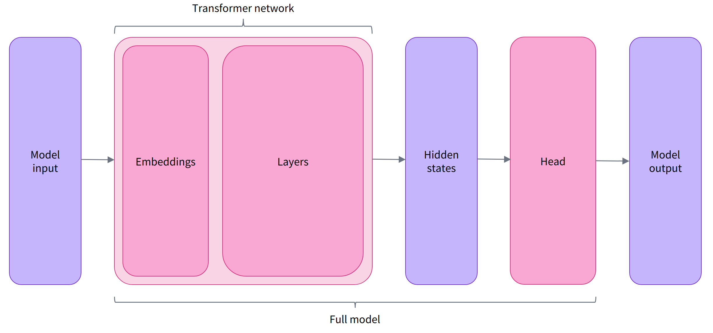
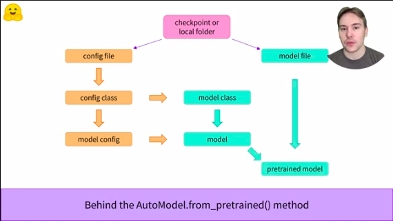

[toc]

# **<u>Chapter 2</u>**

## **<u>Inside the pipeline</u>**

Inside a HuggingFace pipeline there are three main stages

- **<u>Tokenizer</u>**
- **<u>Model</u>**
- **<u>Post-Processing</u>**


****

### **<u>Tokenizer</u>**

Since each different architecture was pretrained in a certain way, each one has its own tokenizer with its own **special tokens** like **start tokens**, **Mask tokens** .... etc.

In huggingface, the job of the tokenizer is to:

- Splitting the input into words, sub-words, or symbols (like punctuation) that are called *tokens*
- Mapping each token to an integer
- Adding additional inputs that may be useful to the model

****

#### <u>**Importing DistilBERT**</u>

```python
from transformers import AutoTokenizer

checkpoint = "distilbert-base-uncased-finetuned-sst-2-english"
tokenizer = AutoTokenizer.from_pretrained(checkpoint)
```

We can now use our tokenizer to tokenize sentences in the `DistilBERT` way.

```python
raw_inputs = [
    "I've been waiting for a HuggingFace course my whole life.", 
    "I hate this so much!",
]
inputs = tokenizer(raw_inputs, padding=True, truncation=True, return_tensors="pt")
print(inputs)
```

The `return_tensors='pt'` tells the tokenizer to return output as a pyTorch `Tensor`. The default return is a python `list`

```python
{
    'input_ids': tensor([
        [  101,  1045,  1005,  2310,  2042,  3403,  2005,  1037, 17662, 12172, 2607,  2026,  2878,  2166,  1012,   102],
        [  101,  1045,  5223,  2023,  2061,  2172,   999,   102,     0,     0,     0,     0,     0,     0,     0,     0]
    ]), 
    'attention_mask': tensor([
        [1, 1, 1, 1, 1, 1, 1, 1, 1, 1, 1, 1, 1, 1, 1, 1],
        [1, 1, 1, 1, 1, 1, 1, 0, 0, 0, 0, 0, 0, 0, 0, 0]
    ])
}
```

`attention_mask` indicates where padding has been applied so that the models ignore it.

**N.B.** This isn't the attention mask as `DistilBERT` is an encoder that doesn't have a `MaskedSelfAttention` layer.

****

### **<u>Model</u>**

When downloading a pre-trained model, we use the `AutoModel` module in the `transformers` library.

```python
from transformers import AutoModel

checkpoint = "distilbert-base-uncased-finetuned-sst-2-english"
model = AutoModel.from_pretrained(checkpoint)
```

`AutoModel` module is generic as in, It returns the model without the ***Head***.



So, this `AutoModel` models don't specialize in anything.

```python
outputs = model(**inputs)
print(outputs.last_hidden_state.shape) #torch.Size([2, 16, 768])
```

This returns the output of the hidden states from the picture which we can use with other layer/s to complete our model.

If we want to import the whole thing, we can do

```python
from transformers import AutoModelForSequenceClassification

checkpoint = "distilbert-base-uncased-finetuned-sst-2-english"
model = AutoModelForSequenceClassification.from_pretrained(checkpoint)
outputs = model(**inputs)
print(outputs.logits.shape) # torch.Size([2, 2])
```

`AutoModelForSequenceClassification` imports a `SequenceClassification` specific architecture that only needs to be fine tuned and add `Softmax` for turning logits intro predictions.(**Post processing**)

There are other Application specific modules

- `*Model` (retrieve the hidden states)
- `*ForCausalLM`
- `*ForMaskedLM`
- `*ForMultipleChoice`
- `*ForQuestionAnswering`
- `*ForSequenceClassification`
- `*ForTokenClassification`

****

#### **<u>Accessing model layers</u>**

- :hugs: transformers models behave like **named tuples** or **dictionaries**, as they can be accessed by:
  - **Attributes**: `outputs['last_hidden_state']` 
  - `outputs.last_hidden_state`
  - **Index** `outputs[0]`

****

### **<u>Post-processing</u>**

- We saw that the models outputs logits. which means that they need `softmax` to be turned to probabilities/predictions.

- If you want to know what each `label` stands for use 

  ```python
  model.config.id2label
  # {0: 'NEGATIVE', 1: 'POSITIVE'}
  ```

****

## **<u>Model</u>**

### **<u>`AutoModel` class</u>**

- The `AutoModel` class is just a wrapper.
- Given a model name `"bert-based-uncase"` for example, it would fetch the checkpoint and instantiate a model with this architecture.
- However, if you know the type of model you want to use, you can use the class that defines the architecture directly as shown below

****



### **<u>Building a BERT model</u>**

The following will output a model that is not pretrained.

```python
from transformers import BertConfig, BertModel

# Buidling the config
config = BertConfig()

# Building the model from the config
model = BertModel(config)
```

```python
print(config)
```

```python
BertConfig {
  [...]
  "hidden_size": 768,
  "intermediate_size": 3072,
  "max_position_embeddings": 512,
  "num_attention_heads": 12,
  "num_hidden_layers": 12,
  [...]
}
```

You can modify the config to fit your needs (i.e. set `num_hidden_layers = 10`)

```python
from transformers import BertConfig, BertModel

# Buidling the config
config = BertConfig.from_pretrained('bert-base-uncased', num_hidden_layers=10)

# Building the model from the config
model = BertModel(config)
```

The model above is **not pretrained**.

To load pretrained model, we use:

```python
from transformers import BertModel

model = BertModel.from_pretrained("bert-base-cased")
```

However this **method** isn't preferred as changing the model to `DistilBERT` for example would require a lot of code change. (i.e. code is different for each model unlike `AutoModel` which is model agnostic)

****

#### **<u>Instantiating a model</u>**

```python
from transformers import AutoModel

checkpoint = "bert-base-cased"
model = AutoModel.from_pretrained(checkpoint)
```

This is better as you only change the check point.

****

#### <u>**Save & Load models**</u>

```python
model.save_pretrained('directory_on_computer')
```

```bash
ls directory_on_computer
# config.json  pytorch_model.bin
```

The `config.json` knows the **architecture** of the saved model while the `bin` file has the **weights**.

****

## **<u>Tokenizers</u>**

### <u>**Word-based tokenization**</u>

Discussed in CS224N

****

### **<u>Character-based tokenization</u>**

- **<u>Pros</u>**
  1. Much smaller vocabulary
  2. Less out-of-vocabulary words since every word can be built from characters.
- **<u>Cons</u>**
  1. Lose on semantic meaning of the words
  2. Very long input which may increase likelihood of vanishing/exploding gradients
  3. Length of a sentence will be very large.

****

### <u>**Subword-based tokenization**</u>

This gets the best of both words from Character and Word based tokenizers.

- This makes it so that common words are not split while **rare words** are decomposed.

  i.e. annoyingly -> annoying & ly where each of these have a meaning

This is especially useful in languages where you can form words by putting multiple words together (Arabic & German).

****

### **<u>Loading & saving tokenizers</u>**

#### **<u>Loading</u>**

```python
from transformers import BertTokenizer, AutoTokenizer

# tokenizer = BertTokenizer.from_pretrained('bert-base-cased')
tokenizer = AutoTokenizer.from_pretrained('bert-base-cased')
```

```python
tokenizer('Using a Transformer network is simple')
```

```python
{'input_ids': [101, 7993, 170, 11303, 1200, 2443, 1110, 3014, 102],
 'token_type_ids': [0, 0, 0, 0, 0, 0, 0, 0, 0],
 'attention_mask': [1, 1, 1, 1, 1, 1, 1, 1, 1]}
```

#### **<u>Saving</u>**

```python
tokenizer.save_pretrained('directory_on_pc')
```

****

Steps done by tokenizer are broken into several functions in case you want to use them separately.

```python
from transformers import AutoTokenizer
tokenizer = AutoTokenizer.from_pretrained("bert-base-cased")

sequence = "Using a Transformer network is simple"
tokens = tokenizer.tokenize(sequence)

print(tokens)
```

```python
# ['Using', 'a', 'transform', '##er', 'network', 'is', 'simple']
```

**N.B.** BERT uses ## to indicate that this is not a start of a word.

```python
ids = tokenizer.convert_tokens_to_ids(tokens)
print(ids)
# [7993, 170, 11303, 1200, 2443, 1110, 3014]
```

```python
decoded_string = tokenizer.decode([7993, 170, 11303, 1200, 2443, 1110, 3014])
print(decoded_string)
# 'Using a Transformer network is simple'
```

****

## <u>**Transformers for Long Sequences**</u>

Models have different supported sequence lengths, and some specialize in handling very long sequences. [**Longformer**](https://huggingface.co/transformers/model_doc/longformer.html) is one example, and another is [**LED**](https://huggingface.co/transformers/model_doc/led.html). If you’re working on a task that requires very long sequences, we recommend you take a look at those models.

****

# 