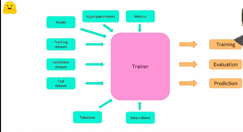

[toc]

# <u>**Chapter 3**</u>

## **<u>HuggingFace Datasets</u>**

HuggingFace Datasets are dictionaries with added functionalities.

```python
from datasets import load_dataset

raw_datasets = load_dataset("glue", "mrpc")
raw_datasets
```

After loading the dataset, you can see that the `DatasetDict` has 3 `Dataset` instances in it.

`train`, `validation` and `test`.

It also shows the attributes (columns) inside the dataset.

```python
DatasetDict({
    train: Dataset({
        features: ['sentence1', 'sentence2', 'label', 'idx'],
        num_rows: 3668
    })
    validation: Dataset({
        features: ['sentence1', 'sentence2', 'label', 'idx'],
        num_rows: 408
    })
    test: Dataset({
        features: ['sentence1', 'sentence2', 'label', 'idx'],
        num_rows: 1725
    })
})
```

From the output above, we can conclude that each instance in the dataset has 4 attributes. 

[`sentence1`, `sentence2`, `label` , `index`] which can be used as needed.

****

#### **<u>`Dataset.features`</u>**

using `Dataset.features` shows more details about the dataset attributes.

```python
raw_train_dataset = raw_datasets['train']
raw_train_dataset.features
```

You can see the data type of each attribute.

If you check the `label` attribute, you can deduce that the models that use this dataset use it to check whether `sentence0` and `sentence1` are equivalent.

```python
{'sentence1': Value(dtype='string', id=None),
 'sentence2': Value(dtype='string', id=None),
 'label': ClassLabel(num_classes=2, names=['not_equivalent', 'equivalent'], names_file=None, id=None),
 'idx': Value(dtype='int32', id=None)}
```

****

## <u>**Processing a dataset**</u>

### Processing sentence pairs

```python
from transformers import AutoTokenizer

checkpoint = 'bert-base-uncased'
tokenizer = AutoTokenizer.from_pretrained(checkpoint)
inputs = tokenizer("This is the first sentence.", "This is the second one.")
inputs
```

```python
{ 
  'input_ids': [101, 2023, 2003, 1996, 2034, 6251, 1012, 102, 2023, 2003, 1996, 2117, 2028, 1012, 102],
  'token_type_ids': [0, 0, 0, 0, 0, 0, 0, 0, 1, 1, 1, 1, 1, 1, 1],
  'attention_mask': [1, 1, 1, 1, 1, 1, 1, 1, 1, 1, 1, 1, 1, 1, 1]
}
```

`token_type_ids` tells the model which tokens are part of the first sentence and which are part of the second one.

```python
['[CLS]', 'this', 'is', 'the', 'first', 'sentence', '.', '[SEP]', 'this', 'is', 'the', 'second', 'one', '.', '[SEP]']
[      0,      0,    0,     0,       0,          0,   0,       0,      1,    1,     1,        1,     1,   1,       1]
```

****

### **`Dataset.map`**

This applies a function to each element in the dataset and is useful in preprocessing.

****

## <u>**Static vs Dynamic Padding**</u>

#### **<u>TL;DR</u>**

- Use Dynamic Padding when using CPU or GPU
- Use Static Padding when using TPU

****

Padding in HuggingFace can be done using the `DataCollatorWithPadding` function that takes the tokenizer as input and knows from it what type of padding to apply.

```python
from transformers import DataCollatorWithPadding

data_collator = DataCollatorWithPadding(tokenizer=tokenizer)
```

and then this is passed to `DataLoader`

```python
train_dataloader = DataLoader(
	tokenized_datasets['train'], batch_size=16, collate_fn=data_collator
)
```

### Static

Useful for :arrow_down_small:

#### TPU Training

Static is when you pad all the sentences to the same length for **all batches**

```python
for i, batch in enumerate(batches,1):
	print(f'Batch {i} shape : ', batch.shape)
# (num_sentences, sentence_length)
# Batch 1 shape : (4, 16)
# Batch 2 shape : (4, 16)
# Batch 3 shape : (4, 16)
# Batch 4 shape : (4, 16)
```

So each one of our sentences will be padded or truncated to 16 no matter how long it is.

****

### Dynamic

Useful for :arrow_down_small:

#### GPU & CPU Training

Dynamic is when you pad all the sentence up to the longest sentence in each batch.

```python
for i, batch in enumerate(batches,1):
	print(f'Batch {i} shape : ', batch.shape)
# (num_sentences, sentence_length)
# Batch 1 shape : (4, 20) # max sentence len = 20
# Batch 2 shape : (4, 10) # max sentence len = 10
# Batch 3 shape : (4, 8)  # max sentence len = 8
# Batch 4 shape : (4, 11) # max sentence len = 11
```

****

## <u>The `Trainer` API</u>



```python
from transformers import AutoModelForSequenceClassification
# old stuff
model = AutoModelForSequenceClassification.from_pretrained(checkpoint, num_labels=2)
```

```python
from transformers import TrainingArguments

training_args = TrainingArguments(
			'test-trainer',
			per_device_train_batch_size=16,
			per_device_eval_batch_size=16,
			num_train_epochs=5,
			learning_rate=2e-05,
			weight_decay=0.01,
)
```

```python
from transformers import Trainer

trainer = Trainer(
			model,
			training_args,
			train_dataset=tokenized_datasets['trained'],
			eval_dataset=tokenized_datasets['validation'],
			data_collator=data_collator,
			tokenizer=tokenizer
)

trainer.train()
```

#### Evaluation Strategy

```python
training_args = TrainingArguments("test-trainer", evaluation_strategy="epoch") # tells model to evaluate each epoch
model = AutoModelForSequenceClassification.from_pretrained(checkpoint, num_labels=2)

trainer = Trainer(
    model,
    training_args,
    train_dataset=tokenized_datasets["train"],
    eval_dataset=tokenized_datasets["validation"],
    data_collator=data_collator,
    tokenizer=tokenizer,
    compute_metrics=compute_metrics # tells model which metrics 
)									# to use during evaluation
```

****

