[toc]

# **<u>Chapter 6 - The Tokenizers Library</u>**

- When we want to train a model **from scratch**, using a tokenizer that was trained on a corpus from another **domain** or **language** is **suboptimal.**
  - e.g. a tokenizer trained on an English corpus will perform poorly on a Japanese corpus as the **use of spaces** and **punctuation** is different in the two languages

****

## **<u>Training a new tokenizer from an old one</u>**

- Training a **tokenizer** isn't the same as training a **model**.
  - Model training uses **SGD** to make the loss a little smaller for **each batch**. It is **randomized by nature**.
  - Training a **tokenizer** is a **statistical process** that tries to **identify** which **subwords** are the **best to pick** for a **given corpus** and the **exact rules** to pick them depend on the **tokenization algorithm**.
    - It is a **deterministic** process.

****

### **<u>Steps for training the tokenizer</u>**

1. Gathering a corpus of text
2. Choose the **tokenizer architecture**
   - Can be same as old tokenizer or completely new architecture
     - Picking a new architecture requires experience on **attention**.
3. Train tokenizer on the corpus
4. save the results.

****

### **<u>Example</u>**

#### **<u>Getting Dataset</u>**

- We will go through the steps of **retraining GPT-2 tokenizer** to tokenize **python code**.

First we get the dataset

- ```python
  from datasets import load_dataset
  
  raw_datasets = load_dataset('code_search_net', 'python')
  raw_datasets['train']
  ```

  ```
  Dataset({
      features: ['repository_name', 'func_path_in_repository', 'func_name', 'whole_func_string', 'language', 
        'func_code_string', 'func_code_tokens', 'func_documentation_string', 'func_documentation_tokens', 'split_name', 
        'func_code_url'
      ],
      num_rows: 412178
  })
  ```

  We will use the `whole_function_string` column to train our tokenizer.
  
- Since the dataset is **huge**, we define a **generator**

  ```python
  def get_training_corpus():
  	return (
  		raw_datasets['train'][i: i+1000]['whole_func_string']
  		for i in range(0, len(raw_datasets['train'], 1000))
  		)
  		
  training_corpus = get_training_corpus()
  ```

  Or using different syntax

  ```python
  def get_training_corpus():
  	dataset = raw_datasets['train']
  	for start_idx in range(0, len(dataset), 1000):
  		samples = dataset[start_idx : start_idx + 1000]
  		yield samples['whole_func_string']
  ```

****

#### **<u>Training a new tokenizer</u>**

- We'll follow the same architecture as the `gpt2` tokenizer, so first we'll get the old tokenizer

  ```python
  from transformers import AutoTokenizer
  
  old_tokenizer = AutoTokenizer.from_pretrained('gpt2')
  ```

  Even though we are training a new tokenizer, it's a good idea to not start entirely from scratch.

  - This way we don't have to specify things like **tokenization algorithm** or the **special tokens** which will be hard to familiarize the model with.

- If the tokenizer doesn't know text, it'll act as follows

  ```python
  example = '''def add_numbers(a, b):
      """Add the two numbers `a` and `b`."""
      return a + b'''
  
  tokens = old_tokenizer.tokenize(example)
  tokens
  ```

  ```python
  ['def', 'Ġadd', '_', 'n', 'umbers', '(', 'a', ',', 'Ġb', '):', 'Ċ', 'Ġ', 'Ġ', 'Ġ', 'Ġ"""', 'Add', 'Ġthe', 'Ġtwo',
   'Ġnumbers', 'Ġ`', 'a', '`', 'Ġand', 'Ġ`', 'b', '`', '."', '""', 'Ċ', 'Ġ', 'Ġ', 'Ġ', 'Ġreturn', 'Ġa', 'Ġ+', 'Ġb']
  ```

  where `Ċ` and `Ġ`, which denote spaces and newlines, respectively.

  You can see that the tokenizer over splits certain words which might cause us to reach the input limit.

  In other cases, the tokenizer might return a lot of `[UNK]` tokens, which will provide us with no information.

- To train our new tokenizer, we will use `train_new_from_iterator`

  ```python
  tokenizer = old_tokenzer.train_new_from_iterator(training_corpus)
  ```

  This will usually take a while.

#### **<u>Saving the tokenizer</u>**

- You can save the tokenizer using

  ```python
  tokenizer.save_pretrained('name')
  ```

- It can be loaded again

  ```python
  tokenizer = AutoTokenizer.from_pretrained('path')
  ```

****

## **<u>Fast Tokenizers</u>**

- Fast tokenizers are written in **Rust** and are **parallelizable** which gives them a huge advantage unlike the slow tokenizers which are written in **python**.

****

- The return of the tokenizer `tokenizer(sentence)` is not just a simple dictionary.

  There are several methods that can be used with it and several properties that can be accessed

- ```python
  from transformers import AutoTokenizer
  
  tokenizer = AutoTokenizer.from_pretrained("bert-base-cased")
  example = "My name is Sylvain and I work at Hugging Face in Brooklyn."
  encoding = tokenizer(example)
  
  print(type(encoding))
  ```

  ```python
  <class 'transformers.tokenization_utils_base.BatchEncoding'>
  ```

  The output is a class called `BatchEncoding`

- Lets explore what we can do with the tokenizer and the `BatchEncoding` class

  - You can check whether the tokenizer was a Fast Tokenizer or not

    ```python
    tokenizer.is_fast # True
    encoding.is_fast # True
    ```

  - If we want to find the tokens in the encoding

    ```python
    encoding.tokens()
    ```

    ```python
    ['[CLS]', 'My', 'name', 'is', 'S', '##yl', '##va', '##in', 'and', 'I', 'work', 'at', 'Hu', '##gging', 'Face', 'in',
     'Brooklyn', '.', '[SEP]']
    ```

    You'll notice that sometimes a word is split into **multiple tokens**, to find which token belongs to which word, we can use

    ```python
    encoding.word_ids()
    ```

    ```python
    [None, 0, 1, 2, 3, 3, 3, 3, 4, 5, 6, 7, 8, 8, 9, 10, 11, 12, None]
    ```

    Notice that `[CLS]` and `[SEP]` got `None` as their word id.

    - The notion of what a word is different for each tokenizer. (e.g. I'll and I will are essentially the same).

      - Will "I'll" be considered 1 word or two?

        This all depends on the **tokenizer** and the **pre-tokenization** operation it applies.

  - We can map any **word** or **token** to **characters in the original text** and **vice versa**.

    This is done using the `word_to_chars()` or `tokne_to_chars()` and `char_to_word()` or `char_to_token()` methods.

    ```python
    start , end = encoding.word_to_chars(3)
    example[start:end] # "Sylvian"
    ```

- This is all powered by the fact that the **fast tokenizer keeps track of the span of text each token comes from in a list of offsets**.

****

### **<u>Tokenizer Pipeline</u>**

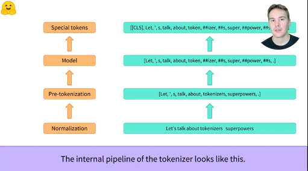

****

### **<u>Token Classification</u>**

- Token classification is like **NER**, where you classify **tokens** coming **out of the tokenizers**.

- **<u>Example</u>**

  ```python
  from transformers import pipeline
  
  token_classifier = pipeline('token-classification')
  token_classifier(example)
  ```

  ```python
  [{'entity': 'I-PER', 'score': 0.9993828, 'index': 4, 'word': 'S', 'start': 11, 'end': 12},
   {'entity': 'I-PER', 'score': 0.99815476, 'index': 5, 'word': '##yl', 'start': 12, 'end': 14},
   {'entity': 'I-PER', 'score': 0.99590725, 'index': 6, 'word': '##va', 'start': 14, 'end': 16},
   {'entity': 'I-PER', 'score': 0.9992327, 'index': 7, 'word': '##in', 'start': 16, 'end': 18},
   {'entity': 'I-ORG', 'score': 0.97389334, 'index': 12, 'word': 'Hu', 'start': 33, 'end': 35},
   {'entity': 'I-ORG', 'score': 0.976115, 'index': 13, 'word': '##gging', 'start': 35, 'end': 40},
   {'entity': 'I-ORG', 'score': 0.98879766, 'index': 14, 'word': 'Face', 'start': 41, 'end': 45},
   {'entity': 'I-LOC', 'score': 0.99321055, 'index': 16, 'word': 'Brooklyn', 'start': 49, 'end': 57}]
  ```

  While **Sylvian** is split into **multiple tokens** each one of these tokens was identified as a **PER** (person).

  - We can also group all the tokens that belong to the word together

    ```python
    from transformers import pipeline
    
    token_classifier = pipeline("token-classification", aggregation_strategy="simple")
    token_classifier("My name is Sylvain and I work at Hugging Face in Brooklyn.")
    ```

    ```python
    [{'entity_group': 'PER', 'score': 0.9981694, 'word': 'Sylvain', 'start': 11, 'end': 18},
     {'entity_group': 'ORG', 'score': 0.97960204, 'word': 'Hugging Face', 'start': 33, 'end': 45},
     {'entity_group': 'LOC', 'score': 0.99321055, 'word': 'Brooklyn', 'start': 49, 'end': 57}]
    ```

    the `aggregation_strategy` decides how the score is calculated after merging tokens to words. Other strategies include

    1. `"first"` : score of entity = score of first token
    2. `"max"` : score = score of max token
    3. `"average"` : score = average of the **words**
    4. `"simple"` : score = average of **tokens**

  - Let's see how we can achieve that w/o the `pipeline` functions

****

- We start by importing the model.

  ```python
  from transformers import AutoTokenizer, AutoModelForTokenClassification
  
  model_checkpoint = "dbmdz/bert-large-cased-finetuned-conll03-english"
  
  tokenizer = AutoTokenizer.from_pretrained(model_checkpoint)
  model = AutoModelForTokenClassification.from_pretrained(model_checkpoint)
  
  example = "My name is Sylvain and I work at Hugging Face in Brooklyn."
  inputs = tokenizer(example, return_tensors="pt")
  outputs = model(**inputs)
  ```

  If we check the input and output size

  ```python
  print(inputs["input_ids"].shape) # torch.Size([1, 19])
  print(outputs.logits.shape) # torch.Size([1, 19, 9])
  ```

  This means that each token has 9 probabilities for belonging to 1 of the 9 classes.

  ```python
  import torch
  
  probabilities = torch.nn.functional.softmax(outputs.logits, dim=-1)[0].tolist()
  predictions = outputs.logits.argmax(dim=-1).tolist()
  print(predictions)
  ```

  ```python
  [0, 0, 0, 0, 4, 4, 4, 4, 0, 0, 0, 0, 6, 6, 6, 0, 8, 0, 0]
  ```

  This is the ID for each token, this ID is a property in the `model.config`

  ```python
  model.config.id2label
  ```

  ```python
  {0: 'O',
   1: 'B-MISC',
   2: 'I-MISC',
   3: 'B-PER',
   4: 'I-PER',
   5: 'B-ORG',
   6: 'I-ORG',
   7: 'B-LOC',
   8: 'I-LOC'}
  ```

  Notice that each class is in there twice once as `B-class` and again as `I-class`

  - `B` here refers to Beginning (i.e. the first token)
  - `I` here refers to Inside (i.e. not the first token)

  You'll notice that none of the tokens has a `B-class` form. This is because there are 2 formats for the `B-` and `I-` labels.

  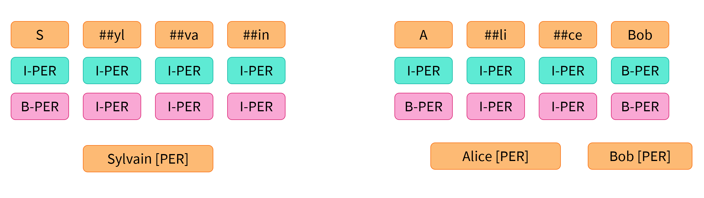

  - In the first one (the one we're using), we only use `B-` as a separator (two entities of the same type following each other).
  - In the second, we use it at the beginning of each entity.

- We will now reproduce what was done earlier,

  Starting from these

  ```python
  predictions = [0, 0, 0, 0, 4, 4, 4, 4, 0, 0, 0, 0, 6, 6, 6, 0, 8, 0, 0]
  ```

  this will be our final goal.

  ```python
  [{'entity_group': 'PER', 'score': 0.9981694, 'word': 'Sylvain', 'start': 11, 'end': 18},
   {'entity_group': 'ORG', 'score': 0.97960204, 'word': 'Hugging Face', 'start': 33, 'end': 45},
   {'entity_group': 'LOC', 'score': 0.99321055, 'word': 'Brooklyn', 'start': 49, 'end': 57}]
  ```

- We list each class from prediction, along with the start and end

  ```python
  results = []
  tokens = inputs.tokens()
  
  for idx, pred in enumerate(predictions):
  	label = model.config.id2label[pred]
  	if label != '0':
  	 	results.append(
  	 		{'entity': label, "score": probabilities[idx][pred], 'word': tokens[idx]}
  	 		)
  print(results)
  ```

  ```python
  [{'entity': 'I-PER', 'score': 0.9993828, 'index': 4, 'word': 'S'},
   {'entity': 'I-PER', 'score': 0.99815476, 'index': 5, 'word': '##yl'},
   {'entity': 'I-PER', 'score': 0.99590725, 'index': 6, 'word': '##va'},
   {'entity': 'I-PER', 'score': 0.9992327, 'index': 7, 'word': '##in'},
   {'entity': 'I-ORG', 'score': 0.97389334, 'index': 12, 'word': 'Hu'},
   {'entity': 'I-ORG', 'score': 0.976115, 'index': 13, 'word': '##gging'},
   {'entity': 'I-ORG', 'score': 0.98879766, 'index': 14, 'word': 'Face'},
   {'entity': 'I-LOC', 'score': 0.99321055, 'index': 16, 'word': 'Brooklyn'}]
  ```

- We will now try to get the offsets of each word

  ```python
  results = []
  inputs_with_offsets = tokenizer(example, return_offsets_mapping=True)
  tokens = inputs_with_offsets.tokens()
  offsets = inputs_with_offsets['offset_mapping']
  
  for idx, pred in enumerate(predictions):
  	label = model.config.id2label[pred]
      if label != '0':
          start , end = offsets[idx]
          results.append(
          	{
          		'entity': label,
                  'score': probabilities[idx][pred],
                  'word': tokens[idx],
                  'start': start,
                  'end': end,
              }
          )
  
  print(results)
  ```

  ```python
  [{'entity': 'I-PER', 'score': 0.9993828, 'index': 4, 'word': 'S', 'start': 11, 'end': 12},
   {'entity': 'I-PER', 'score': 0.99815476, 'index': 5, 'word': '##yl', 'start': 12, 'end': 14},
   {'entity': 'I-PER', 'score': 0.99590725, 'index': 6, 'word': '##va', 'start': 14, 'end': 16},
   {'entity': 'I-PER', 'score': 0.9992327, 'index': 7, 'word': '##in', 'start': 16, 'end': 18},
   {'entity': 'I-ORG', 'score': 0.97389334, 'index': 12, 'word': 'Hu', 'start': 33, 'end': 35},
   {'entity': 'I-ORG', 'score': 0.976115, 'index': 13, 'word': '##gging', 'start': 35, 'end': 40},
   {'entity': 'I-ORG', 'score': 0.98879766, 'index': 14, 'word': 'Face', 'start': 41, 'end': 45},
   {'entity': 'I-LOC', 'score': 0.99321055, 'index': 16, 'word': 'Brooklyn', 'start': 49, 'end': 57}]
  ```

  This is the same as what we got (without `aggregation_strategy='simple'`).

- Now we need to **group entities**

  - We use python to group the entities taking advantage of `I-` and `B-`.

****

### **<u>Question Answering</u>**

- Will be seen in the NLP Book by hugging face.

****

# **<u>Normalization & Pre-tokenization</u>**

## **<u>Normalization</u>**

- The normalization steps involves **general cleanup** such as **removing needless whitespace, lowercasing or removing accents**.

  - They may also apply **Unicode normalization**

- each Transformers `toeknizer` has an attribute called `backend_tokenizer` that allows you to access the underlying tokenizer

  ```python
  from transforemrs import AutoTokenizer
  
  tokenizer = AutoTokenizer.from_pretrained('bert-base-uncased')
  print(type(tokenizer.backend_tokenizer)) # <class 'tokenizers.Tokenizer'>
  
  print(tokenizer.backend_tokenizer.normalizer.normalize_str("Héllò hôw are ü?"))
  ```

  ```python
  'hello how are u?'
  ```

- Different tokenizers will normalize text in different ways

****

## **<u>Pre-tokenization</u>**

- We can't train our tokenizer on raw text, we first need to **split the text into small entities** like **words**.

  - This is what happens in the **pre-tokenization step**.

- a **word-based** tokenizer can simply split a raw text on **whitespace** and **punctuation**.

  ```python
  tokenizer.backend_tokenizer.pre_tokenizer.pre_tokenize_str('Hello, how are  you?')
  ```

  ```python
  [('Hello', (0, 5)), (',', (5, 6)), ('how', (7, 10)), ('are', (11, 14)), ('you', (16, 19)), ('?', (19, 20))]
  ```

  **N.B.** The tokenizer is already keeping track of the **offsets**. the tokenizers ignores the two spaces and replaces them with just one, However, it keeps track of that in the **offsets**.

- The tokenizer above was the BERT tokenizer, here are other examples for different tokenizers

  - `gpt2`

    ```python
    tokenizer = AutoTokenizer('gpt2')
    tokenizer.backend_tokenizer.pre_tokenizer.pre_tokenize_str('Hello, how are  you?')
    ```

    It splits on whitespace and punctuation as well, but it keeps the spaces and replace them with a `Ġ` symbol, this enables us to **recover the original space if we decode the tokens**

    ```python
    [('Hello', (0, 5)), (',', (5, 6)), ('Ġhow', (6, 10)), ('Ġare', (10, 14)), ('Ġ', (14, 15)), ('Ġyou', (15, 19)),
     ('?', (19, 20))]
    ```

  - `t5-small`

    ```python
    tokenizer = AutoTokenizer.from_pretrained("t5-small")
    tokenizer.backend_tokenizer.pre_tokenizer.pre_tokenize_str("Hello, how are  you?")
    ```

    this tokenizer splits on **whitespace only** (doesn't split on punctuation like `gpt2` and `BERT`).

    Also note that, it added a space by default(before `Hello`) and ignored the double space between `are` and `you`

    ```python
    [('▁Hello,', (0, 6)), ('▁how', (7, 10)), ('▁are', (11, 14)), ('▁you?', (16, 20))]
    ```

****

## **<u>SentencePiece</u>**

- SentencePiece is a **tokenization algorithm**, it can be used with Byte-pair encoding, WordPiece or Unigram models.
- It considers the text as a **sequence of Unicode characters**, and replace spaces with the `_` character.
- It **doesn't require a <u>pre-tokenization step</u>** which is **useful** for **languages** that **don't have spaces** (like Chinese or Japanese) 
- The **main feature** of SentencePiece is **reversible tokenization**. since there is no special treatment of spaces, **decoding** is done by **concatenating** then **replacing `_` with spaces** 
  - Unlike `BERT` tokenizer which **removes repeating spaces**, therefore has **non reversible tokenization**.

****

## **<u>Byte Pair Encoding tokenization</u>**

- To create the vocabulary, we first start from all the letters in our corpus.

  ```python
  corpus = "i am enrolled in the hugging face course"
  ```

  the initial vocabulary is the single characters that would allow us to write out corpus again.

  ```python
  ['i', 'a', 'm', 'e', 'n', 'r', 'o', 'l', 'd', 't', 'h', 'u', 'g', 'f', 'c', 's']
  ```

- 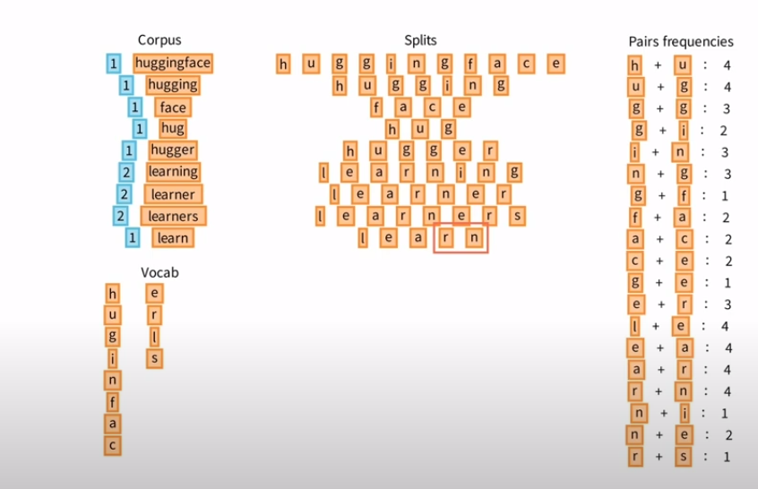

  We then check the frequency of pairs that are next to each other (in the initial corpus), then we add the pair of the **highest frequency** and repeat again

- We keep repeating until we get the desired # of words in the tokenizer (given as a parameter for tokenizer training).

- If we want to tokenize the word `'hugs'`

  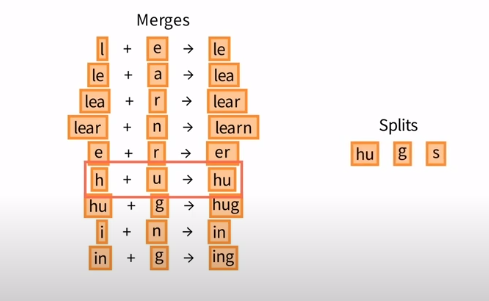

  First, we split hugs into just character `'hugs' -> ['h', 'u', 'g', 's']`

  Then we iterate over the merges, and try to find two tokens that we can merge.

  - In this case, we found `h` + `u` = `hu`, so we replaced them with `hu` and we iterate again
    - We will find `hu` + `g` = `hug`, so we replace it

****

## **<u>WordPiece Tokenization</u>**

- Similar to BPE, you start with the initial vocabulary consisting of the letters that compose the corpus, but there's a small subtlety

  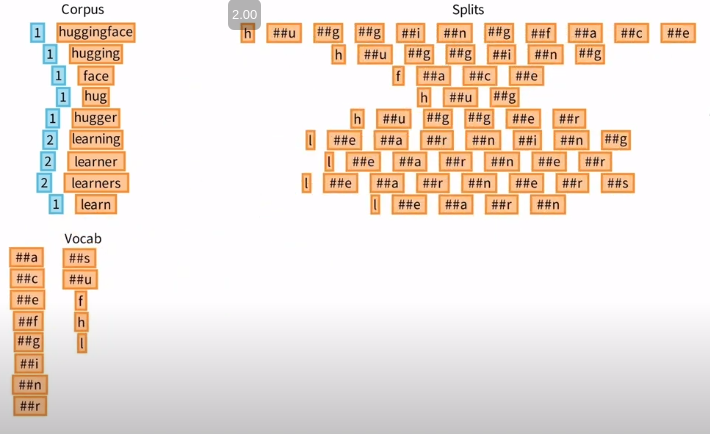

  If a letter is not at the start of a sentence, we add `##` before the letter.

- we then compute a score, for each pair in our vocab

  - The score equation is
    $$
    \text{score} = \frac{\text{freq of pair}}{\text{freq of 1st element} \times \text{freq of 2nd element}}
    $$

  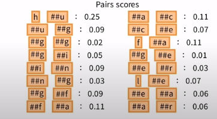

- We then pick the pair with the **highest score**, and merge them so `h` & `##u` will be added as `hu` and then we repeat until we reach the desired size of our vocabulary.

- To split a word into tokens, we do the following

  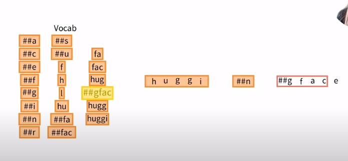

  We search in order from left to right until we find the **longest matching** word in the sentence and the vocabulary.

  then we repeat for new words.

****

## **<u>Unigram Tokenization</u>**

- Unigram's strategy is to start with a large vocabulary and keep removing words until you reach the desired limit

  - The word/token to remove is picked based on a loss function based on the Unigram language model

- **<u>Unigram Model</u>**

  Unigram is a **statistical language model** that assigns probabilities for each word and assumes all words are independent.

  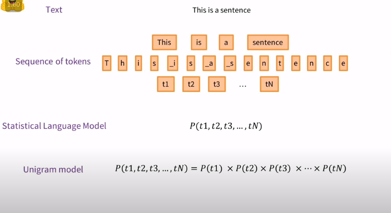

- The initial vocabulary for Unigram is to list all the **substrings** for **each word** in the corpus

  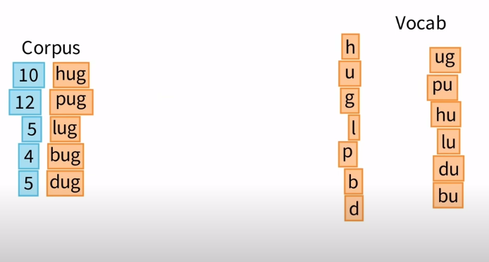

- The model uses an **expectation-maximization approach**.

- The loss is expressed as follows for a corpus $C$ and vocabulary $V$
  $$
  L(V,C) = \sum_i \text{freq}_i \times -\log P(w_i)
  $$

- First, we get the probability of each token using counting $P(\text{token}) = \frac{\text{freq of token}}{\text{total frequency of all tokens}}$

  - For each word, we find all the possible representations using the current vocabulary and compute the probability for each representation.

  - We then pick the representation with the **highest probability**

    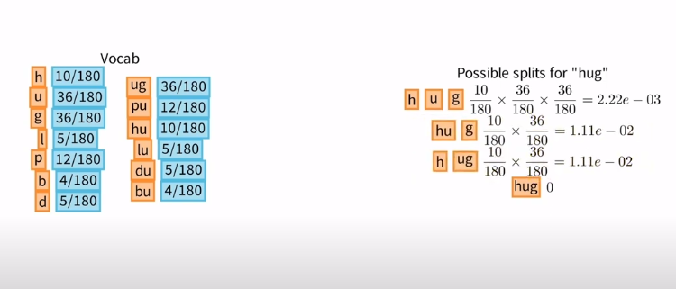

- We then calculate the loss over the whole corpus

  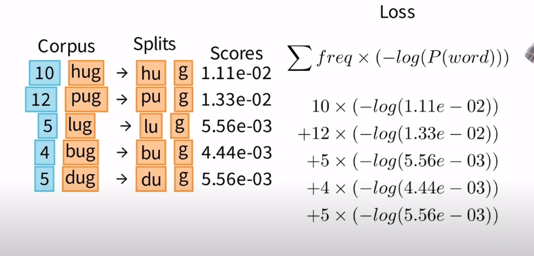

  We take each word in the corpus and get the calculated probability, and use that to calculate the loss.

  We then remove the token/s that **impact** the loss the **least**.

- Then repeat the process until you reach the desired vocabulary size.

****

- **N.B.** we don't have to remove only 1 token per iteration

****