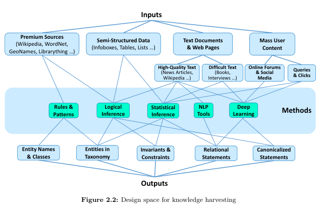

# Foundations and Architecture

## Knowledge representation

- When the focus is on the classes and their logical connections such as subsumption and disjointness, KBs are referred to as **ontologies** (schema in db terminology)
- The class hierarchy alone if often called the **taxonomy**

### Entities

**Entity**: abstract or concrete object of fiction or reality

- Includes events, creative works (books, poems, songs), fictional people and general concepts like empathy and Buddhism.

**Individual Entity** (aka **Named Entities**)

These are entities that can be **uniquely identified** against all other entities.

- When an entity has several labels, they are called **synonyms** or **alias names**.
- When the same label refers to different entities, this label is a **homonym** (same name, different meaning)

- An appearance of an entity label is called a **mention** of the entity.
- The label that appears in the mention is called the **surface form** of the entities (two different mentions can use the same surface form)

- In more difficult cases, acronyms or abbreviation that are not yet in the list of known labels, and the mention in the form of pronouns ("he, she, it, they") or indefinite pronouns suchs as "the singer" need to be handled
  - This case of entity mentions is known as **co-references**, when a more explicit mention is usually nearby

****

### Classes (aka Types)

- Entities often come in groups where all elements have a shared characteristic.
- e.g. Taylor Swift, Phoebe Bridgers and Harry Styles are all musicians and singers
- We capture this by organizing entities into **classes**
- An element of the class is called an **instance**

- Classes can relate to each other in terms of their members as being **disjoint** (men and women), **overlapping**, or **one subsuming the other** (musicians and guitarists)
- Classes can also become quite specific e.g. left-handed electric guitar players could be a class in the KB.
- Deciding what should be considered as an entity or class is up to the KB architect and depends on the intended use case.

****

### Taxonomies (aka Class Hierarchies)

- By relating the instance sets of two classes, we can specify invariants that must hold between the classes, most notably the **subsumption** aka the **sublass/superclass** relation.

- X is a direct class of Y, if there is no class that sybsymes X and is subsumed bt Y.

- **Taxonomy** is a directed acyclic graph, where the nodes are classes and there's an edge from class X to class Y if X is a direct subclass of Y

- In a way taxonomy acts like a **database schema**

...
...
...

****

### Canonicalization

- Each entity, class and property in a KB is **canonicalized** by having a unique identifier and being included exactly once.
    - For entities this implies the need for **named entity disambiguation** aka **enitity linking**.
    - This also applies to classes, as we can't have both guitarist and guitar players as different classes
    - Same also applies to properties.

****

### Logical Invariants (assertions)

- e.g. A person cannot have 2 different birthdates.

****

## Design Space for KB Construction

- **Knowledge Harvesting**: The process of distilling knowledge from online contents

### Requirements

An **ideal KB** would have
  - No errors
  - Covers all types and entities of interest
  - Maintains itself automatically
  - Contain expressive facts that cover all aspects of interest
  - Fully automated without manual supervision and human intervention

However, in our non-ideal world, we have to make trade-offs and prioritize what we want from above

**Dimensions of the desired KB**

#### Correctness

- No disambiguity between entities
- All facts are correct (including types of entities)

#### Coverage

- Requires capturing all entities

#### Expressiveness

#### Agility

- A KB need to be continuously updated and maintained over a long time horizon.
- While doing so, you should preserve the level of correctness, coverage and expressiveness

#### Efficiency

- Make sure it can scale.
- Some methods for building KBs are very expensive money and time wise

#### Scrutability

- For each statement in the KB, we need to be able to track evidence from where it was extracted or inferred.
- This kind of **provenance** tracking is crucial for several reasons
  1. Helps explain the context and validity of a statement to KB curators or crowsourcing workers who contribute to KB QA.
  2. Essential for when newly added statements contradict with existing ones and require conflict resolution.

****

#### Automation vs Human in the Loop

- As we discussed, Ideally there would be no human intervention when creating KBs.
- But this is one of the trade-offs, if we want the KB to have all the other properties.
- Human input may range from manually specifying the schema for types and properties of interest along with consistency constrains, to judiciously select input sources, all the way to providing the system with labeled training samples for supervised knowledge acquisition.
- All of this is about the trade-off between achieving high correctness, coverage and expressiveness and limiting the monetary cost of building and maintaining the KB.

- The most crucial trade-ff among these is between **coverage and correctness**

****

### Measuring performance

$$
  \text{precision} = \frac{\text{\# correct statements in KB}}{\text{\# statements in KB}} \\
  \
  \\
  \text{recall} = \frac{\text{\# correct statements in KB}}{\text{\# correct statements in the real world}^*}
  \\
$$

$^*$ for **recall**, We can only estimate it as we don't know the number of correct statements in the real world

****

#### Coping with trade-offs

- Done

****

# Overview of KB Creation

## Input Sources

- **Premium Sources**: includes well-organized and curated encyclopedic content like Wikipedia.

  - Titles from Wikipedia constiture the world's notable entities in a reasonably standardized form.
  - Having these entities first (and cues about their classes e.g. Wikipedia categories) forms a **strong backbone for subsequent extensions and refinements**
  - This design choice can be seen as an instantiation of the folk wisdom to "pick low-hanging fruit" first

## Outputs

## Methods
