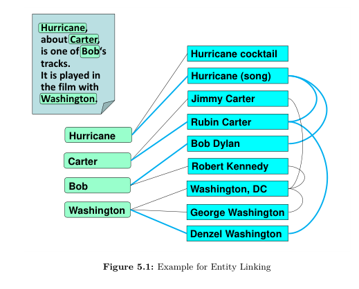

# Entity Canonicalization

- In chapter 4, we retrieved entities and classes from non-premium sources.
- Now that we need to make sure these entities and classes are unique.
  - This task is called **Entity Canonicalization**

- It comes in a number of different settings

## Entity Linking

- Here we assume we have a **core KB** from premium sources, and we just observed **a new set of mentions** in additional inputs like **text documents or web tables**.
- When the input is text, the task is also known as **Named Entity Disambiguation (NED)**.
- There is also a task called **Word Sense Disambiguation (WSD)**

| NED | WSD |
|--|--|
| Michael Jordan, MJ| MJ |
| Tells you that MJ and Michael Jordan refer to the same entity| Tells you whether MJ refers to Michael Jordan, or Michael Jackson|

****

- If we have the sentence "It is played in the film with Washington", Washignton could refer to "Washignton DC", "George Washington" or "Denzel Washington".

- We have several ways to resolve that

### Mention-Entity Popularity

- If the entity is frequently referred by the name of the mention, this is a likely candidate.
- e.g. "Carter" and "Washignton" most likely denote former US president Jimmy Carter and Washington, DC.

### Mention-Entity Context Similarity

- Compare surrounding text of the mention, to the descriptions of entities (can get desc.s from wikipedia).
- Maybe do it using BERT ?

### Entity-Entity Coherence

- Entities occur together if there's a **semantic relationship** that holds them together.

****

- In the image above
  1. Edges between mentions and candidate indicate **mention-entity similarity** 
  2. Edges among candidate indicate **entity-entity coherence**

- To qualify the strength of the similarity and coherence, those edges should be weighted.

****

### EL with Out-of-KB Entities

- An important case is the treament of **out-of-KB entities**
  - They are mentions that denote entites that are **not (yet) included** in the KB

- The situation often arises with **emerging entites**
  - e.g. newly created books oor songs, **long-tail entities** such as garage bands or small startups.

- In such cases, the EL method has an additional otpion to map an entity to **null**, meaning that none of the already known entities is a proper match.

- Those mentions mapped to null may become candidates to be included later in the KB life-cycle

****

### Coreference Resolution (CR)

- This task refers to **grouping** mentions into equivalence classes that denote the same entities
- e.g. "Taylor Swift was very sucessful this year, The signer released a new album, she also wrote a short film"
  - Here "Taylor Swift", "The singer", "she" all refer to the same entity.
  - A group of ["Taylor Swift", "The singer", "she"] is called a **coreference group**

****

- Mentions in the same coreference group linked to a KB entity may be added as **alias names,** or simply **textual cues** for an existing entity
- Coreference groups that cannot be linked to a KB entity can be captured as candidate for new entities to be added, or atleast considered later.

- e.g. If we pick “Peter Udo”, “the sax player”, “the Nigerian saxophonist” and “he” as a coreference group
  - Not only can we assert that he is not an existing KB, but we already have informative cues about what type of entity this is and even a gender cue.

**Methods for CR**

- They can be rule-based, based on CRF-like graphical models or based on neural learning

****

- CR mostly focuses on **short-distance mentions**, however it can be extended to focus on corefs across differnt pargraphs or different documents.

- The extended task is known as **cross-document coreference resolution (CCR)**

****

### Entity Matching (EM)

- Entity matching is when you have 2 KBs and you want to join them together.
- This is similar to EL, but in EM you assume that there is no **core KB** and both KBs are equally trusted.
- If you think one is more trustworthy than the other, you should go back to EL with structured tables as input

**Why not always EL ?**

- EL doesn't leverage the information that both KBs are trust worthy.
- So, in EM we can leverage cues like
  - **Name Similarity**
    - Higher similarity -> more likey to be matching
  
  - **Context Similarity**

  - **Consistency Constraints**
    - Each row is matched only once with another row from the other KB, so this decreases the uncertainty when choosing
  - **Distant Knowledge**
    - We can use the connections of highly related entities even if they don't have strong string similarity

****

#### Benefit of EM for KB Construction

- Used when integrating two KBs, from two different premium sources
  - e.g. Adding GeoNames derived KB to a Wikipedia-derived KB.

****

## Popularity, Similarity and Coherence Measures

****

## EL over semi-structured data

- We can make use of the similarity between rows and the homegenity of columns from rows in table data

****

## EL Variations and Extensions

### Iterative Linking

- Iterative linking can be added to virtually all EL methods.
  - The idea is to make linking decisions in multiple rounds, based on the **mapping confidence**

- i.e. In the first round, we map mentions with confidence of 90% or above, we then compute the mapping confidence again.
  - The new mapping confidence can utilize the new information gained from the previous iteration to do more powerfull mappings.

****

### Domain-specific Methods

- Maybe you know how specific words are incomplete or misspelled in that domain

****

### Methods for Specific Text Styles

- Consider how processing social media texts can differ from processing a page of encyclopedic nature like wikipedia

****

### Methods for Queries and Questions

- The more recent approaches are end-to-end

****

### Methods for Specific Entity Types

- Similar to domain-specific methods but on entities that you know there'll be disambiguation

****

## Entity Matching

