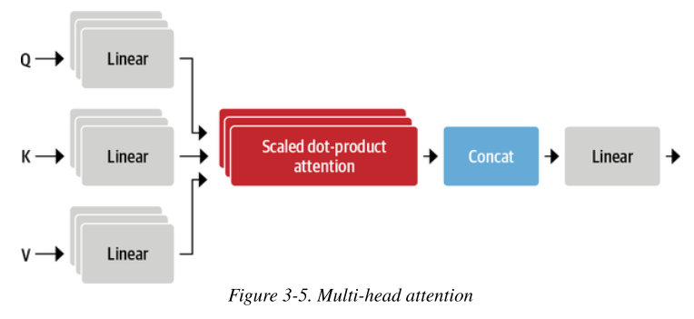
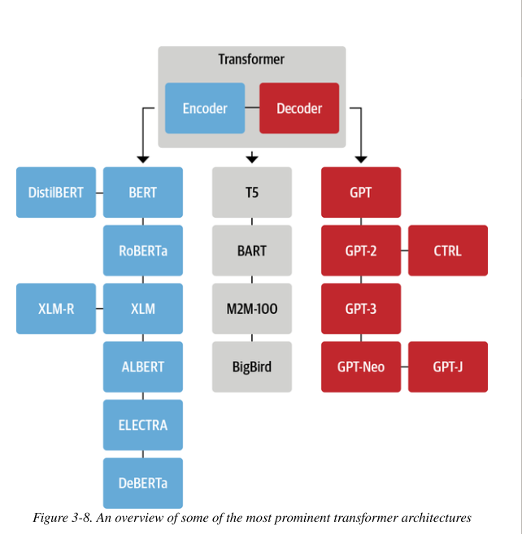

[toc]

I've followed the tutorial and built a transformer using pytorch, the link can be found [here](https://www.kaggle.com/abdelrhmanhosny/transformer-implementation)

Here's the link to the original paper: [Attention is all you need](https://arxiv.org/abs/1706.03762)

# **<u>Transformers Anatomy</u>**

- The transformer (in the paper) consists of **two components**
  - **Encoder**
    Converts an **input sequence of tokens** into a **sequence of embeddings**, these are often called the **hidden state** or **context**.
  - **Decoder**
    Uses the **encoder's hidden state** to **iteratively** generate an output **sequence of tokens**.

    
- Notice that the Encoder and the Decoder containt **Encoder Stacks** and **Decoder Stacks**.
- While transformers were originally made for sequence to sequence tasks, people **separated** the **encoder and decorder** and used them individually for different tasks.
  - **Encoder-only**
  These models convert a sequence of tokens into a sequence of embeddings.
  The representation computed for a given task in this architecture depends on both the **left** and **right contexts** , this is often called **bidirectional attention.**
  - **Decoder-only**
    Given a prompt of text like "Thanks for lunch, I had a ..." these models will **auto-complete the sequency** by **iteratively predicting the most probable next word**.
    The representation computed for a given token in this architecture depends only on **the left context**. This is often called **causal** or **autoregressive attention**.
  - **Encoder-decoder**
  These are used for **complex mappings** from **one sequence of text** into **another**.

- **N.B.** The distinction between applications for decoder-only vs encoder-only architecture is a bit blurry. e.g.
  - GPT family of transformers can be trained for **translation tasks**  which are conventionally thought of as a seq2seq task.
  - Encoder-only models like BERT can be applied to summarization.

****

# **<u>The Encoder</u>**


- The **transformers encoder**   consists of **many encoder layers** stacked next to each other..
  - Each encoder layer **receives a sequence of embeddings** and feeds them to a **multi-head self-attention layer** then through a **feed-forward layer**.
  - **Output** of the embedding has the **same size as the inputs**
  - Each of these sublayers also use **skip connections** and **layer normalization**.

## **<u>Self-Attention</u>**

- The **self** part in self-attention refers to the fact that these weights are computed for **all hidden states in the same set**.
  - In contrast to the attention mechanism in RNNs, which involves computing the **relevance** of each **encoder hidden state** to the **decoder hidden state** at a **given decoding timestep**.
- The main idea behind self-attention is that **instead of using a fixed embedding** for each token, we can use the **whole sequence** to compute a **weighted average** of each embedding.
  $$x^`_i = \sum^n_{j=1}w_{ji}x_j$$
  - Embeddings generated this way are called **contextualized embeddings** and **predate** the invention of transformers in language models like **ELMo**.
  

- Multi-head attention
  

****
## **<u>Feed Forward Network</u>**

- The feed forward sub-layer in the **encoder and decoder** is just a **simple two-layer fully connected NN**, but instead of processing the whole sequence of embeddings as a single vector, it **processes each embedding <u>independently</u>**
  - This is called **position-wise feed forward networks**.
- A rule of thumb from the literature is for the **hidden size of the 1st layer** to be **4 times the size of the embeddings** and to use a **GELU** activation function.
  - This is where most of the **capacity and memorization** is hypothesized to happen and the part that is **most often scaled up when scaling up models.**

### **<u>Adding Layer Normalization</u>**

- There are **two** main choices of layer normalization adpoted in literature
  
#### **<u>Post Layer Normalization</u>**

- This was used in the paper, it places layer normalzation **in between the skup connections**.
- This arrangement is **tricky to train from scratch**.
  - Often used with **learning rate warm-up**, where the learning rate is **gradually increased** from a **small value** to **some max value**  during training.
  

#### **<u>Pre Layer Normalization</u>**

- This is the **most common arrangement** found in literature, it places layer normalization **within the span of skip connections**
- This tends to be **much more stable** during training and doesn't require any **learning rate warm-up**.
  

****

## **<u>Positional Encoding</u>**
- There are several ways to achieve this

### **<u>Learnable position embeddings</u>**

- This works the same way as **token embeddings**, but it uses the **position index** instead of the token ID as **input**
- These are best learned during **pretraining**

### **<u>Absolute positional representations</u>**

- Transformer models can use **static patterns** consisting of **modulated sine and cosine signals** to encode the positions of the tokens
- This works well when there **aren't large volume of data** available

### **<u>Relative positional representations</u>**

- 
****
## **<u>Adding a Classification Head</u>**
- Transformer models are usually divided into a **task-independent body** and a **task-specific head**.

- The way **huggingface** does it is as so
  ```python
  class TransformerForSequenceClassification(nn.Module):
    def __init__(self, config):
      super().__init__()
      self.encoder = TransformerEncoder(config)
      self.dropout = nn.Dropout(config.hidden_dropout_prob)
      self.classifier = nn.Linear(config.hidden_size, config.num_labels)
    
    def forward(self, x):
      x = self.encoder(x)[:, 0, :] # select a certain hidden state from the sentence
      x = self.dropout(x)
      x = self.classifier(x)
      return x
  ```
****

# **<u>The Decoder</u>**

****

# **<u>The Transformer Tree of Life</u>**

- The figure below shows a **few** of the most prominent models and their descendants
  

## **<u>The Encoder Branch</u>**

- The **first** encoder only models based on the Transformer architecture was **BERT**, at the time, it outperformed all the SOTA models ib the GLUE benchmark, which **measures NLU** across several tasks of varying difficulties.

****
### **<u>BERT</u>**

- BERT was pretrained with **two objectives**
  1. **Masked Language Modeling** (MLM)
       - Predicting masked tokens in text
  2. **Next Sentence Prediction** (NSP)
       - Determine if one text passage is **likely to follow** another

****
### **<u>DistilBERT</u>**

- BERT delivered great results but had a **problem**, it was **large** and **slow** for certain environments
- **Knowledge Distillation** technique was used during **pretraining**, and it resulted in **DistilBERT**.
- DistilBERT achieves **97%** of BERT's performance while using **40%** less **memory** and being **60% faster**.

****

### **<u>RoBERTa</u>**

- A study fllowing the release of BERT revealed that **performance** can be **improved** by **modifying the pretraining scheme**.
- RoBERTa is **trained longer**, on **larger batches w/ more training data**, it also **drops the NSP task**.
- These changes improved the performance significantly **compared to the original BERT model**.

****

### **<u>XLM</u>** (Cross-lingual Language Model)

****
### **<u>XLM-RoBERTa</u>**

****
### **<u>ALBERT</u>**

- The **ALBERT** model introduced **three changes** to make the encoder more efficient
  1. **Decouples**  the **token embedding dimension** from the **hidden dimension**.
     - Allows the **embedding dimension** to be small and thereby **saving parameters**. (especially when the vocabulary is large)
  2. All layers **share the same parameters**
     - This further **decreases** the number of effective parameters. (still don't quite understand this tbh : ) )

  3. NSP objective is **replaced** with **sentence-ordering prediction**.
     - Predict **whether or not** the **order**  of **two** sentences was **swapped**. (instead of if they belong together at all)
- These changes made it possible to **train even larger models w/ fewer parameters** and reach a good performance.
