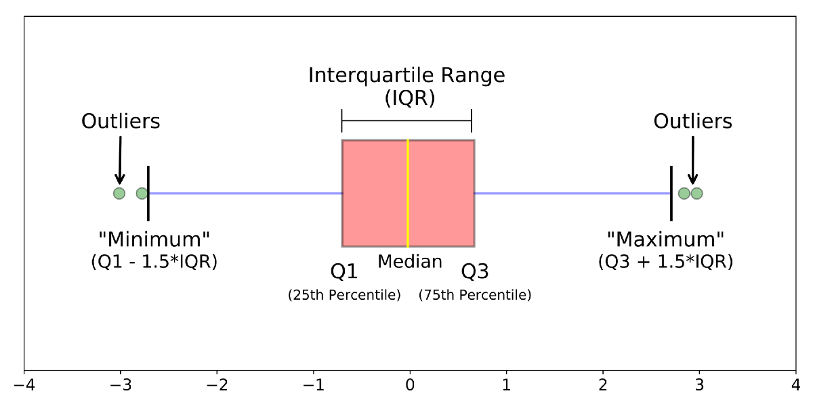
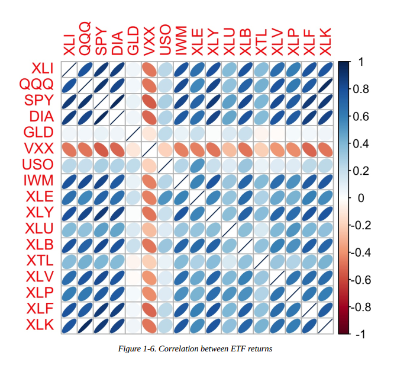
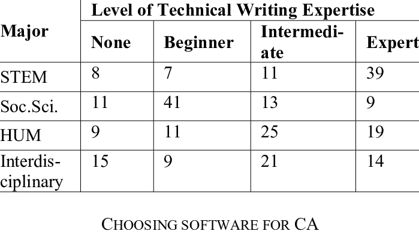
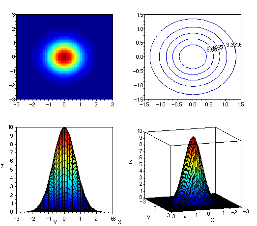

## <u>**Practical Stats for DS**</u>

## <u>Chapter 1</u>

### <u>**Elements of Structured Data**</u>

<u>Key terms for data types</u>

| Continuous      | Data that takes any value in an interval                     |
| --------------- | ------------------------------------------------------------ |
| **Discrete**    | Data that can take only integer values                       |
| **Categorical** | Data that can take only a specific set of values representing a set of possible categories |
| **Binary**      | Special Case of categorical having only two values 1 for True and 0 for False |
| **Ordinal**     | Categorical data that has explicit ordering (I.e. Size ( L - M - S ) or Rating ( 1 , 2 , 3 , 4 , 5 ) ) |

<u>Why bother with the taxonomy of data ?</u>

- In data analysis & predictive modeling , the data type is important to determine the **Type of Visual Display , Data analysis** or **Statistical Model**
- When a computer knows that the data is categorical :
  1. Optimizes storage ( as in Relational DBs)
  2. Values of categorical data are stored as enums or something like it
  3. Add constraints to make sure data is right ( Make sure that a country is entered in the country column )
- Libraries improve performance based on data type

------

### <u>**Rectangular Data**</u>

Rectangular data is the general term for a 2-D matrix with rows indicating records(cases) and columns indicating features(variables).

For Python and R they are called **<u>DataFrame</u>**.

------

### <u>**Non-rectangular Data Structures**</u>

| Type                  | Description                                                  |
| --------------------- | ------------------------------------------------------------ |
| **Spatial Data**      | used in mapping and location analytics, are complex and more varied than rectangular ds. |
| **Graph ( Network )** | Used to represent **Physical , Social** and **Abstract Relationship**. They are useful for certain types of problems such as **Network Optimization** & **Recommender Systems**. |
| **Times Series Data** | Successive measurements ofthe same variable. It's the raw material for statistical forecasting methods |

However the focus in this book is on the rectangular data , as it is the fundamental building block of predictive modeling.

------

### <u>Estimates of Location</u>

Rectangular data has a lot of entries up to millions at times , so finding **estimates** that expresses where the data is located proves quite useful in many contexts.

| Term                | Definition                                                   |
| ------------------- | ------------------------------------------------------------ |
| **Mean**            | Sum of all values divided by their number                    |
| **Median**          | The value such that half of the data lies above and the other have lies below |
| **Weighted Mean**   | Sum of all values times a weight divided the **sum of all the weights** |
| **Weighted Median** | The value such that one-half of the sum of the weights lies above and below the sorted data |
| **Trimmed Mean**    | The average after dropping a fixed number of extreme values  |
| **Robust**          | Not sensitive to extreme values (I.e Resistant )             |
| **Outlier**         | A data value that is very **different** from most of the data |

------

#### <u>Median and Robust estimates</u>

Median is the number in a middle of a sorted list and sometimes it is preferred to the mean. For example , if we calculate the mean income of the city in which Bill Gates lives , we will find that the mean is highly skewed due to Bill being super fucking rich. However , if we just take the median , we will get a number that represents what we want more as Rich Bill won't have as much of an impact and data won't be skewed. This makes the median robust.

<u>**Weighted Median**</u>

How to calculate ?

| Number | Weight |
| ------ | ------ |
| 125    | 2      |
| 190    | 5      |
| 10     | 3      |

This is equivalent to finding the median of { 125,125, 190,190, 190,190 , 190 , 10 , 10 ,10} , Each number repeated the same times as its weight.

So what we do is sort the list by the number , and the median is the number that causes the sum of weights above it to be equal to the sum of the weights below it.

Just like the median , the weighted median is robust to outliers.

------

#### <u>Outliers</u>

While many perceive outliers to be erroneous , That is not always the case . While the Bill Gates example above shows that using Bill Gates in the mean would give bad results , you should always investigate the outliers in your EDA.

There are Robust metrics for location that statisticians have developed for dealing with outliers.

------

### <u>Estimates of Variability</u>

Location is only one dimension when it comes to describing data , another dimension is **variability** which measured whether the data values are **tightly clustered** or **spread out**. 

| Term                                          | Definition                                                   |
| --------------------------------------------- | ------------------------------------------------------------ |
| **Deviation**                                 | The difference between the observed values and the estimate of location.                     (Synonym: Residuals) |
| **Variance**                                  | The Sum of squared deviations from the mean divided by n-1   |
| **Standard Deviation**                        | The square root of variance                                  |
| **Mean Absolute Deviation**                   | The mean of absolute value of the deviations from the mean ( L1 norm ) |
| **Range**                                     | The difference between the largest and the smallest value in a data set |
| **Median Absolute Deviation from the Median** | The median of the absolute value of the deviations from the median |
| **Order Statistics**                          | Metrics based on ascending sorted data values                |
| **Percentile**                                | The value such that P percent of the value take this value or less and (100 - P) percent take this value or more (Synonym : Quantile) |
| **Interquartile range**                       | The difference between the 75th percentile and the 25th percentile (IQR) |

Calculating the IQR on big data sets can be very expensive as it requires us to sort all the data, so there are other algorithms used to get the IQR quicker.

------

### <u>Exploring the Data Distribution</u>

**<u>Boxplot (Box and whiskers plot</u>**

| Term                | Definition                                                   |
| ------------------- | ------------------------------------------------------------ |
| **Frequency Table** | A tally of the count of **numeric** data values that fall into a set of intervals. Each set of intervals is called **bin** |
| **Histogram**       | A **plot** of the **frequency table** with the bins on the x-axis and the count on the y-axis |
| **Density Plot**    | A smoothed version of the histogram , often based on a *Kernel density estimate* |

#### <u>Statistical Moments</u>

In Statistical theory , location and variability are referred to as the first and second *moments* of a distribution.

##### <u>Location</u>

##### <u>Variability</u>

The third and fourth moments are known as *Skewness* and *Kurtosis*.

##### **<u>Skewness</u>**

Refers to whether the data is skewed to larger or smaller values

##### **<u>Kurtosis</u>**

 Refers to the tendency of the data to have **extreme values**.

These aren't measured through numerical values but observed from plots and graphs

------

### <u>Exploring Binary and Categorical Data</u>

| Term               | Definition                                         |
| ------------------ | -------------------------------------------------- |
| **Mode**           | The most commonly occurring category in a data set |
| **Expected Value** | Mean of a discrete distribution                    |
| **Bar Charts**     | The frequency of each category plotted as bars     |
| **Pie Charts**     | A Fucking Pie Chart                                |

------

### <u>Correlation</u>

| Term                        | Definition                                                   |
| --------------------------- | ------------------------------------------------------------ |
| **Correlation Coefficient** | A metric that measures the extent to which numeric variables are associated with one another. Range[-1,1] |
| **Correlation Matrix**      | A table where the variables are shown on both rows and columns, and the cell values are the *correlations* between the variables |
| **Scatter Plot**            | A plot in which the x-axis is the value of one variable , and the y-axis the value of another. |

#### <u>Correlation Matrix</u>

When the ellipses look to the right , this means that there is positive correlation between two variables , and when they look to the left this means that there is negative correlation.

The darker and thinner the ellipses , the higher the value of correlation between two variables.

A variable always has a 1 coefficient correlation with itself and 0 if two variables have no correlation ( independent ).

#### <u>Correlation on non-linear data</u>

When the data is non linear , some correlation methods become useless as  data could have a positive correlation at one point and then be negative at another.

There are specific formulas for correlation that allows it to be used on non-linear data.

------

### <u>Exploring Two or more variables</u>

Familiar estimators like *mean* and *variance* look at variables one at a time (*univariate analysis*).

Correlation compares between two variables at a time (*bivariate analysis*)

This section tries to estimate and plot more than two variables at a time (*multivariate analysis*)

------

#### <u>Contingency tables</u>

It's a tally of count between two or more categorical variables.

------

#### <u>Hexagonal Binning , Contours and Heatmaps</u>

These three plots can show us a relation between three variables or can show us a two dimensional density plot as they take color to express another dimension which is intuitive to understand.

P.S. These are also used instead of scatter plots when there are a large number of examples.

<u>Hexagonal Binning</u>

------

<u>Contour Plot</u>

This is a topographical map to two variables , each contour band represents a specific density of points

 Here you can see a contour plot on the top right and a <u>*Heatmap*</u> on the top left

------

#### <u>Categorical and Numeric Data</u>

Boxplots and violin plots are used to compare <u>*Numeric data against categorical data*</u> as follows:

##### <u>Violin Plot</u>

It is similar to boxplot in addition to plotting the density of the data but flipped , but it doesn't show the outliers as clearly

