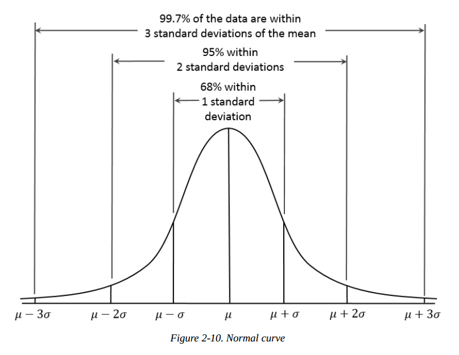

# <u>Chapter 2 : Data and Sampling Distributions</u>

Even though we have a lot of data in this age , we still need sampling 

### <u>Random Sampling and Sample Bias</u>

| Term                    | Definition                                                   |
| ----------------------- | ------------------------------------------------------------ |
| **Sample**              | A subset from a larger set                                   |
| **Population**          | The larger data set or idea of a set                         |
| **N (n)**               | N is size of the population , n is the size of a sample      |
| **Random Sampling**     | Drawing elements into a sample at random                     |
| **Stratified Sampling** | Dividing the population into strata and randomly sampling from each strata |
| **Simple Random Data**  | the sample that results from random sampling without stratifying the population |
| **Sample Bias**         | A sample that misrepresents the population                   |

- The quality of data matters more than quantity when it comes to sampling. Data quality in data science involves ***completeness , consistency of format , cleanliness & accuracy*** . Statistics add the notion of **representativeness**

- All samples are bound to have some amount of bias , and will not exactly be representative of the population. Sample bias occurs when the difference is meaningful and can be expected to continue for other samples drawn in the same way as the first

  

------

#### **<u>Self-Selection Sampling Bias</u>**

The reviews of restaurants and all online reviews in general are prone to bias as the people submitting them are **not randomly selected** rather motivated by something that happened.

So maybe 1 million customer had good experiences therefore had no motivation to write anything but one customer with a bad review went and blasted the place being reviewed.

However , having these prone to bias reviews is better than having nothing when comparing one place to another .

------

#### <u>**Bias**</u>

There should be a clear distinction between errors due to randomness and errors due to bias.

Errors due to randomness occur in no specific pattern ( i.e. giving a prediction that is incorrect by [-10,10] ) , while an error due to bias would have a specific pattern like a prediction that is always incorrect by +3 or something of the sort.

 Errors due to bias often indicate that a statistical or ML Model has been misspecified , or an important variable left out.

------

### **<u>Selection Bias</u>**

It is the practice of selectively choosing data - consciously or unconsciously - in a way that leads to a conclusion that is misleading or ephemeral.

| Term                   | Definition                                                   |
| ---------------------- | ------------------------------------------------------------ |
| **Bias**               | Systematic error                                             |
| **Data Snooping**      | Extensive hunting through data in search of something interesting |
| **Vast Search Effect** | Bias or non reproducibility resulting from repeated data modeling , or modeling data with large numbers of predictor variables |

------

#### <u>Vast Search Effect</u>

If we ask 2000 people to flip a coin 10 times , it is possible that one of them will get 10 heads or 10 tails in a row.

This doesn't mean that you found something interesting but this is just pure chance due to **large number of trials**.

With the era of big data , this is very likely to occur as if you get a large amount of data and keep searching and trying models , you'll eventually find something interesting . At that point you have to make sure that that something isn't just the result of a pure luck or an outlier.

------

### <u>Sampling Distribution of a Statistic</u>

| Term                      | Definition                                                   |
| ------------------------- | ------------------------------------------------------------ |
| **Sample Statistic**      | A metric calculated for a sample of data drawn from a larger population (i.e. sample mean , sample median ...etc) |
| **Data Distribution**     | The frequency distribution of individual values in a data set. |
| **Sampling Distribution** | The frequency distribution of a sample statistic over many samples or re-samples |
| **Central limit theorem** | The tendency of the sampling distribution to take on a normal shape as sample size rises |
| **Standard Error**        | The variability (standard deviation) of a sample statistic over many samples. (not to be confused with standard deviation, which by itself, refers to variability of individual values). |

When we are trying to measure or model something , we usually take a sample from the population to do our work on. Since our model is based on a sample , it might be in error ; yielding different results if we use another sample from the same population. Which introduces a key concern called **sampling variability** .

------

#### **<u>Sampling Distribution vs Data Distribution</u>**

It is important to know the difference between them.

<u>Sampling Distribution</u>: it's the distribution of a sample statistic.

<u>Data Distribution</u>: it's the distribution of the individual data points.

#### <u>**Cental Limit Theorem**</u>

It states that :

​		The distribution of the sampling statistic is likely to be more **regular and bell-shaped** than the distribution of the data itself. The larger the data , the more bell shaped and the more narrower the distribution of the sample statistic.

------

#### **<u>Standard Error</u>**

The *standard error* is a single metric that sums up the **variability in the sampling distribution** for a statistic.
$$
Standard Error= SE = \frac{\sigma}{\sqrt{n}}
$$
Where sigma is the **sample standard deviation**.

------

#### <u>**Standard Deviation vs Standard Error**</u>

Std deviation : measures the variability of individual data points

Standard Error : measures the variability of a sample metric.

------

### <u>Bootstrapping</u>

| Term                 | Definition                                                   |
| -------------------- | ------------------------------------------------------------ |
| **Bootstrap Sample** | A sample taken with **replacement** from an observed dataset. |
| **Resampling**       | The process of taking repeated samples from observed data ; includes both bootstrap and permutation procedures. |

Bootstrap is a powerful tool for *<u>assessing the variability of a sample statistic</u>*.

Since bootstrapping can make it seem like we have an infinite population , people often thing that it compensates for a small sample size or fills the holes in an existing data set which it does not . What bootstrapping does is *<u>infroms us about how lots of additional samples would behave when drawn from a population like our original sample.</u>*

------

#### <u>Resampling vs Bootstrapping</u>

While both terms are used interchangeably. More often , Re-sampling also includes permutation procedures and the sampling may be done without replacement ,

But with Bootstrapping , it is always implied that sampling happens with replacement from an observed data set.

------

### **<u>Confidence Intervals</u>**

Confidence intervals are just another way to understand the potential error in a sample estimate.

| Term                   | Definition                                                   |
| ---------------------- | ------------------------------------------------------------ |
| **Confidence Level**   | The percentage of confidence intervals , constructed in the same way from the same population , expected to contain the statistic of interest |
| **Interval endpoints** | The top and the bottom of the confidence interval            |

#### <u>Calculating confidence intervals</u>

Lets say we have a sample of the weight of a 100 people.

If we do bootstrapping for $N$ times to get $N$ means for that weight ,  then a 95 % confidence interval is the interval where $ 95$% * $N$ of the means lie(95% * $N$ of the means is between the *Interval endpoints*).

N.B. 

- A common misconception is that a confidence interval tells you "what is the probability that the population statistic lies within a certain interval ?" , which is untrue.

  The question answered by confidence interval is "Given a sampling procedure and a population , what is the probability that ... ?".

  To answer the first question , there are more complex calculations involved , not confidence intervals.

- For a data scientist , a confidence interval is a tool to get an idea of how variable a sample result might be.

  Data scientists would use this information not to publish a scholarly paper, but most likely to communicate the potential error in an estimate , and perhaps , learn whether a larger sample is needed.

------

### <u>Normal Distribution</u>

| Term                                 | Definition                                                   |
| ------------------------------------ | ------------------------------------------------------------ |
| **Error**                            | The difference between a data point and a predicted or average value |
| **Standardize**                      | Subtract the mean and divide by the standard deviation       |
| **z-score**                          | The result of standardizing an individual point              |
| **Standard Normal**                  | Gaussian with mean = 0 and std dev = 1                       |
| **QQ-Plot (Quantile-Quantile Plot)** | A plot to visualize how close a data sample is to another distribution , or how close two distributions or 2 data sets are. |

------

#### <u>QQ-Plot</u>

Generally , we draw a QQ Plot to know whether or not our data belongs to a certain distribution, If the data belongs to that distribution , you'll find that you can fit a straight line to the points on the QQ plot , the better fitting of the straight line , the more certain you are that the data is sampled from that distribution.

In case you need to understand how it is plotted : 

[Normal QQ-Plots](https://www.youtube.com/watch?v=X9_ISJ0YpGw): This explains clearly how you plot the curve for normal distributions.

[StatQuest QQ-Plots](https://www.youtube.com/watch?v=okjYjClSjOg): This explains how it could be applied to dataset to dataset or on other distributions that are not normal.

------

### <u>Long Tailed Distributions</u>

| Term     | Definition                                                   |
| -------- | ------------------------------------------------------------ |
| **Tail** | The long narrow portion of a frequency distribution , where relatively extreme values occur at low frequency |
| **Skew** | Where one tail of a distribution is longer than the other    |

