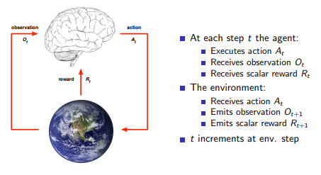
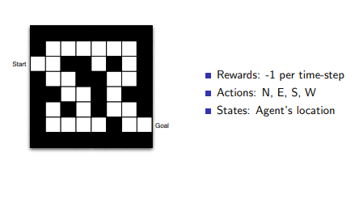
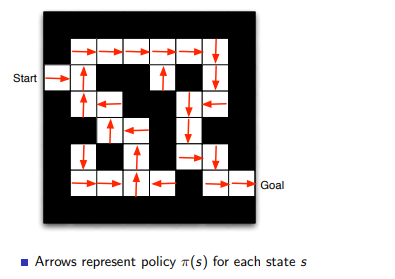
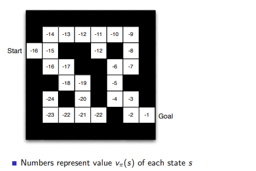
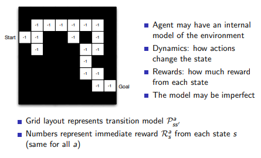

[toc]

# **<u>Video 1 - Introduction</u>**

## **<u>Characteristics of RL</u>**

- What makes RL different from other machine learning paradigms ?
  1. No supervisor, only a **reward signal**.
  2. Feedback is **delayed**. not instantaneous
  3. Time really matters (input data is **sequential**, non i.i.d data)
  4. Agent's action affect the subsequent data it receives

****

# **<u>The Reinforcement Learning Problem</u>**

## **<u>Rewards</u>**

- A reward $R_t$ is a **scalar** feedback signal
  - It has to be a **scalar** as we want to maximize the reward
- $R_t$ indicates how well the agent is doing at step $t$
- The agent's job is to maximize **cumulative** reward.

#### **<u>Reward Hypothesis</u>**

- All goals can be described by the **maximization of expected cumulative reward**.

#### **<u>Sequential Decision Making</u>**

- **<u>Goal</u>**: select actions to maximize total **future reward**.
- Actions may have long term consequences
- Reward can be **delayed**.
  - Sometimes it's better to sacrifice an immediate reward to gain more reward at the end.
    - Can't be greedy.

****

### **<u>Agent and Environment</u>**

- The agent (brain) takes an observation and outputs an action
  - The only thing we can influence is the action.

****

### **<u>History & State</u>**

- The **history** is the **sequence of observations, actions and rewards**
  $$
  H_t = A_1,O_1,R_1,....,A_t,O_t,R_t
  $$
  i.e. all **observable variables** up to time $t$

- Our algorithm will work to turn the history $H_t$ to generate an action $A_{t+1}$.

- But the $H_t$ contains very large amounts of data, most of that data isn't really relevant to the decision of the agent

  - e.g. a helicopter's history might be it's position for the last ten minutes, when only its current position is needed for the decision

  - This is why we use **states**

    - A state is any **function of the history**
      $$
      S_t = f(H_t)
      $$

#### <u>**Types of states**</u>

1. ##### **<u>Environment state</u>**

   - $S_t^e$ is called the **environment state**
   - $S_t^e$ is the environment's **private** representation
     - Whatever data the environment uses to pick the next **observation/reward**.
   - The environment state is not usually visible to the agent.
     - e.g. a tree out of sight of a helicopter is still in the env state but the agent can't see it
   - Even if the agent could see the information, it may contain irrelevant information

   ****

2. **<u>Agent State</u>**

   - $S^a_t$ is the **agent state**.
   - The agent state $S_t^a$ is the agent's **internal representation**
     - i.e. whatever info the agent uses to pick the next action

   ****

3. **<u>Information State</u>**

   - an **information state** (a.k.a. **Markov State**) contains **all useful information from the history**
     $$
     S_t \text{ is a Markov state iff} \\
     P[S_{t+1}|S_t] = P[S_{t+1}| S_1,..,S_t]
     $$
     i.e. probability of the next state given $S_t$ is the same as probability of the next state given all previous states.

   - The future is independent of the past **given the present**.

   - The state is a **sufficient statistic** of the future, and once that state is known, the history may be thrown away.

   - $H_t$ is a Markov state, but not a very useful one as it keeps all of the data.

   - The environment state $S_t^e$ is Markov, as it contains everything.

     - So we can see that it's easy to get Markov States, the hard part is finding compact ones that minimizes the data we need to store.

****

### **<u>Types of environments</u>**

#### **<u>Fully Observable Environment</u>**

- This is the "nice case"

- The agent sees everything

  i.e. $O_t = S_t^e = S_t^a$

  environment state = agent state = information state

- Formally: this is known as a **Markov decision process** (MDP)

****

#### **<u>Partially Observable Environments</u>**

- Partial observability: agent **indirectly observes** the environment

  - A poker playing agent only observes "public" cards

- Now agent state $\neq$ environment state

- Formally: this is know as a **partially observable MDP** (POMDP)

- The agent **must construct its own state representation** $S_t^a$.

- There are several approaches for building your own representations like

  - **Complete History**
    $$
    S_t^a = H_t
    $$
    
  - **Beliefs** of the environment state
  
    You keep a probability distribution of **which state are you probably in**, and you take the decision based on the probability of states.
    $$
    S_t^a = (P[S_t^a=s^1],...,P[S^e_t = s^n])
    $$
  
  - **Recurrent Neural Network**
    $$
    S_t^a = \sigma(s_{t-1}^aW_S+O_tW_o)
    $$

****

# **<u>Inside an RL Agent</u>**

- An RL agent may include **one or more** of these components
  1. **<u>Policy</u>**: agent's **behavior** function
  2. **<u>Value function</u>**: how **good** is each state/action
  3. **<u>Model</u>**: agent's representation of the environment

****

### **<u>Policy</u>**

- It maps from **states** to **actions** e.g.

  - Deterministic policy
    $$
    a = \pi(s)
    $$

  - Stochastic policy
    $$
    \pi(a|s) = P(A=a|S=s)
    $$
    The probability of taking an action based on some state.

****

### **<u>Value function</u>**

- Value function is a **prediction** of future reward

- We need the value function to evaluate the **goodness/badness of states**.

  - After the evaluation, we can select between actions
    $$
    v_\pi(s) = E_\pi[R_t+\gamma R_{t+1} + \gamma^2 R_{t+2}+....| S_t=s]
    $$
    Notice that each **policy** $\pi$ has a special value function.

    The factor of $\gamma$ is less than 1, so if there's a reward $R_t$ and $R_{t+1}$ while $R_t = R_{t+1}$, the reward in the current time step will prioritized.

****

### **<u>Model</u>**

- A model predicts what the **environment** will do next.

- **<u>Transitions</u>**: $\mathcal{P}$ predicts the next state.

- **<u>Rewards</u>**: $\mathcal{R}$ predicts the next (immediate) reward. e.g.
  $$
  \mathcal{P}_{ss'} = P[S_{t+1}=s'|S_t=s,A_t=a] \\
  \mathcal{R}_s^a = E[R_{t+1}|S_t=s,A_t=a]
  $$

- We are basically trying to predict what our reward and environment will be given states and actions, so we can know which actions lead to the best rewards.

****

## **<u>Example</u>**

- We are going to show how all the previous stuff relate to each other.
  

- **<u>Policy</u>**

  

  - The policy maps from the state (position of the agent) to action (direction of movement).

- **<u>Value Function</u>**

  

  based on the policy, the value function in this case represents the number of steps away from the goal (i.e. estimate of the future reward (correct estimate in this case))

- **<u>Model</u>**

  

****

## **<u>Categorizing RL agents</u>**

1. **<u>Value Based</u>**
   - No policy (implicit)
   - Value function
2. **<u>Policy Based</u>**
   - Policy
   - No value function
3. **<u>Actor Critic</u>**
   - Policy
   - Value Function

****

1. **<u>Model Free</u>**
   - Policy and/or Value function
   - No model (doesn't try to learn how the environment works)
2. **<u>Model Based</u>**
   - Policy and/or Value function
   - Model

****

# **<u>Problems withing RL</u>**

## **<u>Learning and Planning</u>**

- In sequential decision making, there are two **fundamental problems**
  1. **<u>Reinforcement Learning</u>**
     - The environment is initially unknown
     - The agent interacts with the environment
     - The agent **improves** its policy
  2. **<u>Planning</u>**
     - A model of the environment is **known**
     - The agent performs computations with its model (w/o external interaction)
     - The agent improves its policy
- Example
  - If you are not told the rules of the game / how the helicopter moves
    - This is a RL problem
  - If you are told the rules / maybe given the differential equations for wind interaction with helicopter
    - This is a planning problem.
  - An RL problem can be turned into a planning problem after studying the environment.

****

## **<u>Exploitation and Exploration</u>**

- Another problem is the *trade-off* between **exploration** and **exploitation**.
  - **Exploitation:** when the system makes use of actions that are **known to give a high reward**.
  - **Exploration:** when the system tries new kind of actions to check **how effective they are** (exploring the environment).

****

## **<u>Prediction and Control</u>**

- **<u>Prediction</u>**: Evaluate the future **given a policy**
- **<u>Control</u>**: Optimize the future 
  - i.e. finding the **best policy**
- **<u>N.B.</u>** we have to solve the prediction problem first to be able to solve the control problem.

****

# **<u>Book Notes</u>**

- **<u>Markov Decision processes</u>** are intended to include **sensation, action and goal** in the **simplest form possible** w/o trivializing any of them.
- Reinforcement learning unlike supervised and unsupervised focuses on the **whole problem** not just subproblems which is a limitation to supervised and unsupervised approaches.
- **RL** may involve **supervised learning** for specific reasons that determine which **capabilities are critical and which aren't**.

