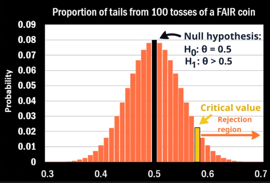
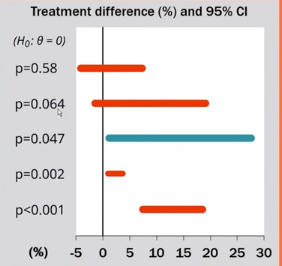

[toc]

# **<u>Statistical Inference</u>**

## **<u>Playlist link</u>**

[link](https://www.youtube.com/playlist?list=PLTNMv857s9WU729gegxdW2e4wto2wEP4S)

****

# **<u>1. Likelihood</u>**

## **<u>Probability vs Likelihood</u>**

**Probabilities**:

- The areas under a **fixed distribution**.
- $p(\text{data}| \text{distribution})$

**Likelihood**:

- the y-axis values for **fixed data points** with **distributions** that **can be moved**.
- Likelihood is when you are trying to find the optimal value for a parameter in a distribution (i.e. $n$ or $p$ in binomial or $\mu \ \& \ \sigma$ in Gaussian), given a bunch of **fixed observed measurements**.
- $L(\text{distribution}|\text{data})$

****

## **<u>Likelihood</u>**

The likelihood describes the extent to which the sample provides support for any particular **parameter value**.

- For a discrete distribution
  $$
  L(\theta_0;y) = P(Y=y|\theta=\theta_0) = f_Y(y;\theta_0)
  $$
  where $f_Y(y;\theta_0)$ is the pmf of y.

- For a continuous distribution, we use the pdf
  $$
  L(\theta_o;y) = f_Y(y;\theta_0)
  $$

- The value of **likelihood** on its own is **meaningless**.

  - Only useful in relative context

  - **Likelihood Ratio**
    $$
    \frac{L(\theta_0;y)}{L(\theta_1;y)}
    $$
    

**N.B.** $P(x;y) = P(x|y)$ i.e. both have the same meaning.

****

### **<u>Likelihood function</u>**

- For a given sample, you can create likelihoods for **all the possible values of ** $\theta$, this is called a **likelihood function**.
  $$
  L(\theta) = L(\theta;y)=f_y(y;\theta)
  $$
  Technically, in a sample of size $n$, the likelihood function takes the form of a product
  $$
  L(\theta) = \prod_{i=1}^nf_i(y_i;\theta)
  $$

****

### **<u>Log-likelihood function</u>**

- It is simply the log of the likelihood function
  $$
  \ell(\theta) = \sum^n_{i=1}log \ f_i(y_i;\theta)
  $$

****

### **<u>Example</u>**

- Find the likelihood & log-likelihood function for $\theta$ given $n=100$, $y=6$ in a binomial distribution.

- **<u>Likelihood</u>**
  $$
  L(\theta;y) = f_Y(y;\theta) = {n \choose y} \theta^y(1-\theta)^{n-y} \\
  L(\theta;6)= f_y(6;\theta) = {100 \choose 6} \theta^6 (1-\theta)^6
  $$

- **<u>Log Likelihood</u>**
  $$
  \ell(\theta;y) = log L(\theta;y) = log({n \choose y} )+ y log(\theta) + (n-y) log(1-\theta) \\
  \ell(\theta;6) = log L(\theta;6) = log({100 \choose 6} )+ 6 \times log(\theta) + 94 \times log(1-\theta) \\
  $$

****

## <u>**Sufficient statistics**</u>

- A statistic $T(y)$, is any quantity that can be calculated purely from a sample (independent of $\theta$) i.e. independent of the parameters.

  - If we have $\bf x = \{ 123, 125, 115, 123 \}$, we can calculate the statistic $T(y) = \sum_i x_i$ without knowing any parameters of the sample.

- A statistic is **sufficient** if it conveys **all the available information about the parameter**.

- If you can transform the function
  $$
  L(\theta;y) = c(y) L^*(\theta;T(y))
  $$
  then $T(y)$ is a **sufficient statistic**.

### **<u>Example</u>**

Systolic blood pressure in pregnancy. where we know before hand that it is a normal distribution with $\sigma^2 = 100$ 

- Sample: $\{135, 123, 120, 102,110 \}$
  $$
  L(\mu)=\prod_{i=1}^5f_i(y_i;\mu)\\
  =\prod_{i=1}^5\frac{1}{\sqrt{200\pi}}e^{-\frac{(y_i - \mu)^2}{200}} \\
  =(\frac{1}{200\pi})^\frac{5}2 e^{-\sum^5_{i=1}\frac{(y_i-\mu)^2}{200}} \\
  =
  (\frac{1}{200\pi})^\frac{5}2
  exp\{{-\sum^5_{i=1}\frac{y_i^2}{200}}\} 
  exp\{{(\frac{\mu (\Sigma y_i) }{100}) - \frac{5 \mu^2}{200}}\}
  $$
  We can now replace $\Sigma y$ with $T(y)$ and then it is a **sufficient statistic**.

- What this means is that we don't need to know the values of the systolic pressure, we just need to know their sum and that will allow us to get the likelihood function for $\mu$
  $$
  L(\mu)=
  (\frac{1}{200\pi})^\frac{5}2
  exp\{{-\sum^5_{i=1}\frac{y_i^2}{200}}\} 
  exp\{{(\frac{\mu T(y) }{100}) - \frac{5 \mu^2}{200}}\} \\
  L(\mu) = c(y)L^*(\mu;T(y))
  $$

****

## **<u>Multple Parameters</u>**

- A normal distribution is perfectly defined by the two parameters $\mu \  \& \ \sigma$

- We can write a likelihood function as follows
  $$
  L(\mu,\sigma^2)=(\frac{1}{2\pi \sigma^2})^\frac{n}{2} exp\{-\sum^n_{i=1} \frac{(y_i-\mu)^2}{2 \sigma^2}\}
  $$

- Sufficient statistics can also be present in multiple parameters, if we consider
  $$
  T(y) = (T_1(y), T_2(y)) = (\sum_iy_i,\sum_iy_i^2)
  $$

- The likelihood function above can be rewritten as
  $$
  L(\mu,\sigma^2)=(\frac{1}{2\pi \sigma^2})^\frac{n}{2} exp\{-\frac{1}{2\sigma^2}(T_2(y)- 2 \mu T_1(y)+n\mu^2)\}
  $$

- Notice that $T(y)$ is a **vector**.

****

## **<u>Nuisance parameters</u>**

- Let's say that in a Gaussian distribution, we only care about the $\mu$.
- The other parameter/s (in this case $\sigma$) is considered to be **nuisance parameter.**
- In our likelihood function, we can **replace the <u>nuisance parameter</u> by an <u>estimate</u>**.
- The function that has the **estimate** instead of the **parameter** is called a **<u>profile likelihood</u>**.

****

# **<u>2. Maximum Likelihood Estimation</u>**

- The aim of Maximum Likelihood Estimation (MLE) is to **find the parameter values** that makes the observed sample, the most likely sample among all possible samples.
  $$
  \forall_i(L(\theta_{MLE}) > L(\theta_i)  )
  $$

- MLE could refer to any of these depending on the context

  - Maximum likelihood estimation
  - Maximum likelihood estimator
  - Maximum likelihood estimate

****

## <u>**Score Equation**</u>

- To find the MLE, we differentiate the log-likelihood and set it equal to 0 (score equation) 

- The **score equation** is 
  $$
  \dv{\theta} \ell(\theta) = 0
  $$

****

## **<u>Information</u>**

- Information represents how confident we are in the **MLE**.

- The **observed information** is as follows
  $$
  I_o(\theta) = -\frac{ d^2}{d \theta^2} \ell(\theta)
  $$

- Our expected information (Fischer's information)
  $$
  I(\theta) = E[I_o(\theta;Y)]
  $$

- The variance of the information is the inverse of $I(\theta)$
  $$
  Var(\theta_{MLE}) \approx I(\theta)^{-1} \approx \frac{1}{I(\theta)}
  $$

****

## **<u>Properties of MLE</u>**

- Explicit vs Implicit

  - Explicit if can be solved w/o numerical methods
  - Implicit : score equation has to be solved numerically

- Biasedness and Consistency

  - MLE can be biased (i.e. can give a wrong value than the one you meant to compute)

  - MLE is **asymptotically** unbiased and consistent.

  - The **asymptotic distribution** of MLE is **normal**
    $$
    \theta_{MLE} \approx \mathcal{N}(\theta, I(\theta_{MLE})^{-1})
    $$

- Asymptotic efficiency

  - The MLE is **asymptotically efficient**. (has smallest variance possible of all consistent estimators)
  - The MLE is almost always **optimal**. 

****

## **<u>Parameter transformations</u>**

- If $\hat \theta$ is the MLE for $\theta$ and $g(\theta)$ is any transformation of $\theta$, then the MLE for $\alpha = g(\theta)$ is $\hat \alpha = g(\hat \theta)$

****

## **<u>MLE vs Least Squares</u>**

- MLE has the **advantage** that it **uses the distribution** of Y
  - MLE is the **most efficient estimator**.
- MLE **disadvantages**
  - Less convenient to calculate (if $\ell(\bf x)$ can't be solved except numerically)
  - Requires **distributional assumptions** (bad when big data, good when small data )
    - If there's enough data Least Squares will learn the distribution on it's own which would be more accurate than the assumption most of the time.

****

# **<u>3. Hypothesis testing</u>**

## **<u>Intuition</u>**

- Let's say that you think that a coin might be **tail-biased**, how would you test this **scientifically**?
- Steps
  1. Flip the coin a bunch of times
  2. Note the proportion of tails
  3. ?????. what to do after this?

- Here, we see the results for 100 tosses of a fair coin
  - What if we got 52 tails, is that enough evidence that the coin is biased ?
  - What if it were 62 ?
  - What we are trying to do here is to find a certain **threshold** such that if we exceed it, we can say that the coin is not a fair coin.

- We are going to establish a null hypothesis $H_0 : \theta = 0.5$ i.e. fair coin and another hypothesis $H_1 : \theta \neq 0.5$

  - 

    We are trying to find the **critical value**, the region that contains the value that are <s>larger</s> **more extreme** that the critical value is called the **rejection region**.

****

## **<u>Example</u>**

- Operate or not operate

  | Treatment | Improved | Not Improved | Total |
  | --------- | -------- | ------------ | ----- |
  | Operation | 62       | 38           | 100   |
  | Physio    | 48       | 52           | 100   |
  | Total     | 110      | 90           | 200   |

- We are trying to test whether there is a **difference in outcomes** between operations and physio.

- We need to prove that operation is  of $5\%$ better than physio.

  - If proven, we can safely recommend operation for all of them.

We will explain other topics based on this problem,

****

## **<u>Null Hypothesis</u>**

lets define a few things

- $p_1$ : probability of +ve outcome for **operative**
- $p_0$ : probability of +ve outcome for **non operative**
- let $\theta = p_1 - p_0$

Our **null hypothesis** will be that the two probabilities are the same
$$
H_0: \theta = 0 \\ H_1 : \theta \neq 0
$$

- When making null hypothesis, you have to think **pessimistically**.
  - i.e. here we are trying to prove that $\theta = 0.05$ (there's 5% improvement using operations). So the null hypothesis will be that **there is no difference**. and then we try to disprove this.
  - We don't assume that what we are trying to prove is true
- Whatever you're seeking evidence for goes into the **alternate hypothesis**.

****

- If $H_0$ is true, how will the sampling statistic be distributed?
  $$
  E(\hat \theta) = 0 \\
  Var(\hat \theta)= Var(p_1 -p_0)
  \\ =Var(p_1) + Var(p_0)
  \\= \frac{p_1(1-p_1)}{n_1} + \frac{p_0(1-p_0)}{n_0}
  $$
  Assuming $H_0$ is true $p_1 = p_0$, So
  $$
  Var(\hat \theta) = p(1-p)(\frac{1}{n_1}+\frac{1}{n_0})
  $$

- So the distribution will be $ \mathcal{N}(0,\ p(1-p)(\frac{1}{n_1}+\frac{1}{n_0}))$.

  

  - But Why is the distribution normal ??
    - Central Limit theorem states in a large population, everything converges to a normal distribution.

****

- We then get the rejection region

  

  If the sampled difference exists inside the rejection region, then our null hypothesis is not correct.

- $\alpha$ is called the **level of significance** or **strictness**. 

- Why is $\alpha = 0.05$?

  - This is just a convention that is used.

- $\alpha = P(\text{Type I error})$, error types will be explained later on.

****

## **<u>Test Statistics</u>**

- We have previously established that
  $$
  \hat \theta \text{ is }  \mathcal{N}(0,\ p(1-p)(\frac{1}{n_1}+\frac{1}{n_0}))
  $$

- Lets consider the test statistic $T$
  $$
  T = \frac{\hat \theta}{SE(\hat \theta)} = \frac{\hat \theta}{\sqrt{ p(1-p)(\frac{1}{n_1}+\frac{1}{n_0})}}
  $$
  Then $T \text{ is } \mathcal{N}(0,1)$, What this does is that it scales the distribution, so that we can use the standard normal distribution for our calculations

- Transforms this graph 

  

  Into this one

  

- Since $T$ is standardized, we know that the critical value $c = 1.96$.

- This allows us to calculate $T$, if $T > 1.96$ then we can reject our null hypothesis.

- Using the table in the **Example**  section, we can calculate $t$
  $$
  t = \frac{\hat \theta}{\sqrt{ p(1-p)(\frac{1}{n_1}+\frac{1}{n_0})}}
  \\
  \hat \theta = p_1 - p_0 = 0.14
  \\
  p = \frac{p_1+p_0}2
  \\ n_1 = n_0 = 100
  $$
  From the values above, we can calculate $t=1.99$, so we can reject our null hypothesis.

- Therefore, there is enough evidence to **infer** a difference between the two options (at $\alpha = 0.05$)

  - Using a different $\alpha$ will affect the result and might change it.
  - we use **infer** instead of prove as all of this is not certain

****

## **<u>p-value</u>**

- **p-value** is the proportion of repeated samples, under the null hypothesis, that would be as extreme as the test statistic we generated.

  - i.e. **p-value** is the area under the curve, that is **more extreme** than our **test statistic**

    

    If $p < \alpha$, then there is enough evidence to reject $H_0$.

    If $p > \alpha$, then there is **NOT** enough  evidence to reject $H_0$.

  - Since $p < \alpha$, we can reject $H_0$ at $5\%$ level of significance.

- The **p-value** saves us from having to run the hypothesis test for different $\alpha$.

****

## **<u>Confidence Interval</u>**

- An interval constructed around the sample statistic $\hat \theta$ (or calculated test statistic $t$).
  $$
  p_1 = 0.62 \ \& \ p_0 = 0.48\\
  \hat \theta = 0.14
  \\
  SE(\hat\theta) = \frac{p_1(1-p_1)}{n_1} + \frac{p_0(1-p_0)}{n_0} = 0.0697
  $$

- our 95% Confidence interval is
  $$
  =\hat \theta \ \pm SE(\hat \theta) z_{0.975} \\
  = 0.14 \ \pm \ 0.0697 (1.96)
  \\
  = [0.0035, 0.2765]
  $$

- We can describe the confidence interval by saying

  - We are $95\%$ confident that the interval from $0.0035$ to $0.2765$ contains the true population difference $\theta$

****

## **<u>Significant treatment difference</u>**

- In the example, they were also trying to find if $\theta \geq 0.05$, remember the pessimistic approach
- $H_0 : \theta \leq 0.05$ & $H_1 \gt 0.05$

We can use what we have done before, the $p-values$.

- If we take 5 samples and get their confidence intervals
- 
  - Only in the last sample are we sure that the treatment difference is higher than $5\%$.

****

## **<u>Power and Sample Size</u>**

- $\alpha$ is the probability of accepting $H_0$ even if it is wrong
- $1 - \beta$ is the probability of rejecting a false $H_0$ it is called the **power**.

- Here $\gamma$ is the true value.

- $\beta$ depends on two things

  - Variance of the two distributions.
  - How close is $\gamma$ to 0

- Keep in mind that variance is equal to
  $$
  Var(\hat\theta) = \frac{p_1(1-p_1)}{n_1} + \frac{p_0(1-p_0)}{n_0}
  $$
  So, as the number of samples increases, variance decreases and the curve becomes thinner, and the **power** ($1-\beta$) becomes larger

  - This means that the probability of rejecting the false $H_0$ increases as we increase the sample size.

****

# **<u>5. Bayesian Statistics</u>**

