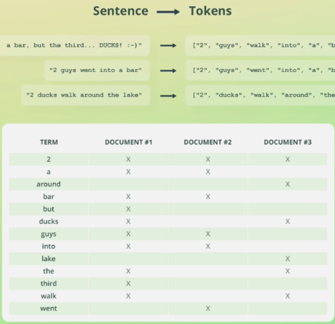

# 3 - Analyze API

- Text analysis:
  The process of converting unstructured text into a structured format that is optimized for search

```json
POST /_analyze
{
  "text": "Two guys walk into a bar, the third one ducks :')",
  "analyzer": "standard"
}

# the two queries are equivalent to each other
POST /_analyze
{
  "text": "Two guys walk into a bar, the third one ducks :')",
  "char_filter": [],
  "tokenizer": "standard",
  "filter": ["lowercase"]
}
```

# 4 - Inverted Indices

- Mapping between each word and the documents that contain them.

- words(tokens) are called **terms**


- This is table is a bit more simplified
  - Inverted indices contain more than just terms and document IDs.
    - e.g. information for relevance scoring

- Lucene stored an inverted index for each text field
```
{
    "name": "Coffee Maker",
    "description": "Electronic device to facitate making coffee",
    "date": elastic_date_format,
    "in_stock": 3
}
```
 - Assuming the schema of the index followed the schema above:
    - the index would have 2 inverted indices as there are two text fields.
    - Other data types like number and date use BKD tree (dk what is BKD tree).

****

# 5 - Mapping

- Mapping is **defining the structure of documents** 
  - Also used to configure how values are **indexed**
- similar to a RDB schema

```json
PUT /employees
{
  "mappings": {
    "properties": {
      "id": { "type": "integer"},
      "first_name": { "type": "text"},
      "last_name": { "type": "text"},
      "created_at": { "type": "date"}
    }
  }
}
```

There are two types of mapping
  1. Explicit mapping
  2. Dynamic mapping

****

# 6 - Data types

There are multiple types in elastic.

One of these is `object` which represents a JSON.

When using data type object, we **don't** use `{"type": "object"}`

Instead we use `"properties"`

```json
PUT /employees
{
  "mappings": {
    "properties": {
      "first_name": { "type": "text"},
      "last_name": { "type": "text"},
      "school_attended": {
        "properties": {
          "name": { "type": "text"},
          "location": { "type": "text"},
        } } } } }
```
- This way elastic knows that the field `"school_attended"` is of type object and can index the inner fields properly

****
## `object` data type

- Used for any JSON object
- objects may be nested
- Mapped using the `"properties"` parameter
- Objects are **not** stored as objects in Apache Lucene

****
## `nested` data type

- recheck nested

****

## `keyword` data type

- Used for **exact** matching of values
- Typically used for filtering, aggregations, and sorting.
- e.g. Searching for articles with a status of `PUBLISHED` or emails

### `keyword` under the hood

- `keyword` fields are analyzed with the `keyword` analyzer
- The `keyword` analyzer is a **no-op** analyzer
  - Outputs unmodified string as a single token
  - The single token is then placed into the inverted index

****

# 8 - Type Coercion in elastic

- Assuming there is no index called `test`, what would happen if we run those three requests

```json

PUT /test/_doc/1
{"price": 7.4}

PUT /test/_doc/1
{"price": "7.4"}


PUT /test/_doc/1
{"price": "7.4m"}
```

1. index is created and document is added
   - an index for the field `price` is created, where the index is optimized for float types 

2. document is added but price field is cast to float as index is created for floats already

3. price can't be cast to float so we get an error

Now, what if we execute `GET /test/_doc/2`


we get 
```json
"metadata":....,
"_source": {
  "price": "7.4"
}
```
- Notice that the value returned is a string, the casting only happens in the index (the one used for searching), but the document is stored as is.
- This leads us to conclude that the data used for searching is not the same data that is stored in the documents.

****

# 9 - Understanding arrays

- There is no such thing as `array` data type.

- Any field may contain zero or more values by default
  - If the type is `text`, strings in an array are concatenated before being analyzed.

****

# 10 - Creating explicit mapping
# 11 - Retrieving a mapping

`GET /index_name/_mapping` to get the whole mapping

`GET /index_name/_mapping/author.email` to get mapping for field called email inside object called author.


- If you want to nest objects, remember to use `nested` in order to query the objects independently

# 12 - Mapping with dot notation

```json
PUT /reviews
{
  "mappings": {
    "properties": {
      "ratings": {"type": "float"},
      "author": {
        "properties": {
          "first_name": "text",
          "last_name": "text"
        }
      }
    }
  }
}

PUT /reviews
{
  "mappings": {
    "properties": {
      "ratings": {"type": "float"},
      "author.first_name": "text",
      "author.last_name": "text",
    }
  }
}
```

Both of those are equivalent

****

# 13 - adding new fields in explicit mapping

```json
PUT /reviews/_mapping
{
  "properties": {
    "created_at": {"type": "date"}
  }
}
```

- new mapping for field `created_at` is created.

****

# 16 - Mapping parameters

## `format` parameter
- used with dates
```
{
  "purchased_at": {
    "type": "date",
    "format": "dd/MM/yyyy"
  }
}
```
Can use any format used with java's `DateFormatter` syntax and some other stuff

****

## `properties` paramter

## `coerce` parameter

- enabled by default

```
PUT /sales
{
  "settings": {
    "index.mapping.coerce": false
  },
  "mappings": {
    "properties": {
      "amount": {
        "type": "float",
        "coerce": true
      }
    }
  }
}
```

## `doc_values`

- Elastic makes use of **several data structures**
- It is essentialy an **uninverted inverted index**

- Disable `doc_values`, if you won't use aggregations, sorting, or scripting
- Useful for large indices; typically not worth it for small ones

- Don't understand 100%
****

## `norms`

- Normalization factors used for **relevance scoring**
- Useful for fields that **won't be used for relevance scoring**
  - Those other fields would be used for filtering and aggregation

****
## `index`

- Disables indexing for a field
- Won't be used in searching
- Useful when you don't need to search for a field but still want to return it after search.
- Often used for time-series data.

****

## `null_value`

- We previously said that empty values won't be included in search
  - i.e. if we search for paper where `status = PUBLISHED` papers with no status won't be included.
- If we set null_value to true, we can search documents where the field is null

****

## `copy_to`

- Used to copy multiple field values into a "group field"
- Simply specify the name of the target field as the value

```json
PUT /sales
{
  "mappings": {
    "properties": {
      "first_name": {
        "type": "text",
        "copy_to": "full_name"
      },
      "last_name": {
        "type": "text",
        "copy_to": "full_name"
      }
    }
  }
}

```

****

# 17 - Update mapping

- We can't update mappings.
- You have to create a new index and then copy the data into it.

# 18 - `/_reindex` API
- to do that you can use the `POST /_reindex` API.

```json
POST /_reindex
{
  "source": {
    "index": "old_index_name"
  },
  "dest": {
      "index": "new_index_name"
    }
}
```
- **NOTE**: If you copy the indices without any processing, type coercion could happen.
  - So while the indices will be modified, the data in `_source` will still be returned in the wrong data type.

- we can also specify a range (search query) that we want to reindex.

- We can also filter the fields that we want to reindex

```json
POST /_reindex
{
  "source": {
    "index": "old_index_name",
    "_source": ["field1", "field2"]
  },
  "dest": {
      "index": "new_index_name"
    }
}
```

****

# 19 - `alias` field


```json
PUT /reviews/_mapping
{
  "properties": {
    "comment": {
      "type": "alias",
      "path": "content"
    }
  }
}
```
****

# 20 - Multiple field mappings

- You can create multiple mappings for the same field (e.g. field mapped as `keyword` and `text`)

- Elastic then finds the best way to perform the query using the indices available.

****


Ignored multiple lectures about mapping as this is not the goal atm.

****

# 27 - Mapping Recommendations


## Mapping parameters

- Set `doc_values` to `false` if you don't need sorting, aggregation, and scripting
- Set `norms` to `false` if you don't need relevance scoring
- Set `index` to `false` if you don't need to filter on values
  - You can still do aggregations e.g. time-series data

- Only worth doing if **storing  > 1M documents**
- Worst case, you'll need to reindex documents.

****

# 29 - Analyzers and search queries

Analyzers are used to create uninverted indices when ingesting data.

- Different languages have different analyzers.

- To use a different analyzer, you can specify it in the `analyzer` field.

****

Skipped 31 -> End Inclusive


